# Admin overview: Hormuud Academy system

The short deck. 30 slides covering what the system is, what every page is for,
and what an admin may, may not, should and shouldn't do. It does not teach
clicking. Show that live on the system afterwards.

Same conventions as the long deck: `---` separates slides, bullets go on the
slide, `Notes:` is what the trainer says, and an image line is that slide's
screenshot from `docs/training/`.

The long version, with click-by-click steps and exercises, is
[admin-training-slides.md](admin-training-slides.md).

---

## Slide 1. Hormuud Academy system

- What it holds, what every page does, and what is yours to decide
- The clicking comes after, on the real system

Notes: Set the expectation in one sentence. This hour is so they understand the
shape of the system. Then you sit with them at the screen and do the work.

---

## Slide 2. How this works

- First: the ideas behind the system, about fifteen minutes
- Then: every page and what it is for
- Then: the rules, what you can do and what the system refuses
- Last: we open the system and do it together

Notes: Tell them not to take notes on steps. The steps are in the guides and
you will walk them through it live.

---

## Slide 3. One college, several branches

- Hormuud Academy is one college. There is no second one
- Branches, teachers, classes and staff belong to a branch
- Skills and students belong to the whole college
- A class is a room, never a group of students

Notes: The last line surprises everybody, so say it clearly. When a screen asks
for a class it wants the room. The split in the middle is why a student can
take a skill at another branch without a second record.

---

## Slide 4. The chain everything hangs on

```
Skill            Graphic Design: 4 months, $15 to register, $30 a month
│                described once for the whole college
└─ Branch skill  Graphic Design at Main Branch
   │             its teacher, its room, its duration, its prices
   └─ Enrollment STU-00003 started 19 Aug 2026, Active
```

Notes: Three levels. A skill is described once. Every branch that teaches it
gets its own branch skill, with its own teacher, room and prices, because a
branch in a smaller city charges less. A student starting the skill creates an
enrollment. Nearly every question you will get comes back to this picture.

---

## Slide 5. Two rules that explain most of the system

- A student keeps the prices and the duration from the day they joined
- Nothing stores a total. Every figure is counted from the records

Notes: The first means raising a price never touches a student mid-skill, and
the same idea covers teacher rates. The second means there is no month to close
and no total to correct. If a figure looks wrong, the payment or expense behind
it is wrong, and fixing that fixes every screen at once.

---

## Slide 6. Money in, money out

- Every dollar in is a payment: what it was for, which branch, how it was paid
- Every dollar out is an expense: what it went on, which branch, how it was paid
- A teacher's pay is an expense like any other
- Net balance is one minus the other. It is not profit

Notes: Net balance only counts money that actually moved. Fees a student still
owes do not lift it, and what a percentage teacher has earned does not lower it
until you pay them.

---

## Slide 7. The fee month

- A monthly fee names the month it pays for, not the day it arrived
- September stays September, paid in August or in November
- A four month skill starting in April owes April to July
- Nobody is chased for a month that has not started

Notes: This is the one idea worth repeating until it sticks. It is why the
system can answer "which months has this student settled" at any time, and why
the day's takings and the month a fee belongs to are two different questions.

---

## Slide 8. Two kinds of people log in

| | Admin | Branch staff |
| --- | --- | --- |
| Branches | Every one | Their own |
| Register students, take fees | Anywhere | Their branch |
| Income, Fees owed | Every branch | Their branch |
| Expenses, Teacher pay, Budget, Dashboard | Yes | Blocked |
| Set up branches, skills, teachers, staff | Yes | No |

Notes: You are the admin. The blocked row is deliberate: a branch should not be
able to read what the college pays its rent or its people. Those pages are
missing from their menu and refused on the server, so typing the address gets
them nowhere.

---

## Slide 9. The whole system in one menu

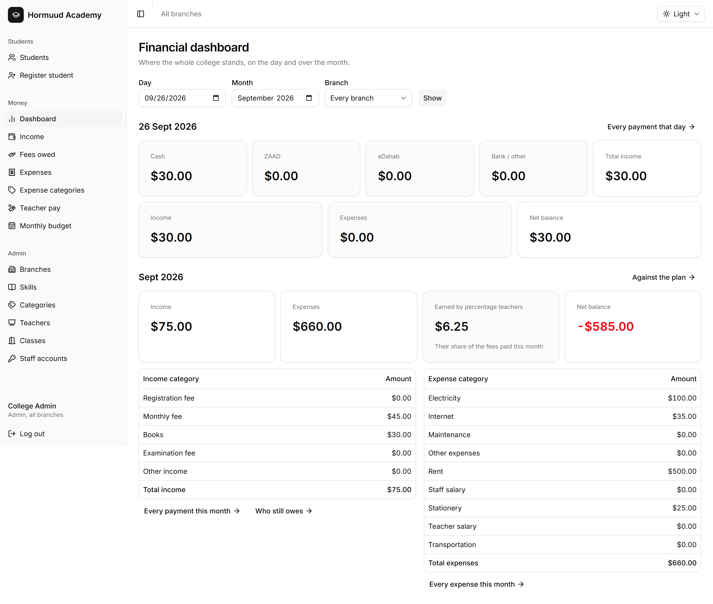

- Students: the people and their skills
- Money: what came in, what went out, what is owed, what is planned
- Admin: the things everything else is built from

Notes: Point at the three groups. Say the training follows Admin first, then
Students, then Money, because that is the order things have to exist in: no
student can enroll before a branch has a skill with a teacher and a room.

---

## Slide 10. Branches

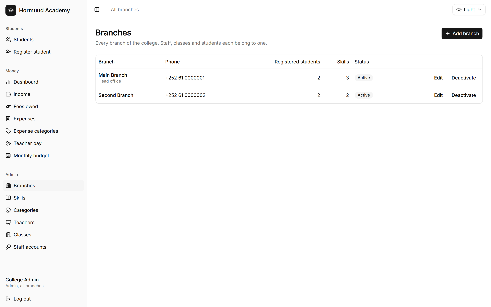

- What it is: every location of the college, with its phone and address
- You can: add, edit, deactivate
- You can't: delete one that has anything attached to it
- Deactivating removes it from every form and keeps all its history

Notes: A branch is the anchor for classes, teachers, staff, enrollments,
payments and expenses. Closing a branch is a deactivation, never a deletion.

---

## Slide 11. Categories and classes

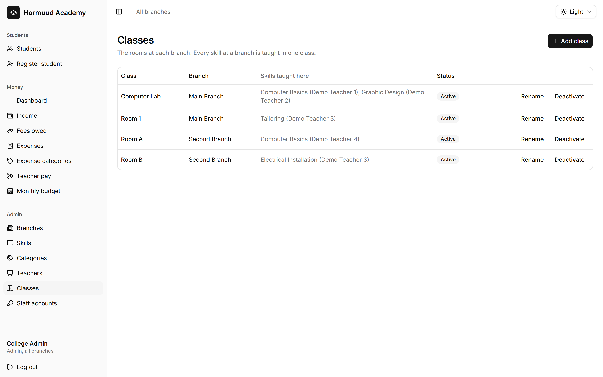

- Categories group skills: Technology Skills, Hand Skills. No money hangs off
  them
- Classes are rooms at one branch
- You can: rename a class
- You can't: move a class to another branch. Make one at the new branch instead

Notes: A class cannot move because skills at the old branch may already use it.
Categories are only for grouping the skill list, so they are the lightest
screen in the system.

---

## Slide 12. Teachers

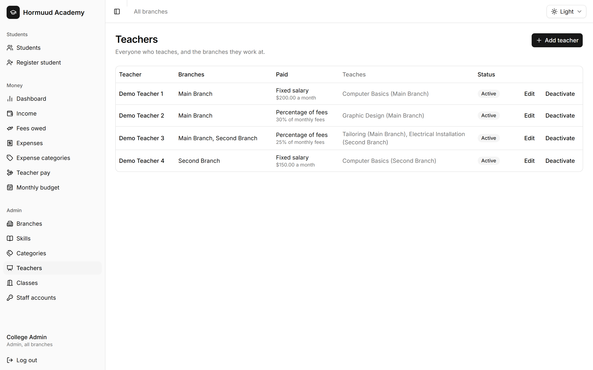

- What it is: the people who teach, and how each one is paid
- Fixed salary every month, or a percentage of the fees their students pay.
  Never both
- You can't: untick a branch where they still teach, or deactivate a teacher
  who still runs an active skill
- A teacher is not a login

Notes: Both refusals exist so a skill is never left with nobody teaching it. If
a teacher also needs to sign in, that is a separate staff account. Changing a
percentage rate affects fees paid from that day on and never rewrites what they
already earned.

---

## Slide 13. Skills, and a skill's page


- The skill holds the defaults: duration, registration fee, monthly fee
- Its page is where you add it to each branch, with that branch's teacher, room
  and prices
- A skill no branch teaches can't be taken by anyone
- Editing the defaults never changes a branch already teaching it

Notes: This is the step people forget. Creating a skill teaches it to nobody
until you add it to a branch. Say that twice.

---

## Slide 14. Staff accounts

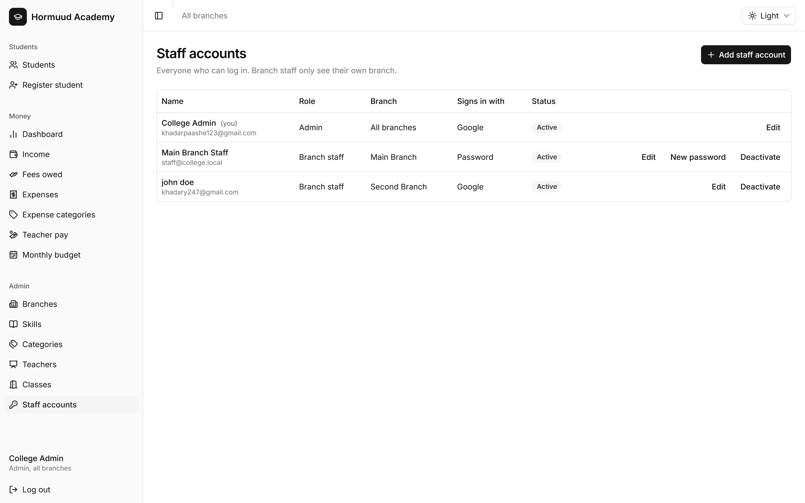

- What it is: who can sign in, with what role, at which branch
- You can: add, edit, deactivate, and give an old account a new password
- You can't: delete an account, change your own role, or deactivate yourself
- No email is sent. Tell the person yourself

Notes: The Gmail address is the login, so read it back to them when you type
it. Accounts are never deleted because students and payments record who created
them. The rules about yourself keep the college from losing its last admin.

---

## Slide 15. The student list

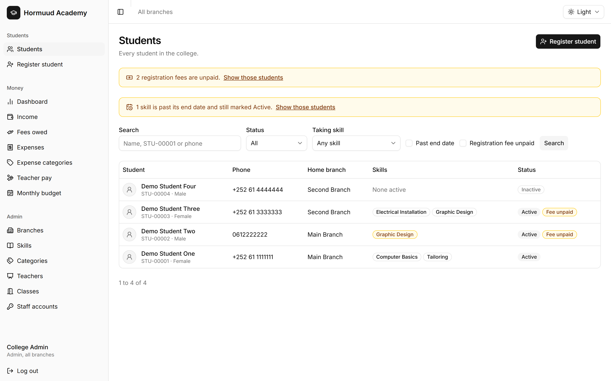

- What it is: everyone registered, newest first
- You can: search by name, student ID or phone, and filter by status, skill,
  past end date or unpaid fee
- An ID or phone search reaches every branch. A name search doesn't
- Active means they have at least one active skill. Nobody sets it by hand

Notes: The yellow bars above the list are the working queue: unpaid
registration fees, and skills past their end date waiting for a decision.

---

## Slide 16. Register student

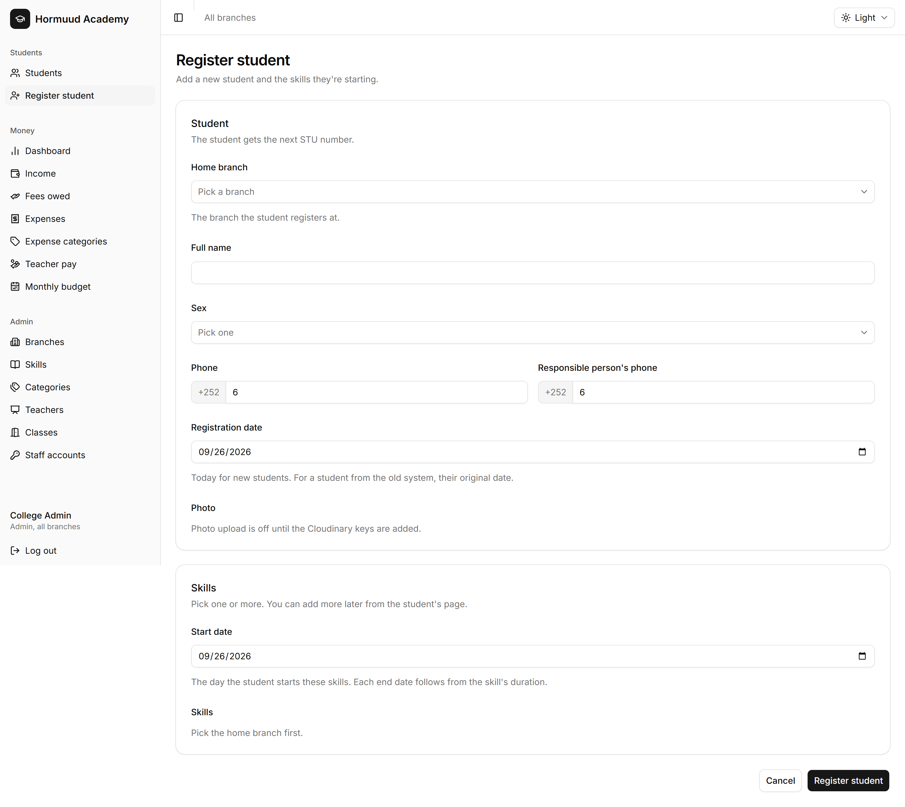

- What it is: a new student and their first skills, in one form
- Must have: a name, a sex, one phone, and at least one skill
- Should have: their original registration date if they came from the old
  system
- The shared phone warning is a hint, not a refusal

Notes: Families share a phone all the time, so the warning links to the other
student and lets you save anyway. If they paid the registration fee now, tick
it here and it is recorded on the registration date.

---

## Slide 17. A student's page

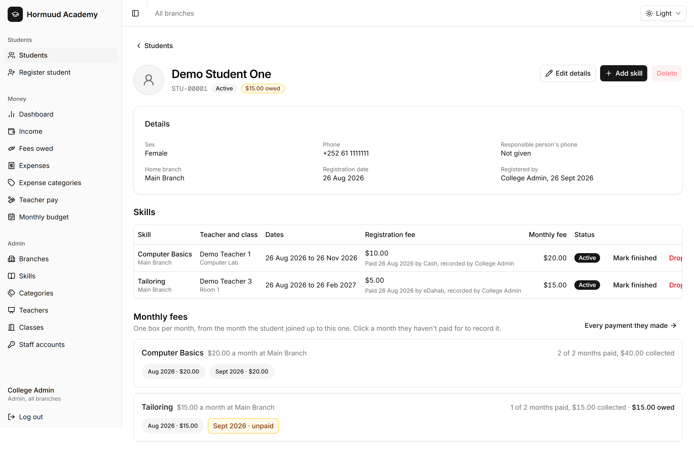

- What it is: their details, their skills, and every month of every skill
- Grey box: that month is paid. Yellow box: still owed
- You decide here: mark finished, drop, or set active again
- The end date never finishes a skill by itself

Notes: This page is where most daily work happens. The end date is a guide
because students sometimes need an extra month, so the system refuses to guess
and waits for a person.

---

## Slide 18. Income

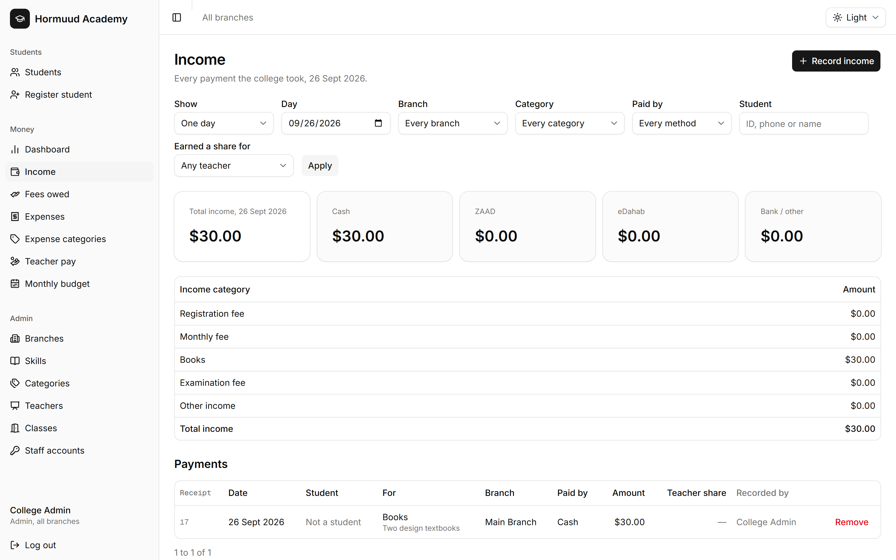

- What it is: every payment the college took
- Registration fees and monthly fees are recorded on the student's page
- Books, examination fees and other income are recorded here
- Only you can remove a payment, and only for money recorded by mistake

Notes: Fees are recorded on the student's page because the amount, the skill
and the teacher's share are already known there. This screen is also the
end-of-day count: cash, ZAAD, eDahab and bank across the top.

---

## Slide 19. Fees owed

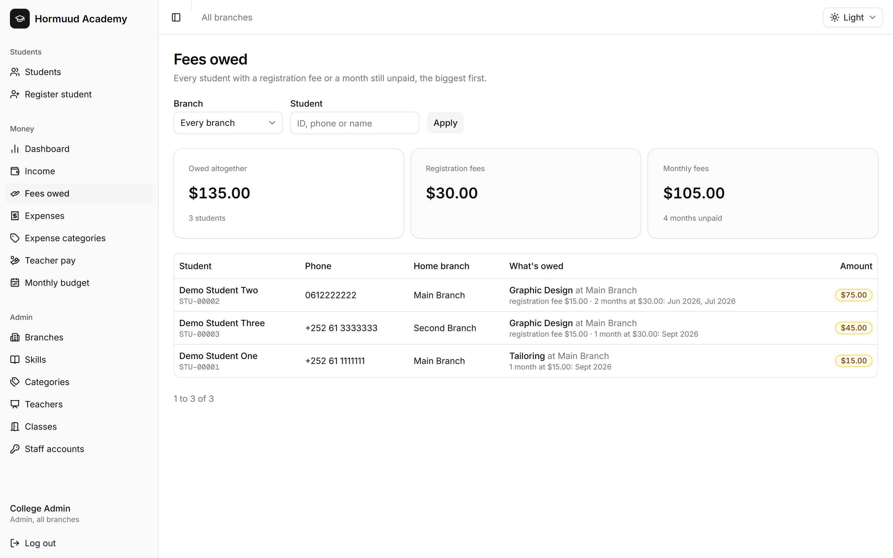

- What it is: everyone who still owes, biggest debt first
- Registration fees and unpaid months, per student, per skill
- A month only counts once it has started
- A dropped skill is not chased

Notes: Nothing here is stored. It is worked out from the enrollments and their
payments every time the page opens, so it is never stale.

---

## Slide 20. Expenses

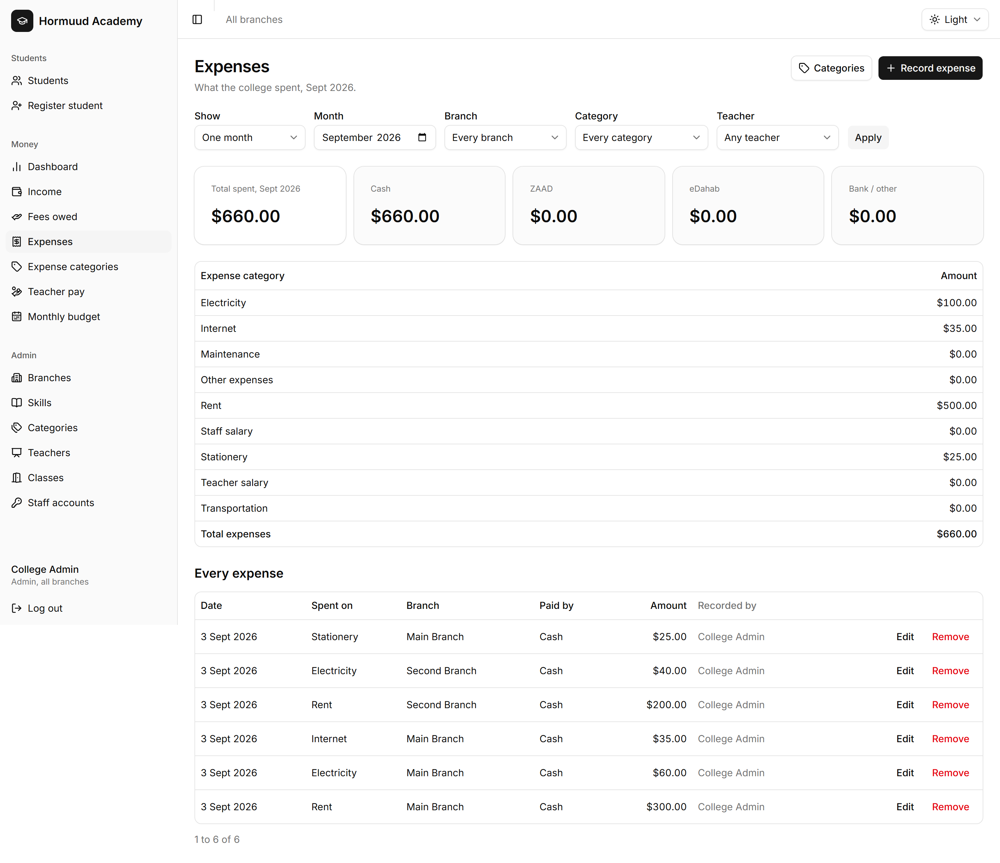

- What it is: everything the college spent, by day, branch and category
- Every expense names the branch it was spent for
- You can: record, edit and remove
- Branch staff can't see this page at all

Notes: The branch is not decoration. It is what lets you compare what a branch
costs to run against what it brings in. Removing an expense is for something
recorded by mistake, not for a refund.

---

## Slide 21. Expense categories

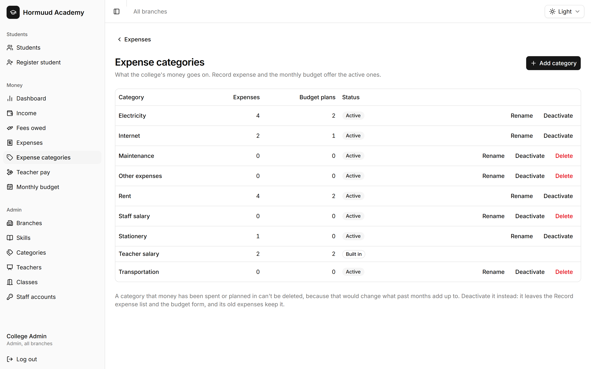

- What it is: the list of what money goes on. It is yours to keep
- You can: add, rename, deactivate
- You can't: delete one that an expense or a budget plan uses. Deactivate it
- Teacher salary is built in and can't be touched at all

Notes: A new kind of spending, say a security guard, is a category you add
yourself and can use the same minute. Deleting a used one is refused because it
would change what past months add up to.

---

## Slide 22. Teacher pay

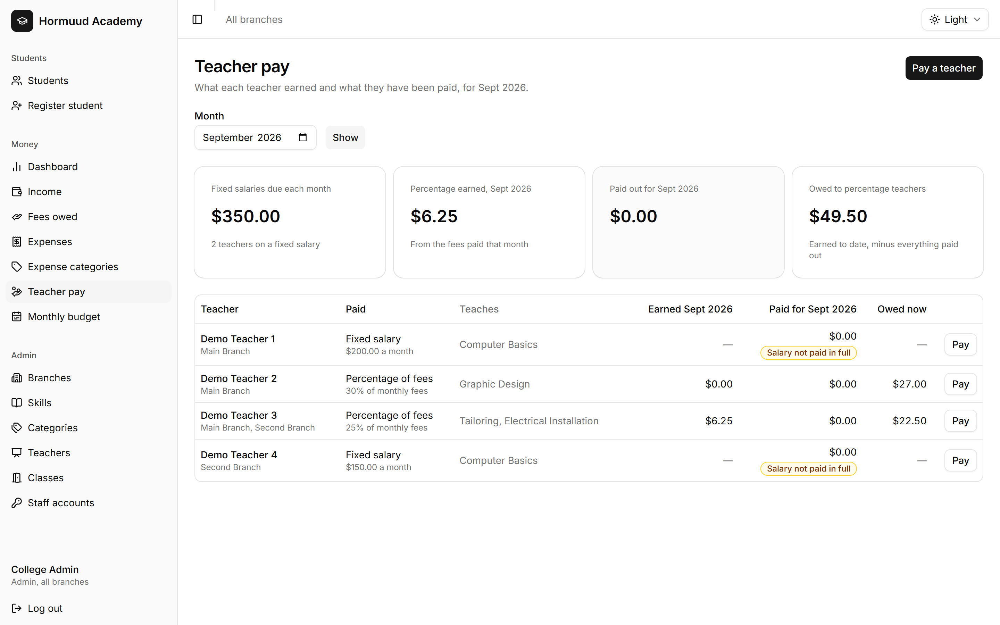

- What it is: what each teacher earned, what they were paid, their unpaid share
- Paying a teacher writes an ordinary Teacher salary expense
- The system refuses to overpay: never more than the unpaid share, never more
  than the month's salary
- Fixed teachers show a dash under Earned. Student payments never add to their
  pay

Notes: There is no separate payroll. The salary recorded here is the same
expense that appears in the month's spending. Their own page shows the rate
each share was worked out at, which answers most pay questions on the spot.

---

## Slide 23. Monthly budget

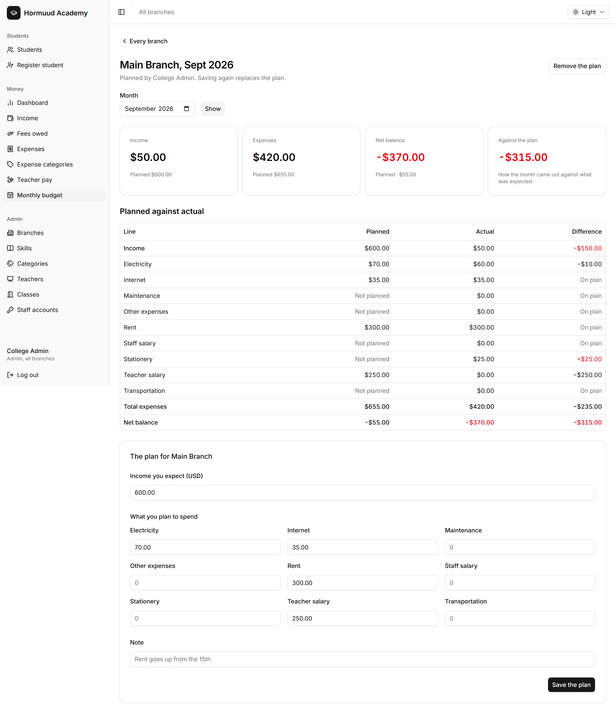

- What it is: one branch's plan for one month, next to what really happened
- Only the plan is saved. The real figures are counted as they stand
- One plan per branch per month. Saving again replaces it
- Spending on something you didn't plan for still shows, as Not planned

Notes: The plan is written on a branch's own page, not on the first screen.
Because the actuals are live, a payment recorded late lands in the comparison
at once, even for a month that is over.

---

## Slide 24. The dashboard


- What it is: the day and the month on one screen, for one branch or all
- The day: what came in by method, and the net balance
- The month: income, expenses, what percentage teachers earned, net balance
- Every block links to the screen behind it

Notes: This is the morning screen. Start here and click through to whatever
looks wrong.

---

## Slide 25. One rule that runs through every screen

- Deactivate: out of new use, history kept, reversible
- Delete: gone for good, allowed only while nothing uses it
- In practice, delete is for something you added a minute ago by mistake

Notes: Give them the sentence to remember. If the college ever used it,
deactivate it. That one habit prevents most of the damage an admin can do.

---

## Slide 26. What the system will refuse, and why

- Paying a teacher more than their unpaid share, or twice for one month
- Removing a payment after that teacher has been paid for the month
- Deleting a student who has paid a monthly fee
- Deleting a category, branch or teacher that has history
- An expense dated in the future, or an amount of zero

Notes: Every one of these protects a number somebody already relies on. When a
refusal appears, read it: each message names the thing in the way and what to
do instead.

---

## Slide 27. What only you can do

- Set up branches, skills, teachers, classes and staff accounts
- Lower or waive a registration fee
- Remove a payment from the books
- Everything about expenses, teacher pay, budgets and the dashboard
- Move a student to another home branch, or delete a duplicate

Notes: These are the decisions the college trusts to one person. Branch staff
can ask for any of them, but the record will say you did it.

---

## Slide 28. What you should do, and when

- Every day: check the dashboard, and count the till on Income at closing
- Every week: work the Fees owed list and the two yellow bars on the student
  list
- Every month: record the rent and the bills, pay the teachers, write next
  month's plan
- When a price or a teacher changes: change it, and trust that current students
  keep what they joined with

Notes: Give them this as the rhythm of the job. Most of what goes wrong is not
a wrong click, it is something nobody looked at for three weeks.

---

## Slide 29. What you shouldn't do

- Don't delete when you mean deactivate
- Don't remove a payment to fix an amount. Remove only what should not exist
- Don't record a fee from the Income screen. Fees belong on the student's page
- Don't share your login. The system records who did what, and it will say you

Notes: The third one matters more than it sounds. A fee typed in by hand
misses the skill, the month and the teacher's share, and nothing downstream
will add up.

---

## Slide 30. Now we do it live

- Log in together
- Register one real student
- Take one real payment
- Record one real expense

Notes: Close the slides here. Everything from now on happens on the system with
them driving and you watching, which is where the steps actually stick. The
written steps are in the guides if they want to read ahead.
