# Admin training: Hormuud Academy system

Slides for training the admin on the whole system. Every slide has a title, the
lines to show, and notes for whoever is teaching. The notes are what you say
out loud; the bullets are what the trainee reads.

How to read this file:

- `---` separates one slide from the next.
- `## Slide n. Title` is the slide title.
- Bullets are the slide's content. Keep them on the slide.
- `Notes:` is the trainer's script. It doesn't go on the slide.
- `Do this now:` marks a slide where the trainee works on the system themselves.
- An image line is the screenshot for that slide. They live in `docs/training/`,
  at 2880 pixels wide, taken from the app in light theme with demo data, so no
  real student's name or phone number is on a slide. Where the caption says to
  crop, crop.

The deck runs about three hours with the exercises. Part 3 onwards needs a
working login and a branch to practise on.

---

## Slide 1. Hormuud Academy system

- Admin training
- One college, several branches, one system

Notes: Welcome them. Say what the session covers: everything an admin does,
from setting up a branch to paying a teacher and planning a month. Tell them
they will use the system themselves, not just watch. Ask them to log in now so
any problem surfaces early.

---

## Slide 2. What you will be able to do by the end

- Set up a branch, a class, a teacher and a skill from nothing
- Register a student and record every kind of payment
- Record what the college spends and pay teachers
- Plan a month and check how it went
- Fix mistakes safely, and know which ones can't be undone

Notes: Read the list. Point out the last line. The system deliberately refuses
some things, and a good admin knows which, because the alternative is a wrong
number in the books that nobody can trace later.

---

## Slide 3. How the session runs

- Part 1: what the system is
- Part 2: getting in and finding your way
- Part 3: setting up the college
- Part 4: students
- Part 5: money coming in
- Part 6: money going out
- Part 7: the budget and the dashboard
- Part 8: practice

Notes: Say roughly how long each part takes. Tell them to interrupt with
questions rather than saving them, because each part builds on the one before.

---

## Slide 4. Part 1. What the system is

Notes: Section divider. This part is background. It takes about twenty minutes
and everything afterwards depends on it, so don't rush it.

---

## Slide 5. One college, several branches

- Hormuud Academy is one college. There is no second one
- A branch is one location, often in its own city
- Branches, teachers, classes and staff belong to a branch
- Skills and students belong to the whole college

Notes: This split matters. A student registered at Main Branch can take a skill
at another branch without a second record. A teacher works at one or more
branches. A class is a room at one branch and never moves.

---

## Slide 6. The word "class" means a room

- Class = a room, like Room 3 or Computer Lab
- Not a group of students
- Every screen uses it that way

Notes: Say this plainly, because most colleges use "class" the other way round.
When the system asks for a class it wants the room the skill is taught in.

---

## Slide 7. The chain that holds everything together

```
Skill            Graphic Design: 4 months, $15 to register, $30 a month
│                one for the whole college
└─ Branch skill  Graphic Design at Main Branch
   │             Teacher, room, 4 months, $15, $30
   └─ Enrollment STU-00003 started 19 Aug 2026, Active
```

Notes: Walk down the chain slowly. A skill is described once for the college. A
branch that teaches it gets a branch skill with its own teacher, room, duration
and prices. When a student starts, the system makes an enrollment that ties the
student to that branch skill. Almost every question later comes back to these
three levels.

---

## Slide 8. Why prices sit on the branch, not the skill

- A branch in a poorer city charges less
- Each branch skill has its own duration, registration fee and monthly fee
- The skill's own figures are only the defaults a new branch starts from
- Changing a default touches no branch already teaching it

Notes: Give the example: $5 a month in a small town for what costs $10 in the
capital. Then the second half, which catches people out. Editing the skill's
default price does not change what any branch currently charges.

---

## Slide 9. What a student keeps from the day they joined

- An enrollment copies the fees and the duration on the start date
- A later price change never touches a student already taking the skill
- New students get the new price

Notes: This is the fairness rule. A student who joined at $30 keeps $30 for the
whole skill. Tell them they will see the same idea again with teacher rates.

---

## Slide 10. Money in: every dollar is a payment

```
Enrollment   STU-00003, Graphic Design at Main Branch, $30 a month
├─ Payment   Registration fee   $15   ZAAD     19 Aug 2026
├─ Payment   Aug 2026           $30   Cash      5 Sept 2026
└─ Payment   Sept 2026          $30   eDahab    4 Sept 2026
```

- Every payment says what it was for, which branch took it, how it was paid

Notes: Point at the middle row. August's fee was paid in September. The payment
belongs to August because that is the month it pays for, and it lands in the
September takings because that is when the money arrived. Both are true at
once, and the system keeps them apart on purpose.

---

## Slide 11. The fee month

- A monthly fee names the month it pays for
- September stays paid whether it was settled in August or November
- A skill has as many fee months as it lasts months
- Four months starting in April means April, May, June, July

Notes: Do the April example on the board. A student joining 19 April with a
four month skill owes April to July. The end date, 19 August, falls in the
month after the last one taught, so August is never owed. Nobody is ever chased
for a month that hasn't started.

---

## Slide 12. Money out: every dollar is an expense

- Rent, electricity, stationery, salaries
- Every expense names the branch it was spent for
- A teacher's pay is an expense too, in the Teacher salary category

Notes: The branch is not decoration. It is what lets you compare what a branch
costs to run against what it brings in. Part 6 covers all of this.

---

## Slide 13. Nothing stores a total

- A day's takings, a month's spending, a teacher's earnings: all counted from
  the records every time a screen opens
- Record something late and every screen shows it at once
- The books and the receipts can't drift apart

Notes: Reassure them. There is no month-end close, no button that locks a
period, no total to correct by hand. If a figure looks wrong, the payment or
expense behind it is wrong, and fixing that fixes every screen.

---

## Slide 14. Two kinds of people log in

- Admin: every branch, sets everything up, sees all the money
- Branch staff: one branch, registers students, takes payments there
- Nobody signs up on their own. The admin creates every account

Notes: They are the admin. Everything in this training is theirs to do. Branch
staff see a much smaller system, which the next slide shows.

---

## Slide 15. What branch staff cannot see

- Expenses
- Teacher pay
- The monthly budget
- The financial dashboard
- Expense categories

Notes: This is deliberate. A branch shouldn't be able to read what the college
pays its rent or its people. The pages are missing from their menu and blocked
on the server, so typing the address in by hand gets them nowhere. Branch staff
do get Income and Fees owed for their own branch, because they take the money
at the counter.

---

## Slide 16. Part 2. Getting in and finding your way

Notes: Section divider. Short part, about ten minutes, but do it on the screen
rather than on slides where you can.

---

## Slide 17. Logging in

- Go to the college's address
- Press Sign in with Google
- Pick the Google account whose address is on your staff account

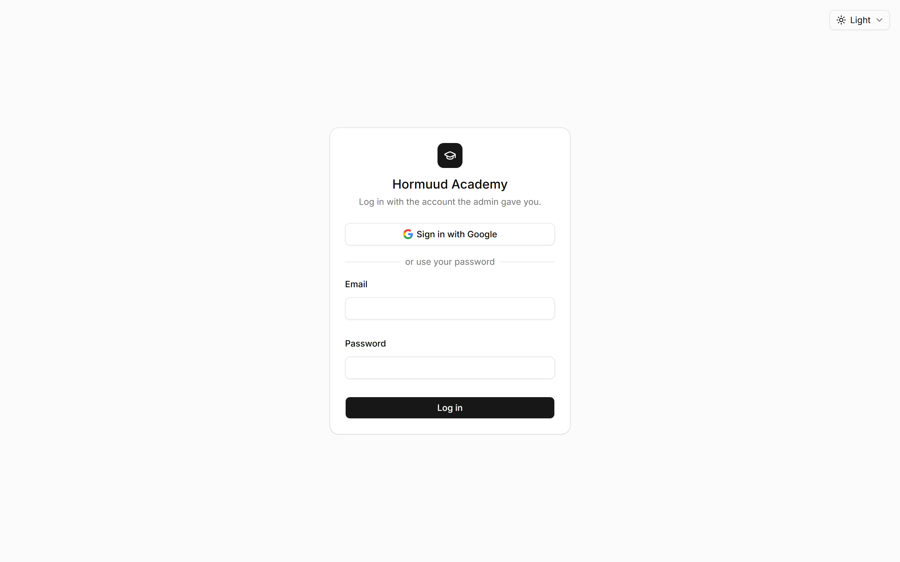

Notes: There is no sign-up. If Google says the account is unknown to the system
the message is "There's no account for that Google address", which means the
admin never added that address. A deactivated account says so too. An email and
password form still sits below the Google button until the switch-over is
finished.

---

## Slide 18. The screen, left to right

- Sidebar on the left: your menu
- Header at the top: "All branches" for an admin
- The button on the left of the header hides the sidebar
- Your name, role and branch sit at the bottom of the sidebar, with Log out

Notes: Walk the real screen while you say this. Point out that a branch staff
member would see their branch's name in the header instead of "All branches".

---

## Slide 19. Your menu as an admin

- Students: Students, Register student
- Money: Dashboard, Income, Fees owed, Expenses, Expense categories, Teacher
  pay, Monthly budget
- Admin: Branches, Skills, Categories, Teachers, Classes, Staff accounts


Notes: Three groups. Students is what everybody has. Money and Admin are yours
alone. Say that the order of the training follows Admin first, then Students,
then Money, because that is the order things have to exist in.

---

## Slide 20. Working on a phone

- The sidebar folds away. Open it with the button at the top left
- Tables are wider than a phone, so the last columns sit off the side
- Tap a row and a pop-up lists everything in it, with that row's buttons
- Tapping a link inside a row still opens that page

Notes: Show it if you have a phone to hand. The row pop-up works on a computer
too, and it is often quicker than reading across a wide table.

---

## Slide 21. After every change

- A short message appears at the top of the screen
- It names what happened: "Rent: $300.00 recorded"
- A refusal appears the same way, or on the field that caused it

Notes: Teach them to read these. Every message in this system names the thing
it changed, so the message is a receipt for what you just did.

---

## Slide 22. Part 3. Setting up the college

Notes: Section divider. The longest part. If the college is already set up,
practise on a test branch rather than skipping it, because everything in Part 4
and Part 5 depends on understanding this.

---

## Slide 23. The order matters

1. Categories
2. Branches
3. Classes
4. Teachers
5. Skills
6. Add each skill to the branches that teach it
7. Staff accounts

Notes: Each step needs the one before it. A class needs a branch. A teacher
needs at least one branch. A skill goes to a branch only once that branch has a
teacher and a room to give it. Staff accounts come last because staff can't do
anything until there are skills to enroll students in.

---

## Slide 24. Every setup screen looks the same

- A table of what exists
- Add at the top right
- Buttons on each row
- Deactivate takes something out of new use and keeps its history
- Delete appears only while nothing uses the record yet

Notes: Learn the pattern once and all six screens are familiar. Stress the
difference between Deactivate and Delete now, because it comes up on every
screen and getting it wrong is the most common mistake.

---

## Slide 25. Deactivate against delete

- Deactivate: gone from new forms, history kept, reversible
- Delete: gone for good, allowed only while nothing uses it
- In practice, Delete is for something you added a minute ago by mistake

Notes: Say it in one sentence they will remember. If the college ever used it,
deactivate it. Delete is for typing mistakes.

---

## Slide 26. Categories

- A category groups skills: Technology Skills, Hand Skills
- Technology Skills and Hand Skills already exist
- Add, rename, deactivate, delete
- A deactivated category can't be picked for new skills. Existing skills carry
  on

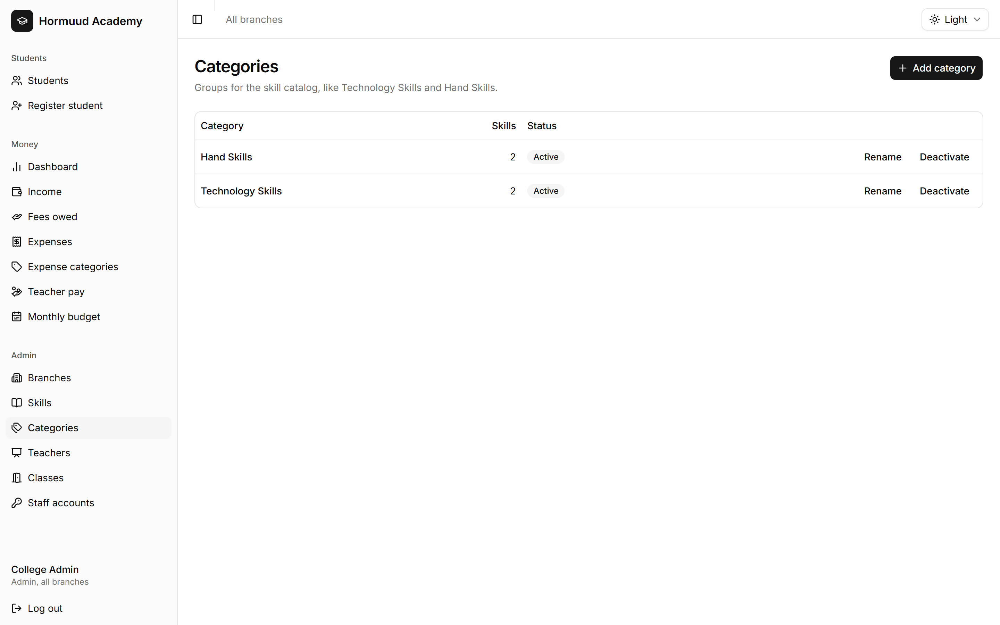

Notes: Keep the list short. Categories exist to group the skill list, nothing
more. No money hangs off them.

---

## Slide 27. Branches

- Name, phone, address
- The table shows how many students registered there and how many skills it
  teaches
- Deactivating a branch removes it from every form: new classes, teacher
  branches, staff accounts, registration, adding skills
- Its old records stay


Notes: A branch is the anchor for classes, teachers, staff, enrollments,
payments and expenses. Deactivating is how a branch closes. The last slide of
Part 8 walks through closing one properly.

---

## Slide 28. Do this now: add a branch

- Admin, Branches, Add branch
- Name it "Training Branch"
- Add a phone in the +252 box and an address

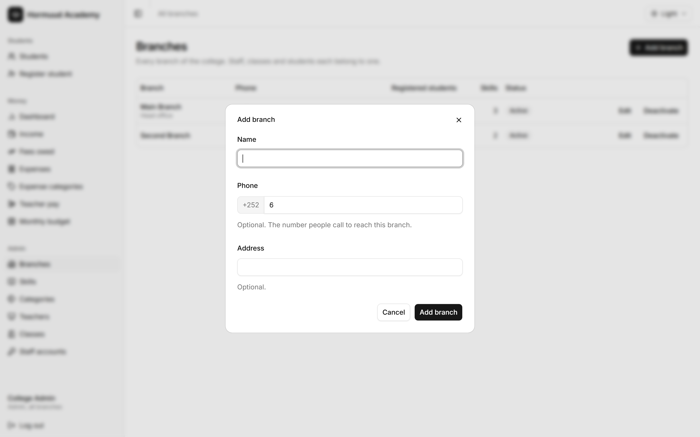

Notes: Let everybody do it. Watch the phone field, which the next slide
explains. Leave the branch in place, because the rest of the exercises use it.

---

## Slide 29. Phone numbers

- Every number is a Somali mobile: +252, then nine digits
- The +252 sits in its own grey box. You type the nine digits next to it
- The box starts with a 6 because most numbers do. Type over it for 77 or 90
- Screens print the whole number back as +252 61 1111111

Notes: Point out that a box holding nothing but that starting 6 counts as
empty, so a field you didn't fill in is not treated as a broken number. The
form takes a pasted 0611111111 or +252 61 1111111 and tidies it up for you.

---

## Slide 30. Classes are rooms

- Pick the branch, type a name: Room 3, Computer Lab
- You can rename a class. You can't move it to another branch
- A deactivated class can't be picked for new skills. Skills already there keep
  it
- The table shows each room's skills and who teaches them


Notes: The reason a class can't move branch is that skills at the old branch
may already use it. If a room really moves, make a new one at the other branch
and change the skills over.

---

## Slide 31. Teachers

- Name, optional phone, and at least one branch
- One teacher can work at several branches
- The table shows every skill each teacher teaches, and where


Notes: A teacher is a person, not a login. They never sign into the system. If
a teacher also needs an account, that is a separate staff account.

---

## Slide 32. How a teacher is paid

- Fixed salary: the same amount every month
- Percentage: a share of every monthly fee their students pay
- Never both
- The percentage is written as a percentage: 30 means 30%

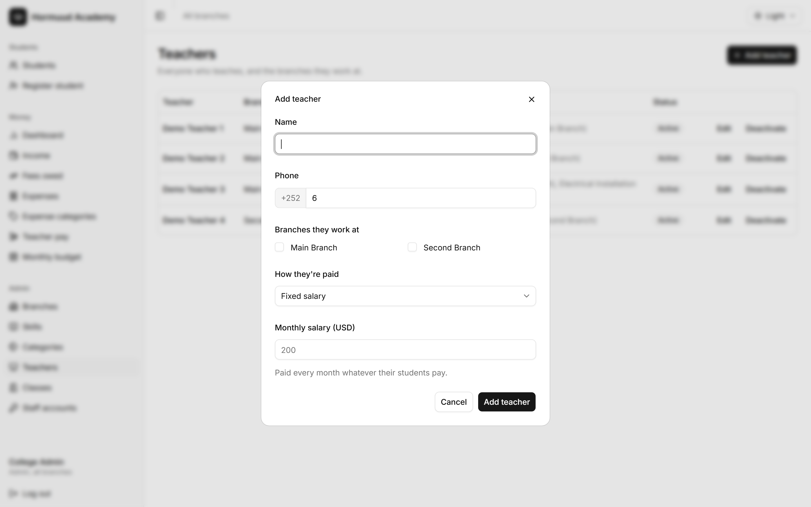

Notes: Set this on the teacher. It drives the whole Teacher pay screen in Part
6. Say that changing a rate later affects only fees paid from that day on, and
never rewrites what a teacher has already earned.

---

## Slide 33. What the system won't let you do to a teacher

- You can't untick a branch where they still teach a skill
- You can't deactivate a teacher who still runs an active skill
- Give the skill another teacher first

Notes: Both refusals exist so a skill is never left with nobody teaching it.
The message tells you which skill is in the way.

---

## Slide 34. Do this now: add a teacher

- Admin, Teachers, Add teacher
- Tick Training Branch
- Set them to a fixed salary of 300

Notes: Everyone will pay this teacher later in Part 6, so make sure the salary
is set. A fixed teacher with no salary can't be paid at all, which is a useful
error to meet later but not right now.

---

## Slide 35. Skills

- The Skills page lists every skill with its category, duration, fees, the
  branches that teach it and how many students take it now
- Add skill creates one, with a name, category, duration, registration fee and
  monthly fee
- Click a skill's name to open its page

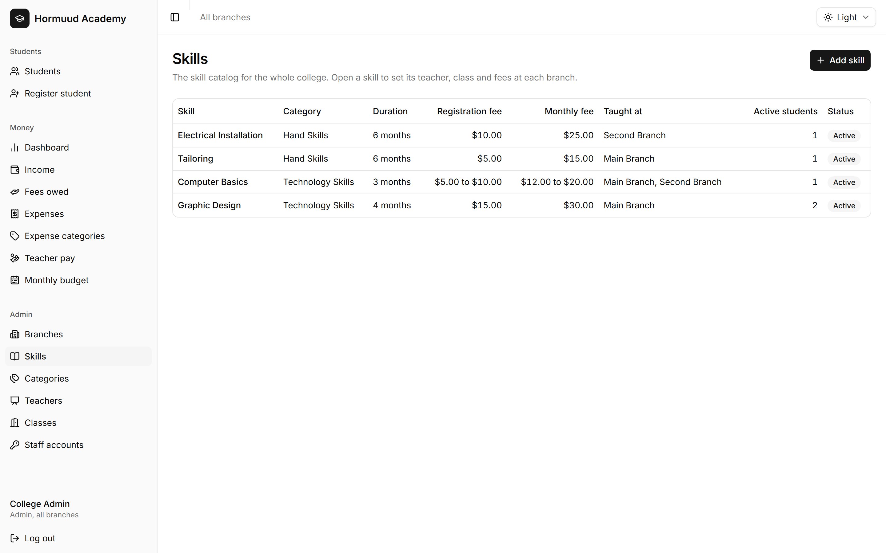

Notes: Stress that adding a skill teaches it to nobody. Until it is added to a
branch, no student can take it. That is the next slide, and it is the step
people forget.

---

## Slide 36. A skill's own page

- Edit skill: name, category, default duration and fees
- Deactivate: nobody new can take it anywhere. Current students keep it
- Delete: only while no branch teaches it
- Add to a branch: the important one


Notes: Remind them that editing the defaults only fills in branches added
afterwards. A branch already teaching the skill keeps its own figures until you
change that branch's row.

---

## Slide 37. Adding a skill to a branch

- Pick the branch first
- The teacher and class lists then show only that branch's
- Duration and fees start at the skill's defaults. Change them if this branch
  charges differently
- Registration fee: what each student pays once to start. Enter 0 for none

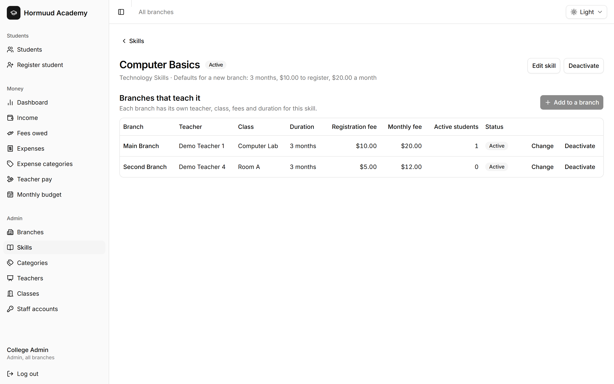

Notes: Pick the branch first, because the other lists depend on it. This is the
moment the branch skill is created, the middle level of the chain from Part 1.

---

## Slide 38. Changing a branch's row later

- Change: teacher, class, duration or fees
- A new fee or duration applies only to students who join afterwards
- Deactivate: that branch stops taking new students, current ones continue
- Remove: only if no student ever took it there

Notes: Same rule as everywhere. Prices move forward, never backward. This is
how a branch stops teaching something without disturbing the students in the
middle of it.

---

## Slide 39. Do this now: a skill from nothing to teachable

- Admin, Skills, Add skill: "Training Skill", 4 months, $10 to register, $20 a
  month
- Open it, Add to a branch, pick Training Branch
- Pick your teacher and a class

Notes: This is the whole setup chain in one exercise. When they finish, the
skill can be taken by a student at that branch, which Part 4 does.

---

## Slide 40. Staff accounts

- Name, Gmail address, role, and for branch staff their branch
- No password and no email is sent. Tell the person yourself
- Signs in with shows Google, or "Google, not signed in yet"
- Accounts can't be deleted, because students and payments record who created
  them


Notes: The Gmail address is the login. Getting it wrong means that person
cannot get in, so read it back to them.

---

## Slide 41. Changing and stopping a staff account

- Edit: name, address, role, branch
- Changing the address logs them out and removes the old Google link
- Deactivate: logs them out everywhere and blocks the login. Their records stay
- You can't change your own role or deactivate yourself

Notes: The last line stops the college being left without an admin. When
somebody leaves, deactivate. The students they registered keep their name as
the person who registered them.

---

## Slide 42. Part 4. Students

Notes: Section divider. About thirty minutes. Do the registration exercise
properly, because everything about money hangs off an enrollment.

---

## Slide 43. The student list

- Newest first, 25 to a page
- Photo, name, ID, sex, phone, home branch, current skills, Active or Inactive
- A yellow Fee unpaid badge means a registration fee is still owed


Notes: Point out the ID. Numbers run from STU-00001 upward across the whole
college and are never reused. They can skip a number, which is normal.

---

## Slide 44. Finding a student

- Type a name for names
- Type STU-00042, stu42 or just 42 for an ID
- Type six or more digits for a phone

Notes: A phone search ignores the country code and the leading zero and matches
the end of the number, so 0611111111, 611111111 and +252 61 1111111 all find
the same person. An ID or phone search reaches every branch, which is how one
branch finds a student who registered somewhere else.

---

## Slide 45. Narrowing the list

- Status: All, Active or Inactive, across the whole college
- Taking skill: only students with that skill Active
- Past end date: an Active skill whose end date has gone by
- Registration fee unpaid

Notes: Two yellow bars can appear above the list, one counting unpaid
registration fees and one counting skills past their end date. Show those
students on either bar applies that filter in one click.

---

## Slide 46. Active and inactive students

- A student is Active if they have at least one Active skill anywhere
- Nobody sets this by hand
- Drop or finish their last skill and they become Inactive by themselves
- Add a skill and they are Active again

Notes: There is no on/off switch on a student, on purpose. The way to take
somebody out of their classes is to drop the skill, which leaves a record of
why.

---

## Slide 47. Registering a student: the student half

- Home branch. As an admin you pick it
- Full name and sex are required
- A phone, or the responsible person's phone. At least one
- Registration date, today by default, never in the future
- Photo, optional, up to 5 MB


Notes: The responsible person is who the college calls about the student. For a
student coming across from the old system, set their original registration
date, not today.

---

## Slide 48. The shared phone warning

- Leave a phone field and the app checks whether another student has it
- A yellow warning appears with a link to that student
- It is only a warning. You can still save

Notes: Families share one phone all the time. Check the link to make sure it
isn't the same person registering twice, then carry on.

---

## Slide 49. Registering a student: the skills half

- Start date, today by default. Every skill you tick starts that day
- The list shows the skills open at that branch, with teacher, room, fees and
  duration
- Tick at least one

Notes: A student must start with at least one skill. The list only shows that
branch's skills, which is why a branch with no skills set up can't register
anybody.

---

## Slide 50. Recording the registration fee during registration

- Registration fee paid appears once you tick a skill that has one
- It shows the total, and each skill's share when there is more than one
- Tick it only if they paid now, then pick Cash, ZAAD, eDahab or Bank / other
- The fee is recorded as paid on the registration date

Notes: The tick clears itself whenever you change the skills, so you always
confirm the final amount. Leaving it unticked is normal: the student then shows
a yellow Fee unpaid badge until somebody records the payment.

---

## Slide 51. Do this now: register a student

- Register student, home branch Training Branch
- Name, sex, one phone
- Tick Training Skill
- Leave the registration fee unticked

Notes: Leaving the fee unpaid on purpose gives everybody something to collect
in Part 5. When they save, the app opens the student's page, which is the next
slide.

---

## Slide 52. A student's page, top to bottom

- Photo, name, ID, Active or Inactive, and what they owe
- Buttons: Edit details, Add skill, Delete
- Details: sex, phones, home branch, registration date, who registered them
- Skills: one row per enrollment
- Monthly fees: one panel per skill


Notes: This page is where most day-to-day work happens. Give them a minute to
look at their own student's page before you carry on.

---

## Slide 53. The skills table

- Branch, teacher, class, start and end dates, both fees, status
- Status is Active, Finished or Dropped
- Mark finished when they complete it
- Drop when they stop coming before finishing
- Set active undoes a mistake

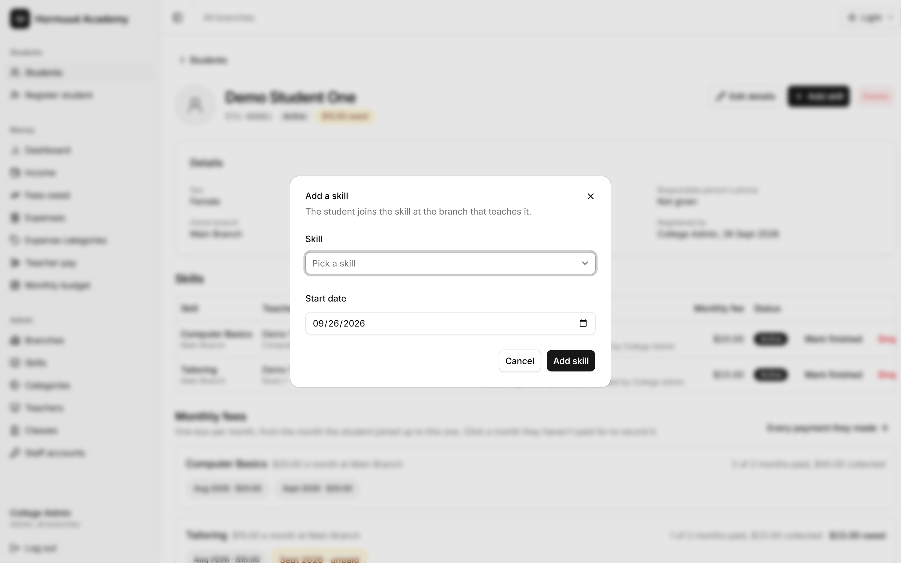

Notes: Drop and Set active both ask for confirmation. Set active is refused if
the student is already taking that skill again, which stops two live
enrollments for the same thing.

---

## Slide 54. The end date is a guide

- Start date plus the skill's duration, as it was on the day they joined
- It never finishes an enrollment by itself
- A skill past its end date waits for a human decision

Notes: Students sometimes need an extra month, so the system refuses to guess.
The yellow bar on the student list is how you find the ones waiting, and you
either mark them finished or leave them running.

---

## Slide 55. The registration fee column

- The amount with a yellow Unpaid badge, or
- The amount with the day it was paid, how, and who recorded it, or
- Nothing to pay

Notes: Nothing to pay means the branch skill has no registration fee, or an
admin waived this student's. The buttons on the row appear only while the fee
is unpaid.

---

## Slide 56. Waiving or lowering a registration fee

- Change fee, admins only, only while it's unpaid
- Enter a lower amount, or 0 to waive it
- It changes this one student's fee for this one skill

Notes: Branch staff can't do this, so a discount stays the admin's decision.
Once the fee is paid the button is gone. To change a paid fee you remove the
payment first, which Part 5 covers.

---

## Slide 57. The monthly fees panel

- One panel per skill, one box per month
- From the month they joined to this month, stopping at the skill's last month
- Grey box: paid. Hover to see when, how and who recorded it
- Yellow box: still owed. Click it to record that month


Notes: Nobody owes for a month that hasn't happened, and a student who dropped
in March is not chased for April. The panel heading counts the months paid,
what has come in and what is still out.

---

## Slide 58. Deleting a student, and why you usually shouldn't

- Delete is for duplicates and typing mistakes only
- It removes the student, every skill record and every payment, for good
- It changes income already recorded for those days
- It is refused outright for a student who has paid a monthly fee

Notes: The right way to take a student out of their classes is to drop their
skills. They show as Inactive and the history stays. Deleting is refused after
a monthly fee because the money is in the books and a percentage teacher may
already have been paid a share of it.

---

## Slide 59. Part 5. Money coming in

Notes: Section divider. About thirty minutes. Everything here is money the
college receives.

---

## Slide 60. The five income categories

- Registration fee
- Monthly fee
- Books
- Examination fee
- Other income

Notes: The first two always belong to one enrollment and are recorded on the
student's page. The other three are typed in on the Income screen. That split
is the whole logic of where you go to record something.

---

## Slide 61. Where each payment is recorded

- Registration fee: the student's page, Record payment
- Monthly fee: the student's page, the yellow month box
- Books, examination fee, other income: Income, Record income

Notes: Fees are recorded on the student's page because the amount, the skill
and the teacher's share are already known there. Typing them in by hand
somewhere else would invite a wrong figure.

---

## Slide 62. Recording a registration fee later

- Open the student, Record payment on that skill's row
- Pick the day they paid, today by default, never in the future
- Pick Cash, ZAAD, eDahab or Bank / other
- The amount is already the full fee. Lower it if the student can only pay part

Notes: The method is asked for because this writes a real payment into the
books, and the end-of-day count is split by method. Whatever amount you record
settles the fee, and no balance is kept. It can't be zero or more than the
fee.

---

## Slide 63. Recording a month

- Click the yellow box for that month
- The amount is already the fee they joined at
- Lower it for a discount if you have to
- Pick the day and the method

Notes: Whatever you record settles that month. A month is paid in full or not
at all, so there are no part payments. If a percentage teacher teaches that
skill, their share is worked out and attached at that moment.

---

## Slide 64. Three months at once

- Record each month separately, all with the same date
- The books show three payments on one day
- The student's page shows three months settled

Notes: This comes up constantly. There is no "pay three months" button, and
recording them one by one is what keeps each month traceable.

---

## Slide 65. Do this now: collect from your student

- Open your student
- Record the registration fee, paid today, Cash
- Record this month's fee, ZAAD

Notes: Watch for the badge at the top of the page changing as they go. Ask them
what the day's income should now be, and check it on the Income screen
together.

---

## Slide 66. The income screen

- Filter by period, branch, category, method, student, and teacher
- Total income at the top, then Cash, ZAAD, eDahab and Bank / other
- One row per income category with the total
- Then every payment, newest first, 25 to a page


Notes: The period picker is One day, One month or Everything, and it opens on
today. The choice travels in the address, so a filtered view can be bookmarked
or sent to somebody.

---

## Slide 67. Counting the till

- Open Income. It is already on today
- The four figures across the top are the cash, ZAAD, eDahab and bank taken

Notes: This is the end-of-day routine. Show it once and they will use it every
evening.

---

## Slide 68. Record income, for what isn't a fee

- Books, Examination fee, Other income
- Amount, method, day, branch, a note
- A student ID like STU-00042 is optional, and links it to that student

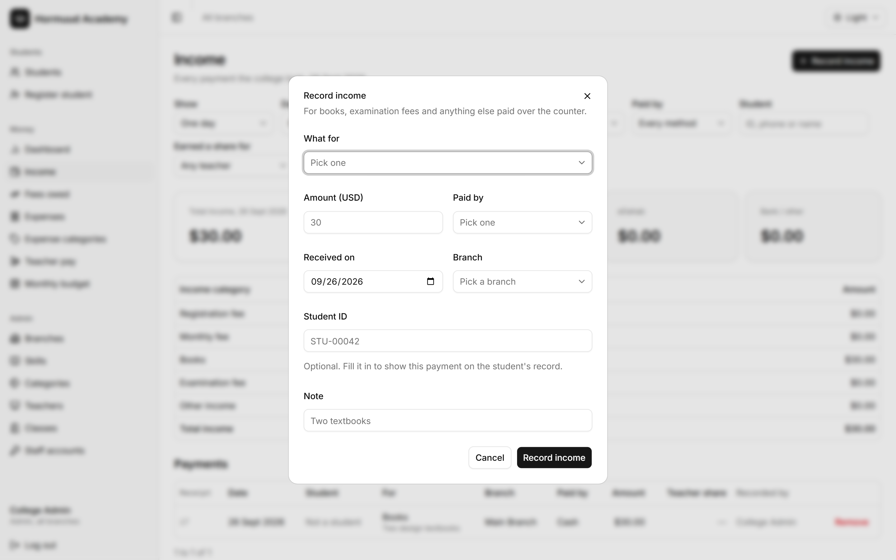

Notes: Selling a textbook over the counter is the usual case. Registration and
monthly fees are missing from this list on purpose, as the earlier slide
explained.

---

## Slide 69. Removing a payment

- Admins only, on the Income screen, after confirming
- For money recorded by mistake, nothing else
- The day's income changes, the month goes back to unpaid, any teacher's share
  comes back out

Notes: To correct a registration fee that has already been paid, remove the
payment first, then change the fee. There is one case where removal is refused,
which is the next slide.

---

## Slide 70. When a payment can't be removed

- A monthly fee that earned a percentage teacher a share
- And that teacher has already been paid for the month it was taken in
- The message names the teacher and the month

Notes: Teachers are paid at the end of the month. Once the share has gone out,
the college does not take it back. If you genuinely must remove it, remove the
teacher's salary expense first, then the payment, then record the salary again.

---

## Slide 71. Fees owed

- Everyone who still owes, biggest debt first
- What is owed altogether, by how many students, split into registration fees
  and monthly fees
- Each row lists the skill and what they are behind on
- Click a name to go and record it


Notes: A month only counts once it has started, and a dropped skill stops being
chased. Nothing here is stored. It is worked out from the enrollments and their
payments each time the page opens.

---

## Slide 72. Part 6. Money going out

Notes: Section divider. About thirty minutes. This is the part branch staff
never see.

---

## Slide 73. What an expense is

- Money the college spent
- The day it went out, the branch it was spent for, the category, the method,
  the amount
- Rent, electricity, stationery, salaries

Notes: The branch is what lets you compare a branch's costs with its income. If
a cost is genuinely shared, book it to the branch it mostly serves and keep
doing it the same way every month.

---

## Slide 74. Recording an expense

- Expenses, Record expense
- Category, amount, method, the day it was paid, the branch, a note
- The day can't be in the future
- The amount must be above zero

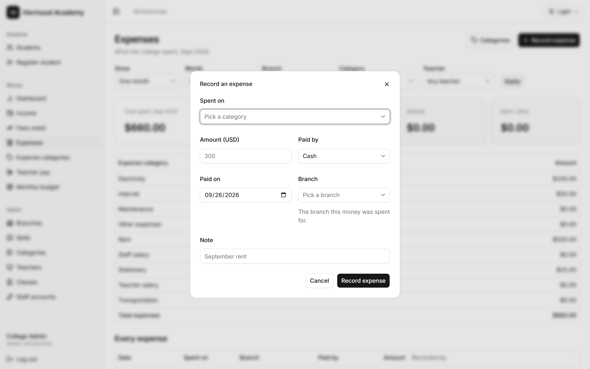

Notes: Walk the fields on screen. The day matters, not when you typed it: an
expense paid Friday and entered Saturday belongs to Friday. The note is where
"September rent" goes.

---

## Slide 75. Reading the expenses screen

- Period, branch, category and teacher filters
- Total spent, then Cash, ZAAD, eDahab and Bank / other
- One row per category with its total
- Then every expense, newest first, 25 to a page


Notes: One difference worth knowing. Expenses opens on this month, while Income
opens on today, because spending is read a month at a time far more often.

---

## Slide 76. Expense categories

- The admin keeps the list: Rent, Electricity, Internet and the rest
- Add, rename, deactivate, activate
- Delete only while no expense and no budget plan uses it
- Names are unique, ignoring capitals


Notes: Nine categories exist from the start. A new kind of spending, say a
security guard, is a new category you add yourself and can use immediately.

---

## Slide 77. Teacher salary is fixed

- Marked Built in, with no buttons
- It can't be renamed, deactivated or deleted
- Teacher pay is recorded in it, and the pay screens find it by name

Notes: Every other category is yours. This one row the system relies on.

---

## Slide 78. Why a used category can only be deactivated

- Deleting it would change what past months add up to
- Deactivating takes it out of Record expense and the budget form
- Its old expenses keep it, and the reports still count them

Notes: A deactivated category still appears in the category filter marked
"(inactive)", so you can always find what was spent on it.

---

## Slide 79. Do this now: record two expenses

- Expenses, Record expense: Rent, 300, Cash, today, Training Branch, note
  "training rent"
- Add a category called Security, then record 50 against it

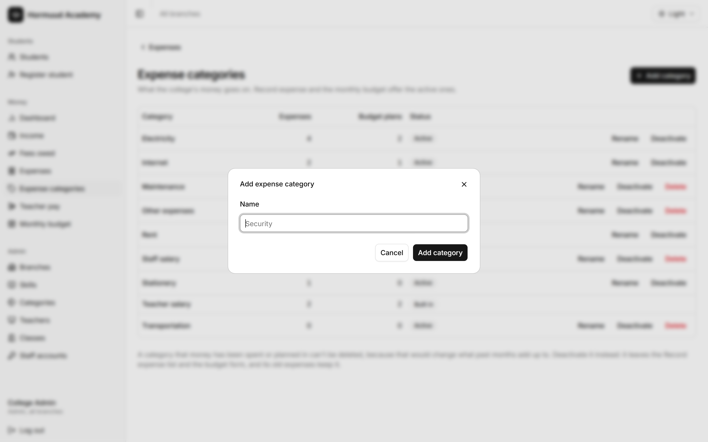

Notes: The new category is usable straight away in Record expense and in the
budget form. Have them find both expenses with the category filter afterwards.

---

## Slide 80. Teacher pay

- Pick a month at the top
- Fixed salaries due, what percentage teachers earned that month, what was paid
  out, and the unpaid teacher shares
- One row per teacher with how they are paid and what they teach
- A fixed teacher paid less than their salary gets a yellow badge


Notes: Fixed teachers show a dash under Earned and Unpaid share, because
student payments never add to their pay. Only percentage teachers build up an
unpaid share. It is money the college still has to hand over, never money the
teacher owes the college.

---

## Slide 81. Paying a teacher

- Pay on their row fills in the teacher, the month and the amount
- A percentage teacher comes up at their unpaid share
- A fixed teacher comes up at their monthly salary
- It saves as an ordinary Teacher salary expense

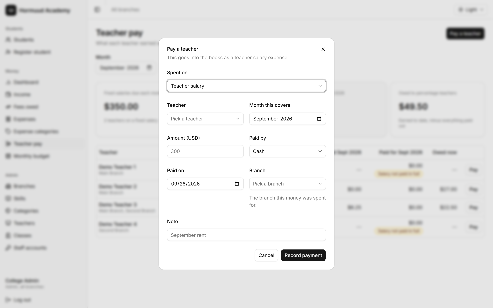

Notes: That last line matters. There is no separate payroll. The salary you
record here is the same expense you will find on the Expenses page, counted in
the month's spending like any other cost.

---

## Slide 82. The system won't overpay a teacher

- A percentage teacher: never more than their unpaid share
- A fixed teacher: never more than their salary for that month, counting
  everything already paid for it
- A fixed teacher with no salary set can't be paid at all
- Editing a saved salary is checked the same way

Notes: Two half payments for one month are fine. A second full salary is
refused, with a message saying how much is left to pay. This is the guard
against paying somebody twice in a busy month.

---

## Slide 83. A teacher's own page

- What they have earned in total, been paid, and their unpaid share
- Which branches the earnings came from
- The last 100 payments that earned them a share, with student, skill, month
  and rate
- Every payment the college has made to them

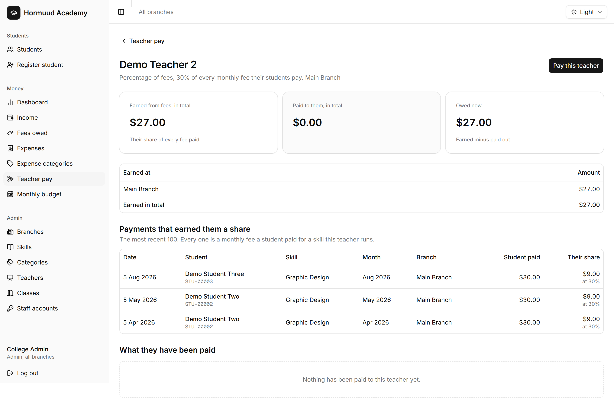

Notes: This is the page to open when a teacher questions their pay. It shows
the rate each share was worked out at, which answers most disputes on the spot.

---

## Slide 84. Do this now: pay your teacher

- Teacher pay, pick this month, Pay on your teacher's row
- Accept the amount and save
- Then find the same payment on the Expenses page

Notes: The point of the second step is to see that it is one record, not two.
Ask them what would happen if they tried to pay the same salary again, then let
them try it and read the refusal.

---

## Slide 85. Part 7. The budget and the dashboard

Notes: Section divider. About twenty minutes.

---

## Slide 86. What a monthly budget is

- One branch's plan for one month
- The income it expects, and what it means to spend on each category
- Written before the month is spent
- Only the plan is saved. The real figures are counted as they stand

Notes: Because the actuals are counted live, a payment or expense recorded late
appears in the comparison at once, even for a month that is over.

---

## Slide 87. The first budget screen

- Pick a month
- One row per branch: income planned and actual, expenses planned and actual,
  net balance
- The whole college on the last row
- A branch with no plan says No plan yet, and still shows its real figures

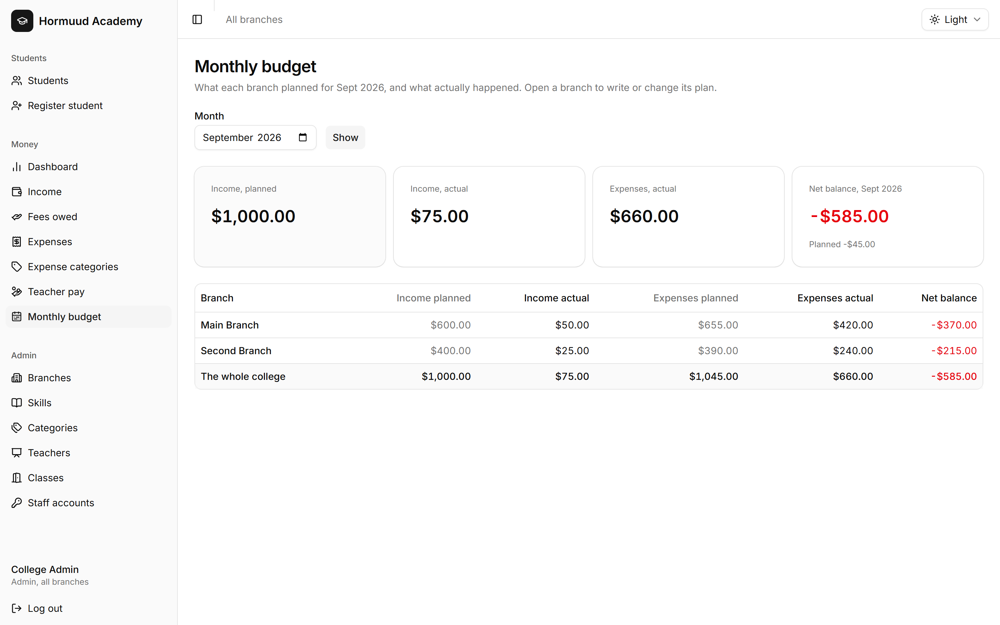

Notes: This screen is read-only. The plan itself is written on a branch's own
page, which is the next slide and the thing people hunt for.

---

## Slide 88. Writing a plan

- Click the branch name in the table
- Scroll to the bottom, to the card titled The plan for that branch
- Income you expect, an amount for each category, a note
- Save the plan


Notes: Say clearly that the form is not on the first screen. A branch has one
plan per month, so saving again replaces it. An empty box means nothing was
planned for that category, and clearing a box removes that line.

---

## Slide 89. Reading the comparison

- Income first, then every category, then the totals
- Planned, actual, and the difference
- On plan when they match
- Red when it is the wrong way round: less income, more spending, a worse net
  than expected
- Not planned for a category you didn't budget for, with its spending still
  shown

Notes: Unplanned spending cannot hide. That is the main thing the screen is
for.

---

## Slide 90. Net balance

- Income minus expenses, over a day, a month, a branch or the college
- Negative, shown in red, means more went out than came in
- It is not profit

Notes: Nothing counts until the money actually moves. Fees a student still owes
don't lift it, and what a percentage teacher has earned doesn't lower it until
you pay them. That is why the dashboard shows what teachers earned as a
separate figure, as a warning of money due.

---

## Slide 91. The dashboard

- Pick a day, a month, and optionally one branch
- The day: cash, ZAAD, eDahab, bank, the total, then income, expenses and net
- The month: income, expenses, what percentage teachers earned, net, then
  income by category beside expenses by category
- Every block links to the screen behind it


Notes: This is the morning screen. Start here, and click through to whatever
looks wrong.

---

## Slide 92. Do this now: plan and compare

- Monthly budget, this month, click Training Branch
- Expect 500 income, plan 300 rent and 20 stationery
- Save, then read the comparison against the expenses you recorded earlier

Notes: They will see Security as unplanned spending, and rent on plan. That is
the lesson in one screen.

---

## Slide 93. Part 8. Practice and fixing mistakes

Notes: Section divider. Run these as questions to the room, not as slides you
read out. Let them find the answer on the screen.

---

## Slide 94. Drill 1

- A student paid $60 for two months of one skill, in cash, today

Notes: Answer: open the student, click each of the two yellow month boxes, and
record them separately with today's date and Cash. Two payments, one day.

---

## Slide 95. Drill 2

- A student was registered twice last week

Notes: Answer: open the duplicate and delete it, admins only. If the duplicate
has already paid a monthly fee the system will refuse, and the payment must
come off first on the Income screen.

---

## Slide 96. Drill 3

- The rent went up in the middle of the month and you already recorded the old
  amount

Notes: Answer: find it on Expenses and press Edit. Remove is for an expense
that shouldn't exist at all, not for one with the wrong figure.

---

## Slide 97. Drill 4

- A teacher says they were underpaid last month

Notes: Answer: open Teacher pay, click their name, and read what they earned,
what they were paid and at what rate each share was worked out. Then pay the
difference if there is one, which the system allows up to their unpaid share.

---

## Slide 98. Drill 5

- A branch stops teaching one skill

Notes: Answer: open the skill's page and deactivate that branch's row. Current
students carry on, and nobody new can join there.

---

## Slide 99. Drill 6

- A branch closes for good

Notes: Answer, in order: finish or drop its students' skills, deactivate its
skills on each skill page, deactivate its staff accounts, then deactivate the
branch. The history stays. Nothing is deleted.

---

## Slide 100. Drill 7

- A teacher leaves

Notes: Answer: on each skill page where they teach, use Change to pick another
teacher, then deactivate the teacher. The system refuses to deactivate them
while they still run an active skill, which is the reminder to do it in that
order.

---

## Slide 101. The five things that can't be undone

- Deleting a student, with their payments
- Removing a payment
- Removing an expense
- Deleting a category, branch, class or teacher
- Removing a budget plan, though no money is touched

Notes: Everything else is a deactivate, which is reversible. Tell them the
habit that keeps them safe: if the record has history, deactivate it.

---

## Slide 102. Where the answers live

- docs/expenses.md, for the expense screens
- docs/monthly-budget.md, for the budget screen
- docs/system-guide.md, for the whole system

Notes: Point them at the guides and say the everyday situations section of the
system guide answers most questions with a two-line recipe.

---

## Slide 103. Questions

Notes: Leave time. Then have each trainee register one real student and record
one real payment while you watch, because that is the point where mistakes are
cheapest to correct.
