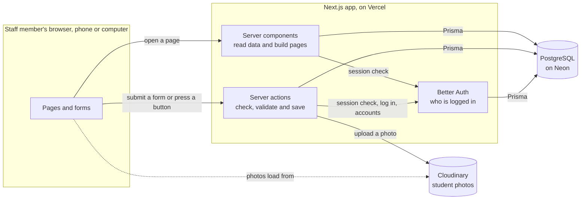
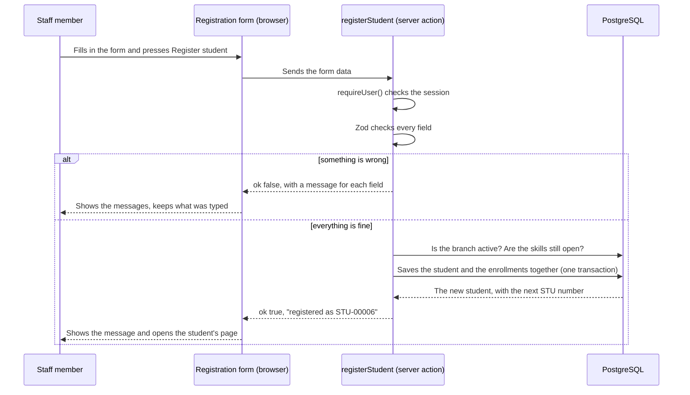
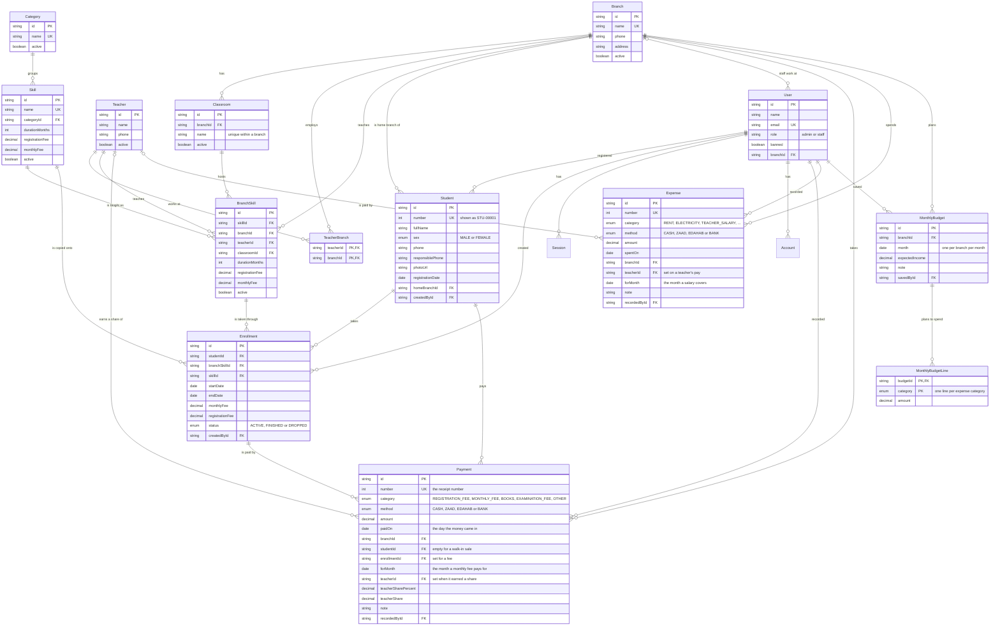

# How the Hormuud Academy system works

This guide explains the whole system: the technology it's built on, every library it uses, how the code is organised, how the database tables connect, and every screen and action you can use. Read it top to bottom once. After that, use the contents list to jump back to the part you need.

The words in this guide have exact meanings. A "class" is a room, not a group of students, and an "enrollment" is one student taking one skill. [CONTEXT.md](../CONTEXT.md) defines every term, and [docs/adr](adr) records the main decisions the rest of the design depends on.

## Contents

1. [The system in two minutes](#the-system-in-two-minutes)
2. [Technology stack](#technology-stack)
3. [Every library and what it does](#every-library-and-what-it-does)
4. [Architecture](#architecture)
5. [The database](#the-database)
6. [Who can do what](#who-can-do-what)
7. [Using the system](#using-the-system)
8. [The money screens](#the-money-screens)
9. [Everyday situations](#everyday-situations)
10. [Running and deploying](#running-and-deploying)
11. [Adding new features](#adding-new-features)
12. [What isn't built yet](#what-isnt-built-yet)

## The system in two minutes

Hormuud Academy is one college with several branches. The system keeps track of:

- the branches
- the skills the college teaches, like Graphic Design or Tailoring, in one list for the whole college
- which teacher teaches each skill at each branch, and in which class (room)
- the students, and which skills each student is taking
- the registration fee a student pays for each skill they start, and whether it's paid
- every payment the college takes, by day, by category and by how it was paid
- every month of every skill: paid, or still owed
- what the college spends, at which branch and on what
- what each teacher earns, whether that's a fixed salary or a share of the fees they bring in
- what each branch planned to take and spend this month, against what really happened

One chain of ideas holds it all together:

```
Skill            Graphic Design, defaults: 4 months,          (one for the whole college)
│                $15 to register, $30 a month
└─ Branch skill  Graphic Design at Main Branch,               (one per branch that teaches it)
   │             Demo Teacher 2, Computer Lab,
   │             4 months, $15 to register, $30 a month
   └─ Enrollment STU-00003 started on 19 Aug 2026, Active     (one per student taking it)
```

A skill is defined once. Each branch that teaches it gets a **branch skill**, which says who teaches it there, in which class, how long it runs and what it costs. Branches are in different cities, so a small town can charge $5 a month for what costs $10 in the capital. The skill's own fees and duration are only the defaults a new branch starts from. When a student starts a skill, the system creates an **enrollment** that links the student to that branch skill. The enrollment keeps the branch skill's two fees and its end date from that day. A student taking three skills has three enrollments, and three registration fees, and the skills can be at different branches.

Money hangs off that same chain. Every dollar in is a **payment**, and every payment says what it was for, which branch took it and how it was paid:

```
Enrollment   STU-00003 takes Graphic Design at Main Branch, $30 a month
├─ Payment   Registration fee   $15   ZAAD    19 Aug 2026
├─ Payment   Aug 2026           $30   Cash     5 Sept 2026   → teacher earns $9
└─ Payment   Sept 2026          $30   eDahab   4 Sept 2026   → teacher earns $9
```

A monthly fee payment names the **month it pays for**, not just the day the money arrived, so the system can say which months a student has settled and which they still owe. Money out is an **expense**, which always names a branch. Nothing stores a running total: a day's takings, a month's spending and a teacher's earnings are counted from those rows every time a screen asks.

Two kinds of people log in:

- **Admins** see every branch and set everything up.
- **Branch staff** work at one branch. They register students and look after those students' skills at that branch.

Nobody signs up on their own. The admin creates every account.

Phase 1 was the college itself: branches, skills, teachers, classes, students and enrollments. Phase 2 is the money described above. Attendance, exams and certificates aren't built yet, and the last section lists everything else that's missing.

## Technology stack

| Layer | Technology | Its job in this system |
|---|---|---|
| Language | TypeScript 5 | All the code, on the server and in the browser |
| Framework | Next.js 16 (App Router) | Serves the pages, runs the server code, builds the app |
| UI library | React 19 with the React Compiler | The screens are React components |
| Styling | Tailwind CSS 4 | Styles through class names such as `flex gap-2 text-sm` |
| Components | shadcn/ui on Radix UI | Buttons, dialogs, tables, the sidebar, form fields |
| Database | PostgreSQL | Stores everything. Neon in production, `prisma dev` on your computer |
| Database access | Prisma 7 | Describes the tables, changes the database safely, runs typed queries |
| Login | Better Auth 1.7 | Passwords, sessions, roles, deactivating accounts |
| Validation | Zod 4 | Checks every form on the server before anything is saved |
| Photos | Cloudinary | Stores student photos |
| Hosting | Vercel | Runs the app on the internet |
| Package manager | pnpm 11 | Installs the libraries |
| Code checks | ESLint 9 | Catches mistakes, including React Compiler rule breaks |

### Next.js 16 and React 19

Next.js decides which page a URL shows, runs code on the server, and builds the app. This project uses the **App Router**: every folder under `src/app` is part of a URL. A `page.tsx` file is the page for that URL, and a `layout.tsx` file wraps every page beneath it.

Three kinds of code matter:

- **Server components** are the default. They run only on the server, so they can read the database directly and send finished HTML to the browser. Almost every `page.tsx` here is one.
- **Client components** start with `"use client"`. They run in the browser and handle anything interactive: dialogs, forms, the sidebar, dropdowns that change other dropdowns. Files named `*-dialog.tsx` and `*-form.tsx` are client components.
- **Server actions** live in files that start with `"use server"`, which are always called `actions.ts` here. They are functions that run on the server, but a client component calls them like normal functions. Every change you make in the app, like saving a form or clicking Deactivate, is a server action. That is why the project has no separate REST API.

The **React Compiler** (`reactCompiler: true` in `next.config.ts`) speeds up re-rendering automatically, so the app's own code doesn't need manual `useMemo` or `useCallback`. Next.js 16 builds with **Turbopack**.

Next.js 16 changed a lot compared to older versions, and `AGENTS.md` points to the exact documentation for the installed version in `node_modules/next/dist/docs/`.

### Tailwind CSS 4 and shadcn/ui

Tailwind styles elements with class names instead of CSS files. The theme colours and fonts are in `src/app/globals.css`.

The colours are CSS variables such as `--background` and `--warning`, set once in `:root` for light mode and again in `.dark` for dark mode. Screens use the variable names (`bg-background`, `bg-warning`), never fixed colours like `bg-amber-50`, so they follow the theme without extra classes. `next-themes` puts the `dark` class on `<html>` when someone picks Dark from the sun and moon button (top right of every page), or picks System and their device is in dark mode. It saves the choice in the browser's `localStorage`, so each person's choice stays on their own device.

shadcn/ui is not a normal library. Its command line tool copies each component's source code into `src/components/ui`, so the project owns that code and you can edit it. The components are built on **Radix UI**, which handles keyboard use, focus and screen readers for dialogs, checkboxes and menus. `components.json` records the settings (the "radix-vega" style). To add another component, run `pnpm dlx shadcn@latest add <name>`.

### PostgreSQL and Prisma 7

PostgreSQL stores the data in tables. Prisma sits between the code and the database:

- `prisma/schema.prisma` describes every table as a **model**.
- `prisma generate` turns the schema into a TypeScript client in `src/generated/prisma`, so a query like `prisma.student.findMany()` knows every column's type. The generated folder isn't in git, and `pnpm dev` and `pnpm build` regenerate it.
- **Migrations** in `prisma/migrations` are SQL files that change the database one step at a time. `pnpm db:migrate` creates and applies them on your computer, and `pnpm db:deploy` applies them to the production database.
- Prisma 7 talks to Postgres through a **driver adapter**, here `@prisma/adapter-pg` with the `pg` driver. The same code works with Neon and with the local database.
- `prisma.config.ts` tells the Prisma command line tool where the schema, the migrations, the seed script and the database are.
- The **partial indexes** preview feature is switched on for one rule: a student can't have the same skill Active twice.

On your computer, `pnpm db:local` runs `prisma dev`, a real Postgres engine (PGlite) inside the Prisma CLI, so you don't need Docker. It accepts one connection at a time, which is why `.env` sets `DATABASE_POOL_MAX=1` locally. In production the database is **Neon**, a hosted Postgres you add through the Vercel Marketplace.

### Better Auth

Better Auth handles everything about logging in:

- It checks emails and passwords and stores only a hash of each password, never the password itself.
- It creates a **session** when someone logs in, stores it in the `session` table, and gives the browser a `better-auth.session_token` cookie. A login lasts 7 days and is extended while the person keeps using the app.
- The **admin plugin** adds roles (`admin` and `staff`), lets an admin create accounts and set passwords, and **bans** accounts. In this app, "Deactivate" on a staff account is a ban. A ban also ends the person's open sessions.
- It **rate-limits** its own `/api/auth` endpoints and keeps the counts in the `rateLimit` table. Its default store is the server's memory, which doesn't work on Vercel, where each copy of the app has its own memory and loses it often. Better Auth only applies these limits in production.
- The `nextCookies()` plugin lets server actions set the login cookie.
- Sign-up is switched off (`disableSignUp: true`). The seed script creates the first admin, and after that only admins create accounts.

The configuration is in `src/lib/auth.ts`. Better Auth's web endpoints are served at `/api/auth/...` by `src/app/api/auth/[...all]/route.ts`. The screens don't call them directly, because the login and logout forms use server actions.

A server action calls Better Auth's functions directly, without going through `/api/auth`, so Better Auth's rate limit never sees it. That's why the login action checks its own limit first, with `consumeRateLimit()` from `src/lib/rate-limit.ts`, in the same `rateLimit` table.

### Zod

Every server action checks its form with a Zod schema before touching the database, for example "a phone number is the nine digits after +252". When something is wrong, the action sends back one message per field and the form shows each message under the right field. The checks run on the server, so nobody can skip them by changing the page in their browser.

### Cloudinary

Student photos are uploaded to Cloudinary. The database keeps only the photo's address (`photoUrl`) and its Cloudinary id (`photoPublicId`, needed to delete it). Photos are shrunk to at most 600 by 600 pixels and stored in the `hormuud-academy/students` folder. Until the three Cloudinary keys are in `.env`, the photo field says upload is off, and everything else works.

### Vercel

Vercel runs the app on the internet and deploys it from GitHub. A college that pays for the system needs the Pro plan, because the free Hobby plan is for non-commercial use.

## Every library and what it does

These are all the libraries in `package.json`.

### Used when the app runs

| Library | Version | What it's for | Where you'll see it |
|---|---|---|---|
| `next` | 16.3.5 | The framework | Everywhere |
| `react`, `react-dom` | 19.2.8 | Building the screens | Every component |
| `@prisma/client` | 7.10 | The runtime the generated Prisma client runs on | `src/lib/prisma.ts` |
| `@prisma/adapter-pg` | 7.10 | Connects Prisma to Postgres | `src/lib/prisma.ts` |
| `pg` | 8.23 | The Postgres driver the adapter uses | Used by the adapter |
| `better-auth` | 1.7.5 | Login, sessions, roles, bans | `src/lib/auth.ts`, `src/lib/session.ts` |
| `@better-auth/prisma-adapter` | 1.7.5 | Lets Better Auth save users and sessions through Prisma | `src/lib/auth.ts` |
| `zod` | 4.6 | Checks form input | `src/lib/validation.ts` and every `actions.ts` |
| `cloudinary` | 2.11 | Uploads and deletes photos | `src/lib/cloudinary.ts` |
| `server-only` | 0.0.1 | Breaks the build if server-only code ends up in the browser | `session.ts`, `cloudinary.ts`, `students/queries.ts` |
| `dotenv` | 18 | Reads `.env` for the Prisma CLI and the scripts | `prisma.config.ts`, `prisma/seed.ts`, `prisma/demo.ts` |
| `radix-ui` | 1.6.7 | Accessible parts behind the shadcn components | `src/components/ui` |
| `shadcn` | 4.21 | The shadcn tool, plus the `shadcn/tailwind.css` styles | `src/app/globals.css` |
| `class-variance-authority` | 0.7 | Defines component variants such as button sizes and colours | `src/components/ui` |
| `cn` | 0.3 | Merges Tailwind class names without conflicts | `src/lib/utils.ts` and the UI components |
| `lucide-react` | 1.47 | Icons | Sidebar, buttons, pages |
| `sonner` | 2.0 | The small pop-up messages, like "Branch saved." | `src/components/ui/sonner.tsx` |
| `next-themes` | 0.4 | Light, dark or device theme, remembered in the browser | `src/components/theme-provider.tsx`, `src/components/theme-toggle.tsx` |
| `tw-animate-css` | 1.4 | Opening and closing animations for dialogs | `src/app/globals.css` |

### Used only while developing

| Library | Version | What it's for |
|---|---|---|
| `prisma` | 7.10.0 | The Prisma CLI: migrations, generate, Studio, the local database. Pinned to exactly 7.10.0, because npm's "latest" tag points at a Prisma 8 test release |
| `typescript` | 5.9 | Type checking |
| `tailwindcss`, `@tailwindcss/postcss` | 4.3 | Builds the CSS |
| `eslint`, `eslint-config-next` | 9, 16.3.5 | Lint rules, including the React Compiler rules |
| `babel-plugin-react-compiler` | 1.0 | The React Compiler |
| `tsx` | 4.23 | Runs TypeScript scripts directly, for the seed and demo scripts |
| `@types/node`, `@types/react`, `@types/react-dom`, `@types/pg` | | Type information for those libraries |

The fonts are Inter for text and Geist Mono for the student ID on a student's page, loaded by `next/font` in `src/app/layout.tsx`.

The shadcn components installed are alert-dialog, avatar, badge, button, card, checkbox, dialog, field, input, label, select, separator, sheet, sidebar, skeleton, sonner, spinner, table and tooltip. Three more are installed but not used yet: dropdown-menu, empty and textarea.

## Architecture

### The big picture



There is one app and one database. Every branch uses the same app through a browser, so the admin sees every branch's data live.

### Folders and files

```
hormuud-academy/
├── prisma/
│   ├── schema.prisma            All the database tables
│   ├── migrations/              The SQL that builds the database, step by step
│   ├── seed.ts                  Creates the first admin and the two starting categories
│   └── demo.ts                  Sample data for trying the app locally
├── prisma.config.ts             Where the Prisma CLI finds the schema and the database
├── next.config.ts               Next.js settings: React Compiler, 6 MB uploads, Cloudinary images
├── src/
│   ├── app/                     Every page, by URL
│   │   ├── layout.tsx           The outer page: fonts and pop-up messages
│   │   ├── login/               The login page and its server action
│   │   ├── api/auth/            Better Auth's web endpoints
│   │   └── (app)/               Everything behind the login
│   │       ├── layout.tsx       Checks the login, draws the sidebar and header
│   │       ├── app-sidebar.tsx  The menu
│   │       ├── actions.ts       Log out
│   │       ├── page.tsx         "/" sends you on to /students
│   │       ├── students/        Student list, registration, student page, editing
│   │       ├── finance/         The money screens
│   │       │   ├── page.tsx     The financial dashboard, admins only
│   │       │   ├── labels.ts    The words for each stored code, shared by every screen
│   │       │   ├── access.ts    Who sees which money
│   │       │   ├── period.ts    Day, month or everything, read from the query string
│   │       │   ├── queries.ts   The totals every money screen is built from
│   │       │   ├── figures.tsx  The stat cards and the breakdown table
│   │       │   ├── fee-months.ts Which months an enrollment owes a fee for
│   │       │   ├── payments.ts  The registration fee written with a new enrollment
│   │       │   ├── income/      Income, and every action that records a payment
│   │       │   ├── owed/        Who still owes a registration fee or a month
│   │       │   ├── expenses/    Expenses, admins only
│   │       │   ├── teacher-pay/ What each teacher earned and was paid, admins only
│   │       │   └── budget/      The plan per branch per month, admins only
│   │       ├── teachers/        Admins manage them; branch staff see their branch's
│   │       ├── classes/         Admins manage them; branch staff see their branch's
│   │       └── admin/           Setup screens, admins only
│   │           ├── layout.tsx   Sends anyone who isn't an admin back to /students
│   │           ├── branches/
│   │           ├── categories/
│   │           ├── skills/      The skill list, and [id]/ for one skill's page
│   │           └── staff/
│   ├── components/
│   │   ├── ui/                  shadcn/ui components
│   │   └── *.tsx                Shared pieces: FormDialog, ActionButton, fields, badges
│   ├── hooks/                   useFormAction and useIsMobile
│   ├── lib/                     auth, session, prisma, access, dates, money, teacher-share,
│   │                            format, validation, search-params, cloudinary, rate-limit
│   └── generated/prisma/        The generated Prisma client (not in git)
├── docs/                        This guide and the decision records
├── CONTEXT.md                   The glossary
├── CLAUDE.md, AGENTS.md         Notes for AI coding assistants working on the project
└── .env.example                 Every setting the app needs, without real values
```

`(app)` in brackets is a **route group**. The brackets keep the folder name out of the URL, so the student list is at `/students`, not `/app/students`. The group exists so every page inside it shares one layout with the login check and the sidebar.

### The files inside a feature folder

Every setup screen has the same three kinds of file. Take `src/app/(app)/admin/branches/`:

- `page.tsx` is a server component. It reads the branches with Prisma and draws the table.
- `actions.ts` holds the server actions: `createBranch`, `updateBranch`, `setBranchActive` and `deleteBranch`.
- `branch-dialog.tsx` is a client component: the pop-up form used both to add and to edit a branch.

Every server action follows the same five steps:

1. Check who is asking with `requireUser()` or `requireAdmin()`.
2. Check the form with a Zod schema.
3. Check the business rules, for example that the name isn't taken or the branch is active.
4. Save with Prisma.
5. Call `refresh()` so the page shows the new data, and return an `ActionResult`.

The students folder has a few more files, because it has more rules:

| File | What it does |
|---|---|
| `access.ts` | Decides which students and which enrollments each person can see and change |
| `queries.ts` | All the reading: the list with its filters, a student's page, the skills a student can join |
| `actions.ts` | Register, edit, add a skill, change an enrollment's status, record and change registration fees, delete, find by phone |
| `types.ts` | Plain data shapes passed from the server to the forms |
| `student-fields.tsx` | Fields used by registration, editing and Add skill: the phone warning, the photo picker, the skill picker and the "registration fee paid" box |
| `new/` | The registration page |
| `[id]/` | A student's page with its Add skill and fee dialogs, plus `edit/` for editing |

The finance folder works the same way, with a few pieces shared by all four money screens:

| File | What it does |
|---|---|
| `labels.ts` | The word shown for each stored code: `EDAHAB` is "eDahab", `TEACHER_SALARY` is "Teacher salary". Safe to import from a client component, so a dropdown and a table can't disagree |
| `access.ts` | Which payments a person may see, and which branch a screen reports on |
| `period.ts` | Reads "one day", "one month" or "everything" out of the query string and turns it into a date filter |
| `queries.ts` | Income by method, income by category, expenses by category, the totals and the net balance |
| `figures.tsx` | `StatCard` and `Breakdown`, the two shapes every money screen is drawn from |
| `fee-months.ts` | The months one enrollment owes a fee for. Pure arithmetic, no database |
| `income/actions.ts` | Every action that records or removes a payment, including the ones the student's page calls |

The student's page imports `recordRegistrationFee` and `recordMonthlyFee` from `finance/income/actions.ts` rather than having its own copies, so the branch check and the teacher's share are worked out in one place whatever screen took the money.

### What happens when you open a page

1. The browser asks for `/students`.
2. `src/app/(app)/layout.tsx` calls `requireUser()` in `src/lib/session.ts`. That asks Better Auth to turn the session cookie into a user. With no valid session, you go to `/login`.
3. Pages under `/admin` also go through `admin/layout.tsx`, which calls `requireAdmin()` and sends branch staff back to `/students`.
4. The page reads what it needs through Prisma, filtered by the branch rules in `students/access.ts`.
5. Next.js builds the HTML on the server and sends it. The interactive parts, like dialogs, start working once the browser loads them.

### What happens when you press Save

This is registering a student. Every other form works the same way.



"One transaction" means the student and their enrollments are saved together or not at all. You never get a student saved without their skills.

### The shared building blocks

| Piece | File | What it does |
|---|---|---|
| `ActionResult` | `src/lib/action-result.ts` | What every action returns: `{ ok: true, message }` or `{ ok: false, error, fieldErrors }` |
| `useFormAction` | `src/hooks/use-form-action.ts` | Sends a form to an action, keeps what you typed when there's an error, shows field errors, shows the success message |
| `FormDialog` | `src/components/form-dialog.tsx` | A pop-up with one form. Closes when the action works, and opens with a fresh form each time |
| `ActionButton` | `src/components/action-button.tsx` | A button that runs an action without a form, like Deactivate or Mark finished. It can ask for confirmation first and can move to another page afterwards |
| `TextField`, `SelectField` | `src/components/form-fields.tsx` | A labelled input or dropdown with its error message |
| `SelectInput` | `src/components/select-input.tsx` | The one dropdown every screen uses: the form fields, the students filters and the theme picker. Built on the shadcn `select`. The page draws the list itself, so it gets the app's font and theme, which the browser's own `<select>` list can't. It can't take an empty option value, so a "no filter" choice like "Any skill" needs a real value |
| `PageHeader`, `ActiveBadge`, `EmptyRow` | `src/components/` | The page title row, the Active/Inactive badge, the "nothing here yet" box |

### Security and permissions

- Every page and every server action checks the login again. A server action can be called without opening its page, so hiding a button isn't enough: the action itself checks with `requireUser()` or `requireAdmin()`, and then checks the branch rules.
- The branch rules live in `src/app/(app)/students/access.ts`: `visibleEnrollments`, `browsableStudents`, `canEditStudent` and `canActAtBranch`.
- Passwords are stored as hashes. Nobody, including the admin, can read a password back. An admin can only set a new one.
- There is no sign-up page.
- Deactivating an account stops the login and ends every open session straight away.
- Setting a new password also ends every open session for that person, because a reset often means someone else knew the old password. An admin who resets their own password stays logged in on the device they're using.
- The login form allows 5 tries per email and 20 tries per computer (IP address) each minute. After that it shows "Too many login attempts" and how many seconds to wait. This stops anyone guessing a password by trying thousands.

### Dates and the time zone

Registration, start and end dates are calendar days with no time. The database stores them as `DATE` columns. "Today" always means today in East Africa Time (UTC+3), wherever the server runs. Without that, a student registered after 21:00 UTC would get the next day's date. All of this is in `src/lib/dates.ts`.

An enrollment's end date is its start date plus the skill's duration in months. When the day doesn't exist in the target month, the end date moves to the last day of that month, so 31 January plus one month is 28 or 29 February.

### Months

A month is written `2026-09`, which is what an `<input type="month">` gives, and stored as that month's first day in a `DATE` column. `src/lib/dates.ts` has the helpers: `collegeMonth()`, `monthOf()`, `monthStart()`, `monthEnd()`, `monthsBetween()` and `formatMonth()`. A budget is set for a month, and a monthly fee pays for one.

### Money

Every amount is stored as `DECIMAL(10, 2)`, exact to the cent, and shown in US dollars. Ordinary floating-point numbers can't hold an amount like 0.10 exactly, which is why no amount is one. Prisma hands these back as `Decimal` objects; the code turns them into strings like `"20.50"` and adds them with the helpers in `src/lib/money.ts`, which work in whole cents so `10.10 + 15.20` comes out as `25.30` and not `25.299999999999997`.

Each enrollment copies the skill's monthly fee and registration fee on the day the student joins, so a later price change doesn't touch current students.

**Every dollar in is a payment.** One row in `payments` holds the amount, the day the money came in, the branch that took it, what it was for and how it was paid. Registration fees used to live on the enrollment; [ADR 0004](adr/0004-one-ledger-for-every-payment.md) explains why they moved here and why nothing stores a running total. The enrollment still keeps the fee it *owes*, because that's a price the admin can waive; whether it was paid is the ledger's answer.

A fee is paid in full or not at all, whether it's a registration fee or one month of a skill. There are no part payments. A monthly fee payment carries a **fee month**, so September stays September's however late the money arrived, and the database refuses a second payment for a month already settled.

**Every dollar out is an expense**, and every expense names the branch it was spent for. A teacher's pay is an expense in the Teacher salary category that also names the teacher and the month it covers.

**A percentage-paid teacher's share** is worked out when the payment is recorded and written onto it, along with the rate it was worked out at, by `src/lib/teacher-share.ts`. Raising a rate changes what they earn from that day on and never rewrites the past. [ADR 0005](adr/0005-a-teachers-share-is-worked-out-once.md) covers it.

### Student IDs

A student's number comes from a database sequence and is shown as `STU-00001`. Numbers are never reused. They can skip: if a registration fails halfway, or a student is deleted, that number is gone.

### Phone numbers

Every number the college holds — a student's, a responsible person's, a teacher's, a branch's — is a Somali mobile: the country code 252, then nine digits starting with 6.

The database keeps that number as digits and nothing else: `252611111111`. No plus, no spaces, no trunk zero. That is exactly the form WhatsApp takes, in a `wa.me/252611111111` link and in the Cloud API's `to` field, so when the college starts sending messages a number goes from a row into a message with nothing to clean up first.

The country code is the same for everyone, so the forms don't ask for it: `+252` sits in a small grey box of its own, and the nine digits are typed next to it, grouped the way people read them out — `61 1111111`. The box starts with a 6 already in it because most Somali mobiles start with 6, but that digit is typed over like any other, so a `90` or `77` number goes in just as easily. A box holding nothing but that starting 6 counts as empty. The server puts the whole number together before saving, and screens print it back as `+252 61 1111111`.

`src/lib/phone.ts` holds the whole rule:

| Function | What it does |
|---|---|
| `toStoredPhone("61 1111111")` | `"252611111111"`, the value the database holds. Understands a pasted `0611111111` or `+252 61 1111111` too, and returns `null` for anything that isn't nine digits |
| `phoneTyped(value)` | What the box shows while someone types or pastes: a whole pasted number settles as `61 1111111` |
| `isBlankEntry(value)` | True for an empty box, or one holding only the 6 it starts with |
| `formatPhone("252611111111")` | `"+252 61 1111111"` for the screen. A value that doesn't fit the pattern is shown as it is, never mangled |
| `phoneEntry("252611111111")` | `"61 1111111"`, what a form's box starts with when editing |
| `phoneSearch(query)` | The digits a search should match the end of a number with |

`DEFAULT_PREFIX` in `src/lib/phone.ts` is the 6 a fresh box starts with. Change it there and every phone field follows.

### How search works

The search box on the student list reads what you type:

| You type | It searches for | Where |
|---|---|---|
| `STU-00042`, `stu42` or `42` (up to 5 digits) | That student ID | Every branch |
| Six or more digits, like `0611111111` or `+252 61 1111111` | That phone number, as the student's or the responsible person's phone | Every branch |
| Anything else | Names containing those letters, ignoring upper and lower case | Only the students you can browse |

A phone search ignores the country code and the trunk zero and matches the end of the number, so `0611111111`, `611111111`, `+252 61 1111111` and `252611111111` all find the same student. See [Phone numbers](#phone-numbers) for how they are stored.

## The database

### How the tables connect



GitHub draws this diagram. In VS Code you need a Mermaid preview extension. PK is the primary key (the row's id), FK a foreign key (a column pointing at another table), and UK a unique column.

Read the lines like this: `Branch ||--o{ Classroom` means one branch has zero or more classes, and each class belongs to exactly one branch. `Branch |o--o{ User` means a user belongs to zero or one branch, because admins have none. In the same way, `Teacher |o--o{ Payment` means a payment names zero or one teacher: none unless the skill's teacher is paid by percentage.

### The tables one by one

The code uses the model names on the left. The actual table names in Postgres are in brackets.

**Branch** (`branches`). One location of the college. Name (unique), phone, address, and `active`. Classes, teachers, branch skills, staff and students all point at a branch.

**Category** (`categories`). A group of skills, like Technology Skills or Hand Skills. Name (unique) and `active`. The seed script creates those two.

**Skill** (`skills`). One entry in the college-wide catalog. Name (unique), category, `durationMonths` (1 to 60), `registrationFee` and `monthlyFee` in dollars (a registration fee of 0 means none), and `active`. The duration and fees are defaults: they're copied onto a branch skill when the skill is added to a branch, and changing them later touches no branch that has it already.

**Classroom** (`classrooms`). A room at a branch, like Room 3. The screens call it a "Class". Each class belongs to one branch, and names are unique within a branch. The code says Classroom so nobody mistakes it for a group of students.

**Teacher** (`teachers`). A person who teaches. Name, phone, `active`, and how they're paid: `salaryType` is `FIXED` with a `fixedSalary` each month, or `PERCENTAGE` with a `percentageRate` such as 30 for 30%. Never both — the form clears the one that doesn't apply. A teacher is not a login account.

**TeacherBranch** (`teacher_branches`). A link table: one row for each branch a teacher works at. It lets one teacher work at several branches without being entered twice.

**BranchSkill** (`branch_skills`). A skill as taught at one branch: which skill, which branch, which teacher, which class, the `durationMonths`, `registrationFee` and `monthlyFee` that branch charges, and `active`. There is at most one per skill per branch (a unique rule on skill plus branch). This is what students enroll in.

**Student** (`students`):

| Column | Meaning |
|---|---|
| `number` | The student ID, from a sequence. Shown as STU-00001 |
| `fullName`, `sex` | Required |
| `phone`, `responsiblePhone` | At least one of the two is required. Stored as `252611111111` — see [Phone numbers](#phone-numbers) |
| `photoUrl`, `photoPublicId` | The Cloudinary photo, if there is one |
| `registrationDate` | The day they registered. Can be set to an earlier date for students from the old system |
| `homeBranchId` | The branch they registered at |
| `createdById` | The staff account that registered them |

A student has no status column. They are Active when at least one of their enrollments is Active, and the system works that out each time.

**Enrollment** (`enrollments`). One student taking one branch skill:

| Column | Meaning |
|---|---|
| `studentId`, `branchSkillId` | Who, and which skill at which branch |
| `skillId` | A copy of the branch skill's skill, kept so the database can enforce the rule below |
| `startDate`, `endDate` | The end date is start plus the skill's duration. It's a guide only |
| `monthlyFee` | The skill's monthly fee on the day the student joined |
| `registrationFee` | The skill's registration fee on the day the student joined, unless the admin lowered or waived it since. 0 means nothing to pay. Whether it was *paid* is a row in `payments`, not a column here |
| `status` | `ACTIVE`, `FINISHED` or `DROPPED` |
| `statusChangedAt` | When the status last changed |
| `createdById` | The staff account that added it |

**Payment** (`payments`). Money received. One row per registration fee, per month of a skill, and per book or examination fee taken at the counter:

| Column | Meaning |
|---|---|
| `number` | The receipt number, from a sequence, counted across the whole college |
| `category` | `REGISTRATION_FEE`, `MONTHLY_FEE`, `BOOKS`, `EXAMINATION_FEE` or `OTHER` |
| `method` | `CASH`, `ZAAD`, `EDAHAB` or `BANK` (bank or anything else) |
| `amount`, `paidOn` | How much, and the college day the money came in. Daily income counts by `paidOn`, not by when the row was typed |
| `branchId` | Where the money was taken. For a fee, the branch teaching the skill |
| `studentId` | Empty for income with nobody behind it, like a book sold over the counter |
| `enrollmentId` | Set for a registration fee or a monthly fee, which always belong to one skill |
| `forMonth` | The month a monthly fee pays for, as that month's first day |
| `teacherId`, `teacherSharePercent`, `teacherShare` | Filled in only when the skill's teacher is paid by percentage. The rate is kept beside the amount so a later change never rewrites it |
| `note`, `recordedById` | A free note, and the account that recorded it |

**Expense** (`expenses`). Money spent. A number, a category (`RENT`, `ELECTRICITY`, `TEACHER_SALARY`, `STAFF_SALARY`, `INTERNET`, `STATIONERY`, `TRANSPORTATION`, `MAINTENANCE`, `OTHER`), a method, an amount, the day it went out, the branch it was spent for, a note and who recorded it. A teacher's pay also carries `teacherId` and the `forMonth` it covers.

**MonthlyBudget** (`monthly_budgets`) and **MonthlyBudgetLine** (`monthly_budget_lines`). One branch's plan for one month: the income it expects, a note, and one line per expense category it plans to spend on. A category with no line simply wasn't planned for. Nothing about what *actually* happened is stored here — that's counted from the payments and expenses each time the screen opens, so the comparison always matches the ledger.

**User** (`user`). A login account. Better Auth's own columns (name, email, `emailVerified`, `image`), the admin plugin's columns (`role`, `banned`, `banReason`, `banExpires`), and this app's `branchId`. Branch staff have a branch. Admins have none.

**Session**, **Account**, **Verification** (`session`, `account`, `verification`). Better Auth's tables. A session is one login on one device. An account row holds the password hash for email logins. Verification is unused for now; Better Auth uses it for things like email confirmation links.

**RateLimit** (`rateLimit`). Counts recent login attempts. `key` says what's being counted, such as `action:sign-in:email:amina@example.com`, `count` is the attempts so far, and `lastRequest` is when the count started, in milliseconds. Rows older than a minute are deleted as new attempts come in.

### Rules the database enforces itself

These hold even if a bug slips into the code:

- Unique: branch names, category names, skill names, class names within a branch, one branch skill per skill per branch, student numbers, user emails.
- One active enrollment per student per skill, at any branch. This is a **partial unique index**: it only counts rows whose status is `ACTIVE`, so a student can finish a skill and take it again later.
- One registration fee per enrollment, and one monthly fee payment per enrollment per fee month. Both are partial unique indexes too, counting only rows of that category. Two clicks on Record payment can't charge a student twice, whatever the code does.
- One budget per branch per month.
- A row can't be deleted while other rows point at it. You can't delete a teacher a branch skill still uses, for example. The exceptions are deliberate: deleting a student deletes their enrollments and every payment they made, deleting an enrollment deletes its payments, deleting a budget deletes its lines, deleting a teacher deletes their branch links, and deleting a user deletes their sessions and accounts. The app refuses to delete a teacher who has any money on record, so nobody's earnings vanish by accident.

The app adds its own checks on top. Names are compared ignoring upper and lower case, so "main branch" is refused when "Main Branch" exists. The database compares exact text only.

### Migrations so far

| Migration | What it does |
|---|---|
| `20260919075848_init` | Creates every table, index and rule |
| `20260919093000_rename_guardian_phone` | Renames `guardianPhone` to `responsiblePhone`, keeping the data |
| `20260919151919_registration_fee` | Adds the registration fee to skills and enrollments, with the paid date and who recorded it. Skills and enrollments that existed already start at 0 |
| `20260920104500_financial_system` | Adds payments, expenses, budgets and budget lines, and the teacher's salary type. Moves every registration fee already recorded as paid into `payments`, then drops the two columns that held it. The moved rows land under Cash with a note saying the method wasn't asked for back then, rather than pretending the college knows |
| `20260921120000_whatsapp_phone_numbers` | Rewrites every phone number already in the database into WhatsApp's form. `0611111111`, `611111111`, `+252 61 1111111` and `00252611111111` all become `252611111111`. Anything that isn't a Somali mobile is left alone for a person to look at |
| `20260921180000_branch_skill_pricing` | Gives each branch skill its own duration, registration fee and monthly fee, copied from its skill so nothing changes until the admin edits a branch |
| `20260922090000_rate_limit` | Adds the `rateLimit` table, which counts login attempts so someone can't guess a password by trying thousands |

### Looking at the data yourself

`pnpm db:studio` opens Prisma Studio in your browser, where you can browse and edit every table. Be careful editing there: Studio skips the app's rules.

## Who can do what

| Action | Admin | Branch staff |
|---|---|---|
| See the student list | Every student | Students registered at their branch, or taking a skill there |
| Find a student by exact ID or phone | Yes | Yes, from any branch |
| Open a student's page | Yes | Yes, but they only see the skills at their own branch |
| Register a student | At any branch | At their own branch only |
| Add a skill to a student | At any branch | At their own branch only |
| Mark finished, drop, set active again | At any branch | Only for skills at their branch |
| Record a registration fee payment | At any branch | Only for skills at their branch |
| Record a monthly fee payment | At any branch | Only for skills at their branch |
| Record books, examination fees and other income | At any branch | At their own branch only |
| Lower or waive a registration fee | Yes, while it's unpaid | No |
| Remove a payment from the books | Yes | No |
| See the Income screen | Every branch, with a branch filter | Their own branch only |
| See the Fees owed screen | Every branch, with a branch filter | Their own branch's students only |
| See a teacher's share on a payment | Yes | No, the column is hidden |
| Expenses | Yes | No, the page is blocked |
| Teacher pay | Yes | No, the page is blocked |
| Monthly budget | Yes | No, the page is blocked |
| The financial dashboard | Yes | No, the page is blocked |
| Set how a teacher is paid | Yes | No |
| Edit a student's details | Yes | Only students whose home branch is theirs |
| Move a student to another home branch | Yes | No |
| Delete a student | Yes | No |
| See teachers and classes | Every branch's | Their own branch's, read-only |
| Add or change teachers and classes | Yes | No |
| Branches, skills, categories | Yes | No, those pages aren't in their menu and are blocked |
| Staff accounts | Yes | No |

A staff account that has no branch set sees a notice asking them to contact the admin, and can't do anything else.

## Using the system

### Logging in and out

Go to the app's address. Anyone not logged in lands on the login page. Log in with the email and password the admin gave you. A wrong password shows "Wrong email or password.", and a deactivated account shows "This account has been deactivated." After 5 wrong tries in a minute, the form makes you wait before you can try again.

To log out, use **Log out** at the bottom of the sidebar.

### The screen layout

- **The sidebar** on the left. Students (**Students** and **Register student**) is there for everyone. Admins also get Money (**Dashboard**, **Income**, **Fees owed**, **Expenses**, **Teacher pay**, **Monthly budget**) and Admin (**Branches**, **Skills**, **Categories**, **Teachers**, **Classes**, **Staff accounts**). Branch staff get Your branch instead (**Income**, **Fees owed**, **Teachers** and **Classes**), which shows only their own branch; the teachers and classes there can't be changed. The bottom shows your name, your role and your branch.
- **The header** shows "All branches" for an admin, or your branch's name for branch staff. The button on the left of the header hides and shows the sidebar.
- **On a phone**, the sidebar folds away. Open it with the button at the top left.
- After every change, a short message appears at the top of the screen.

### Setting up the college for the first time

Log in as the admin and do these in order, because each step needs the one before it:

1. **Categories.** Technology Skills and Hand Skills already exist. Add others if you need them.
2. **Branches.** Add each branch.
3. **Classes.** Add the rooms at each branch.
4. **Teachers.** Add each teacher and tick the branches they work at.
5. **Skills.** Add each skill with its category, duration, registration fee and monthly fee. After saving, the app opens the skill's page.
6. **On each skill's page**, press **Add to a branch** for every branch that teaches it and pick that branch's teacher and class. A skill no branch teaches can't be taken by anyone.
7. **Staff accounts.** Create an account for each person at each branch, and give them their email and password yourself.

After that, staff can register students.

### Admin screens

Every setup screen follows the same pattern. There's a table, an **Add** button at the top right, and buttons on each row. **Deactivate** takes a record out of new use but keeps its history. **Delete** only appears when nothing uses the record yet, which is usually right after you added it by mistake.

#### Branches

Add, edit, deactivate and delete branches. Each has a name, a phone and an address. The table shows how many students registered at each branch and how many skills it teaches.

A deactivated branch disappears from every form: new classes, teacher branches, staff accounts, registration, and adding skills to students. Its old records stay.

#### Categories

Add, rename, deactivate and delete categories. A deactivated category can't be picked for new skills. Skills already in it keep working normally.

#### Classes

Add a class by picking its branch and typing a name. You can rename a class, but not move it to another branch, because skills at that branch may already use it. A deactivated class can't be picked for skills anymore. The skills already taught there keep it until you change them. The table shows each class's skills and who teaches them.

Branch staff see this page too, with only their branch's classes and no buttons.

#### Teachers

Add a teacher with a name, an optional phone, and at least one branch. When you edit a teacher, you can't untick a branch where they still teach a skill: give that skill another teacher first. You also can't deactivate a teacher who still runs an active skill. The table shows every skill each teacher teaches, and where.

Branch staff see this page too, with only the teachers at their branch, the skills each one teaches there and in which class, and no buttons.

#### Skills

The **Skills** page lists every skill with its category, duration, registration fee, monthly fee, the branches that teach it and how many students are taking it now. Press **Add skill** to create one. Click a skill's name to open its page.

On a **skill's page** you can:

- **Edit skill** to change the name, category, or the default duration and fees. The defaults only fill in branches you add afterwards; a branch that teaches the skill already keeps its own.
- **Deactivate** the skill, so nobody new can take it at any branch. Current students keep it.
- **Delete** it, only while no branch teaches it.
- **Add to a branch.** Pick the branch first, and the teacher and class lists then show only that branch's teachers and classes. The duration and fees start at the skill's defaults; change them if this branch charges differently. The registration fee is paid once by each student who starts the skill. Enter 0 if there's none.
- On each branch's row: **Change** its teacher, class, duration or fees (a new fee or duration only applies to students who join afterwards; current students keep what they joined with), **Deactivate** it (that branch stops taking new students for this skill, but current ones continue), or **Remove** it if no student ever took it there.

#### Staff accounts

- **Add staff account.** Enter a name, an email, a role and, for branch staff, their branch, then choose a password of at least 8 characters. There's no email sending, so you tell the person their password yourself.
- **Edit** changes the name, role or branch. The email can't be changed. You can't change your own role, so the college can't be left without an admin.
- **New password** sets a new password when someone forgets theirs. It also logs them out everywhere, so they log in again with the new one.
- **Deactivate** logs the person out everywhere and blocks their login. Their students and records stay. **Turn back on** reverses it. You can't deactivate yourself.

Accounts can't be deleted, because students and enrollments record who created them.

### Student screens

#### The student list

**Students** in the sidebar shows the students you can browse, newest first, 25 per page. Each row shows the student's photo, name, ID, sex, phone, home branch, the skills they're taking now and whether they're Active. A yellow **Fee unpaid** badge next to the status means they still owe a registration fee.

To narrow the list:

- **Search** by name, student ID or phone (see [How search works](#how-search-works)).
- **Status**: All, Active or Inactive. This describes the student across the whole college.
- **Taking skill** shows only students with that skill Active.
- **Past end date** shows students with an Active skill whose end date has passed.
- **Registration fee unpaid** shows students who still owe a registration fee, whatever their skill's status.

Two yellow bars can appear above the list. One says how many registration fees are unpaid, and the other how many skills are past their end date. **Show those students** on either applies that filter. In the table, a skill past its end date has a yellow badge. **Clear** removes every filter.

For branch staff, the Skills column, the Fee unpaid badge and both yellow bars only count skills at their own branch.

#### Registering a student

Press **Register student**. The form has two parts.

**Student**:

- **Home branch.** Admins pick it. For branch staff it's always their own branch.
- **Full name** and **Sex** are required.
- **Phone** and **Responsible person's phone**. At least one is required. When you leave a phone field, the app checks whether another student already has that number and shows a yellow warning with a link to them. It's only a warning, because families often share one phone, so you can still save.
- **Registration date** is today by default. For a student from the old system, set their original date. It can't be in the future.
- **Photo** is optional, up to 5 MB. On a phone you can take the picture right then. Until Cloudinary is set up, this field only says that photo upload is off.

**Skills**:

- **Start date** is today by default. Every skill you tick starts on this day.
- **Skills** lists the skills open at the home branch, each with its teacher, class, registration fee, monthly fee and duration. Tick at least one.
- **Registration fee paid** appears once you tick a skill that has a registration fee. It shows the total, and each skill's share when there's more than one. Tick it if the student paid now, then pick **Paid by**: Cash, ZAAD, eDahab or Bank / other. The fees are recorded as paid on the registration date, which is also right for a student from the old system who paid long ago. Leave it empty if they'll pay later. The tick clears itself when you change the skills, so you always confirm the final amount.

Press **Register student**. If something is missing, every problem shows at once under its field and nothing you typed is lost. When it works, you see "registered as STU-00006" and the app opens the student's page.

#### A student's page

The top shows the photo, name, student ID and Active or Inactive. The buttons are:

- **Edit details**, for an admin or staff at the student's home branch.
- **Add skill.** Pick a skill and a start date. The dialog shows the teacher, class and fees, and roughly when the skill will end. When the skill has a registration fee, tick **Registration fee paid** if the student paid now and say how: it's recorded as paid today. Branch staff only see their branch's skills, and skills the student already has Active don't appear. The button is greyed out when there's nothing left to add.
- **Delete**, for admins only. Use it only for duplicates and typing mistakes: it removes the student, every skill record they have and every payment they made, for good, which changes the income already recorded for those days. It's greyed out for a student who has paid even one monthly fee, and the app refuses it too. The money is already in the books, and a percentage teacher may have been paid a share of it. To take that student out of their classes, drop their skills instead: they show as Inactive and their history stays.

**Details** shows sex, phones, home branch, registration date, and who registered the student and when.

**Skills** lists each enrollment with its branch, teacher, class, start and end dates, registration fee, monthly fee and status. Branch staff see only the skills at their branch, with a note saying so.

The **Registration fee** column shows one of three things:

- The amount with a yellow **Unpaid** badge.
- The amount with the day it was paid, how it was paid, and who recorded it.
- **Nothing to pay**, when the skill has no registration fee or the admin waived it.

Its buttons appear only while the fee is unpaid:

- **Record payment**, for staff at the skill's branch and admins. Pick the day the student paid — today by default, never in the future — and how they paid: Cash, ZAAD, eDahab or Bank / other. This writes a payment into the books, which is why the method has to be asked for.
- **Change fee**, for admins only. Enter a lower amount, or 0 to waive it. Only this student's fee for this skill changes.

To take a recorded payment back, an admin removes it on the [Income screen](#income), where the receipt lives.

The other buttons on each row are:

- **Mark finished** when the student completed the skill.
- **Drop**, after confirming, when the student stopped coming before finishing.
- **Set active**, after confirming, to undo a Finished or Dropped by mistake. It's refused if the student is already taking that skill again.

When the last Active skill is finished or dropped, the student becomes Inactive by themselves. Adding a new skill makes them Active again.

**Monthly fees** is below the Skills table, one panel per skill. Each panel has a box per month, from the month the student joined up to this one, stopping at the skill's last month or the month the student dropped it. A skill that lasts four months has four boxes, so a student who joins on 19 April owes April to July, not August: the end date, 19 August, falls in the month after the last one taught. Nobody owes for a month that hasn't happened.

- A **grey box** is a month that's been paid. It shows the amount, and hovering over it says when it was paid, how, and who recorded it.
- A **yellow box** is a month still owed. Staff at the skill's branch click it to record that month: the amount starts at the fee the student joined at and can be lowered for a discount, then pick the day and the method. Whatever is recorded settles that month — there are no part payments.

The panel's heading counts the months paid, what's been collected and what's still owed, and the badge beside the student's name at the top adds up everything they owe, registration fees included. **Every payment they made** opens the Income screen filtered to that student.

#### Editing a student

**Edit details** opens the same fields as registration, filled in. Admins can also change the home branch. Moving a student doesn't move their skills: those stay at the branch that teaches them. If the student has a photo, you can replace it or tick **Remove the current photo**. The student ID never changes.

## The money screens

Branch staff get **Income** and **Fees owed** for their own branch, because they are the ones taking money at the counter and chasing what hasn't come in. The dashboard, expenses, teacher pay and the budget are the admin's alone, so a branch can't read what the college pays its rent or its people. Every one of these pages checks that again on the server, so typing the address in by hand doesn't get anybody in.

Income and Expenses share a **period picker** at the top left: **One day**, **One month** or **Everything**. The choice travels in the address, so any filtered view can be bookmarked or sent to somebody else. The dashboard takes a day and a month together, teacher pay and the budget take a month, and Fees owed is always "as things stand now".

### Income

Everything the college was paid. Filter by period, branch (admins), income category, payment method, student — by ID, phone or name, the same box as the student list — and, for admins, the teacher a payment earned a share for. Filtering by a teacher says so above the table, with a link to what they're owed.

At the top, **Total income** for the period, then what came in as **Cash**, **ZAAD**, **eDahab** and **Bank / other**. Below that, a table with one row per income category — Registration fee, Monthly fee, Books, Examination fee, Other income — so a zero is visibly a zero rather than a missing line, and the total at the bottom.

Then every payment, newest first, 25 per page: receipt number, date, student, what it was for, branch, method, amount, the teacher's share (admins only) and who recorded it. Admins get **Remove** on each row, after confirming, for money recorded by mistake; the day's income and any teacher's share change with it. A monthly fee that earned a percentage teacher a share can't be removed once that teacher has been paid for the month it was taken in: the college doesn't refund money whose share has already gone out.

**Record income** at the top right is for money that isn't a fee: **Books**, **Examination fee** or **Other income**. Give the amount, the method, the day, the branch, and a note. A student ID like `STU-00042` is optional — fill it in and the payment shows on that student's record too. Registration and monthly fees aren't in this list, because they're recorded on the student's own page where the amount, the skill and the teacher's share are already known.

### Fees owed

Everyone who still owes the college money, the biggest debt first. Staff see their own branch; admins see every branch with a branch filter, and both can search for one student by ID, phone or name.

The three figures at the top are what's owed altogether and how many students that is, then how much of it is registration fees and how much is monthly fees, with the number of unpaid months. Each row names the student, their phone, and for every skill what they're behind on: the registration fee if it's unpaid, and the unpaid months with the fee per month. More than three months are shortened to "and 2 more". The student's name opens their page, where the months can be recorded.

A month only counts once it has started, and a student who dropped a skill in March isn't chased for April. Nothing here is stored: it's worked out from the enrollments and their payments each time the screen opens.

### Expenses

Admins only. The same period picker, plus branch, category and teacher filters. At the top, the total spent and how it was paid out; below it, one row per expense category with the total.

**Record expense** asks for the category, amount, method, day, branch and a note. Choose **Teacher salary** and two more fields appear: which teacher, and which month the pay covers. That's what makes a salary traceable back to a person, which is why it isn't optional.

Each row can be edited or removed.

### Teacher pay

Admins only. Pick a month at the top. The four figures across the top are the fixed salaries due each month, what percentage teachers earned from the fees paid in that month, what was paid out for that month, and what percentage teachers are owed right now.

The table lists every teacher with how they're paid, what they teach, what they earned in the month, what they've been paid for it and what they're owed. A fixed-salary teacher paid less than their salary for the month gets a yellow **Salary not paid in full** badge. Fixed-salary teachers show a dash under "Earned" and "Owed": student payments never add to their pay.

**Pay** on a row opens the expense dialog with the teacher, the month and the amount already filled in — what a percentage teacher is owed, or a fixed teacher's monthly salary. It saves as an ordinary Teacher salary expense, so it shows up in the month's spending like every other cost. The amount box is checked: a percentage teacher can't be paid more than they're owed, and a fixed teacher can't be paid more than their monthly salary for that month across every payment for it, so a second full salary is refused. A fixed teacher with no salary set can't be paid until one is entered on the Teachers page. Editing a saved salary expense is checked the same way.

Clicking a teacher's name opens their own page: what they've earned in total, what they've been paid, what they're owed, which branches the earnings came from, the last 100 payments that earned them a share — with the student, the skill, the month, what the student paid and the rate it was worked out at — and every payment the college has made to them.

### Monthly budget

Admins only. Pick a month, and the first screen compares every branch's plan against what really happened: income planned and actual, expenses planned and actual, and the net balance, with a row for the whole college at the bottom. A branch with no plan yet says so.

Click a branch to open its plan for that month. At the top: income, expenses, the net balance, and how the month came out against what was expected. Then a line-by-line comparison — income first, then every expense category, then the totals — with the difference beside each. A difference that's the wrong way round is red: taking less income than planned, or spending more than budgeted. A category with no plan reads **Not planned**, and any spending on it still shows.

The form underneath writes or replaces the plan: the income you expect, an amount for each category you plan to spend on, and a note. Boxes left empty mean nothing was planned for that category. **Remove the plan** throws the plan away and leaves every payment and expense exactly as they are.

### The financial dashboard

Admins only, and the first thing under Money. Pick a day, a month and optionally one branch.

**The day** shows what came in as cash, ZAAD, eDahab and bank, the total, and then income, expenses and the net balance side by side.

**The month** shows income, expenses, what percentage teachers earned from that month's fees, and the net balance, then income by category next to expenses by category. Every block links through to the screen behind it: every payment that day, every payment or expense that month, or the month against its plan.

## Everyday situations

**A new student joins.** Register student, tick their skills, tick Registration fee paid if they paid, save.

**A student starts another skill later.** Open their page and press Add skill. The new skill has its own registration fee.

**A student pays the registration fee later.** Open their page and press Record payment on that skill. Pick the day they paid and how.

**A student pays for a month.** Open their page, find the skill under Monthly fees and click the yellow box for that month. The amount is already there; change it if they were given a discount, then pick the day and the method. If the teacher is paid by percentage, their share is worked out and added at the same moment.

**A student pays for three months at once.** Record each month separately, all with the same date. The books show three payments on one day, and the student's page shows three months settled.

**Checking who is behind on their fees.** Open **Fees owed**: everyone who still owes anything, the biggest first, with what each one is behind on. For one student, their own page shows every unpaid month as a yellow box, and the badge at the top adds up what they owe.

**Checking who still owes a registration fee.** Tick Registration fee unpaid on the student list, or press Show those students in the yellow bar.

**A student gets a discount or a free place.** An admin opens their page and presses Change fee on that skill: a lower amount, or 0 to waive it. Branch staff can't do this, so it stays the admin's decision.

**A payment was recorded by mistake.** An admin opens Income, finds the receipt — searching the student's ID narrows it fast — and presses Remove. The money leaves the day's income, the month goes back to unpaid, and any teacher's share it earned comes back out. If the payment earned a percentage teacher a share and that teacher has already been paid for the month, the app refuses, with a message naming the teacher and the month. To change a registration fee that's already paid, remove the payment first.

**Counting the till at the end of the day.** Open Income. The day is already today. The four figures across the top are the cash, ZAAD, eDahab and bank that came in.

**Recording the rent or the electricity.** An admin opens Expenses, presses Record expense, and picks the category, amount, method, day and the branch the money was spent for.

**Paying a teacher.** An admin opens Teacher pay, picks the month and presses Pay on that teacher's row. A fixed salary comes up at their monthly amount; a percentage teacher comes up at what they're owed. Both save as a Teacher salary expense for that month.

**Changing a teacher's percentage.** Edit the teacher and change the rate. Everything they've already earned keeps the rate it was worked out at; only fees paid from now on use the new one.

**Planning a month.** At the start of the month an admin opens Monthly budget, clicks a branch, and fills in the income expected and what each category is expected to cost. Coming back later in the month shows the plan against what really happened, line by line.

**Seeing how the month went.** Open the financial dashboard, or Monthly budget for the plan-against-actual view. Total income minus total expenses is the net balance.

**A student wants a skill another branch teaches.** Staff at that other branch search for the student's exact ID or phone, open their page and press Add skill. The student keeps one record and one ID. An admin can also do it from any branch.

**A student finishes a skill.** Mark finished on their page.

**A student stops coming.** Drop on their page.

**A skill is past its end date.** The end date doesn't finish anything by itself, because students sometimes need an extra month. Click Show those students in the yellow bar, open each student, and Mark finished (or leave it Active if they're still coming).

**Entering a student from the old system.** Register them with their original registration date and the date they started their current skills. If they already paid the registration fee, tick Registration fee paid, and it's recorded on their original registration date. They get a new STU number. Their past monthly fees appear as unpaid boxes — record the ones they really paid, dated when they paid them, and the books match the old ledger.

**Two students share a phone.** The yellow warning is just a hint. Check it isn't the same person, then save.

**A student was registered twice by mistake.** An admin opens the duplicate and deletes it.

**A skill's price changes.** Edit the skill's registration fee or monthly fee. Students already taking it keep their old fees, and new students get the new ones.

**A teacher leaves.** On each skill page where they teach, use Change to pick another teacher. Then deactivate the teacher.

**A branch stops teaching a skill.** On the skill's page, deactivate that branch's row. Current students continue, and nobody new can join there.

**A branch closes.** Finish or drop its students' skills, deactivate its skills on each skill page, deactivate its staff accounts, then deactivate the branch. The history stays.

**A staff member forgets their password.** An admin opens Staff accounts, presses New password and tells them the new one.

**A staff member leaves.** An admin deactivates their account. The students they registered keep their "registered by" record.

**A staff member moves to another branch.** An admin edits their account and changes the branch.

**A student moves to another branch for good.** An admin edits the student and changes the home branch. Their current skills stay at the old branch, so finish or drop those there and add the new ones at the new branch.

## Running and deploying

### Commands

| Command | What it does |
|---|---|
| `pnpm install` | Installs the libraries |
| `pnpm db:local` | Starts the local database in the background. Run it again after restarting your computer |
| `pnpm db:migrate` | Applies migrations locally, or creates a new one after you change `schema.prisma` |
| `pnpm db:seed` | Creates the first admin and the two starting categories. Safe to run twice |
| `pnpm db:demo` | Fills an empty local database with sample branches, skills, teachers and students |
| `pnpm dev` | Runs the app at http://localhost:3000 |
| `pnpm lint` | Checks the code for mistakes |
| `pnpm typecheck` | Checks the TypeScript types |
| `pnpm build` | Builds the production version. Run it before every commit, because it catches problems the type check misses |
| `pnpm db:studio` | Opens Prisma Studio to look at the data |
| `pnpm db:deploy` | Applies migrations to the production database |

The [README](../README.md) has the full first-time setup and the steps to deploy to Vercel with Neon.

### Settings in `.env`

| Setting | What it is |
|---|---|
| `DATABASE_URL` | The database the app uses. In production, Neon's pooled connection |
| `DIRECT_URL` | A direct database connection for the Prisma CLI. If it's missing, `DATABASE_URL_UNPOOLED` is used instead, which is the name Neon's Vercel integration gives it |
| `DATABASE_POOL_MAX` | Only locally: `1`, because the local database takes one connection at a time |
| `SHADOW_DATABASE_URL` | Only locally: a scratch database `prisma migrate dev` uses to check migrations |
| `BETTER_AUTH_SECRET` | A long random secret that signs the login cookies. Different in every environment, and never shared |
| `BETTER_AUTH_URL` | The app's address, like `http://localhost:3000` or the production address |
| `CLOUDINARY_CLOUD_NAME`, `CLOUDINARY_API_KEY`, `CLOUDINARY_API_SECRET` | Photo upload. Leave empty to turn photos off |
| `SEED_ADMIN_NAME`, `SEED_ADMIN_EMAIL`, `SEED_ADMIN_PASSWORD` | The first admin that `pnpm db:seed` creates |

`.env` holds real secrets and is never committed. `.env.example` is the copy without values.

### Sample data

`pnpm db:demo` adds two branches (Main Branch and Second Branch), four skills, four teachers, four students and a branch staff account `staff@college.local` at Main Branch. It prints that account's password once. If you lose it, set a new one under Staff accounts.

The sample students cover a student with two skills, a student past their end date, a student taking skills at both branches, an Inactive student, and both paid and unpaid registration fees. The money is there too: two of the four teachers are on a fixed salary and two on a percentage, fees are paid across all four methods with some months left owing, books were sold over the counter, rent and electricity went out for this month and last, last month's salaries were paid and this month's weren't, and both branches have a plan for this month to compare against. Never run it on the real database. It refuses anyway if branches already exist.

## Adding new features

### The recipe

Most new features follow the same steps:

1. **Name things.** Check [CONTEXT.md](../CONTEXT.md). If the feature brings a new idea, like "payment", add it there first so the code and the screens use one word for it.
2. **Change the schema.** Edit `prisma/schema.prisma`.
3. **Create a migration.** Run `pnpm db:migrate --name what_changed`. This writes the SQL into `prisma/migrations` and applies it to your local database. Read the SQL before committing it.
4. **Write the reading code.** In the feature's `page.tsx`, or in a `queries.ts` when several pages share it.
5. **Write the server actions** in `actions.ts`, following the five steps: check the user, check the form with Zod, check the rules, save with Prisma, `refresh()`. Remember the branch rules in `students/access.ts`.
6. **Build the screen.** A server component `page.tsx` for the table, and a client `*-dialog.tsx` that uses `FormDialog` for the form.
7. **Add it to the menu** in `src/app/(app)/app-sidebar.tsx`.
8. **Check it.** Run `pnpm lint` and `pnpm build`, then try the feature in the browser as an admin and as branch staff.
9. **Record big decisions.** If the feature involved a hard-to-undo trade-off, add a short decision record to `docs/adr`.

### A small example: a notes field for students

1. Add `notes String?` to the `Student` model in `schema.prisma`.
2. Run `pnpm db:migrate --name add_student_notes`.
3. Add `notes: optionalText(500)` to `profileSchema` in `students/actions.ts`, so register and edit both save it.
4. Add `notes` to `StudentFormValues` in `students/types.ts`, give it a starting value in `new/registration-form.tsx` and `[id]/edit/page.tsx`, and add a field for it in `student-fields.tsx`.
5. Show it in the Details card on `students/[id]/page.tsx`.

### Where the next modules plug in

| Future module | What it attaches to | Why that's already ready |
|---|---|---|
| Attendance | Enrollment and BranchSkill | A branch skill is one teacher's group at one branch, and each enrollment is one student in it |
| Exams and results | Enrollment | Results belong to one student in one skill at one branch |
| Printed receipts | Payment | Every payment already has a receipt number, an amount, a method and a date |
| Office staff salaries | Expense, with User | Staff salaries are already a category; a `userId` beside `teacherId` would name the person |
| Reports over longer stretches | Payment and Expense | Both carry a branch and a date, so any grouping is a `groupBy` away |
| Custom roles and permissions | `src/lib/auth.ts` | Better Auth's access control can define more roles than admin and staff |
| Importing from the old system | `students/actions.ts` | Registration already knows how to create a student with enrollments in one transaction |

## What isn't built yet

Everything here was left out of Phase 1 on purpose, or is a known gap:

- No attendance, exams, results or certificates.
- Fees are paid in full or not at all. There are no part payments, for a registration fee or for a month. A discount is recorded by lowering the amount, and that month still counts as settled.
- No printed receipts or statements. Payments have receipt numbers, but nothing prints them.
- Removing a payment deletes it rather than writing a reversing entry, so the books show what is true now, not what was once typed. That's the right trade for a college this size, but it means a removed payment leaves no trace.
- Office staff salaries are an expense category with no person attached. Only teachers are named on their pay.
- Fees owed reads every enrollment a person can see and works the months out in the app, because the months a fee is due for are arithmetic the database can't do. That's comfortable for a college of this size; tens of thousands of enrollments would need a stored count of months paid.
- Nothing chases anybody by itself. Fees owed lists who is behind, but there are no reminders, no SMS and no yellow bar on the student list for unpaid months the way there is for registration fees.
- A budget is per branch per month and has to be written by hand each month. Last month's plan isn't copied forward.
- No automated tests yet. Everything was checked by hand in the browser. Adding tests is a good next step: unit tests for `src/lib` and browser tests for registration and the branch rules.
- No import from the old system. Old students are typed in by hand.
- No printing: no ID cards, receipts or registration forms.
- No emails. Staff can't reset their own password, so an admin does it.
- Photos stay off until the Cloudinary keys are set.
- No record of who changed what. Only who registered a student, who added each enrollment, who recorded each payment and expense, and who saved each budget. A fee the admin lowered or waived doesn't show what it was before, and an edited expense doesn't show its old amount.
- Each branch runs a skill once, with one teacher in one class. There are no morning and evening groups of the same skill at the same branch.
- A staff account works at exactly one branch.
- Phone search needs the number written the same way. `0611111111` and `+252611111111` are different.
- The admin tables don't page through results. That's fine for a few dozen branches, teachers or skills.
