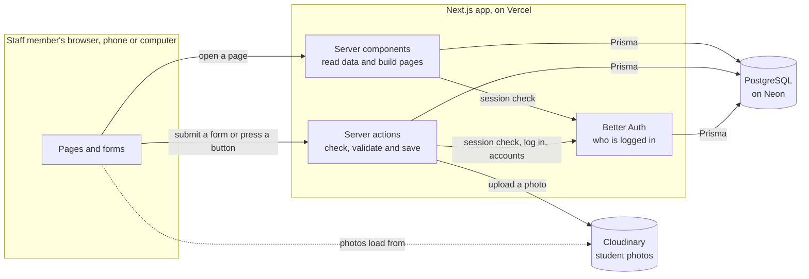
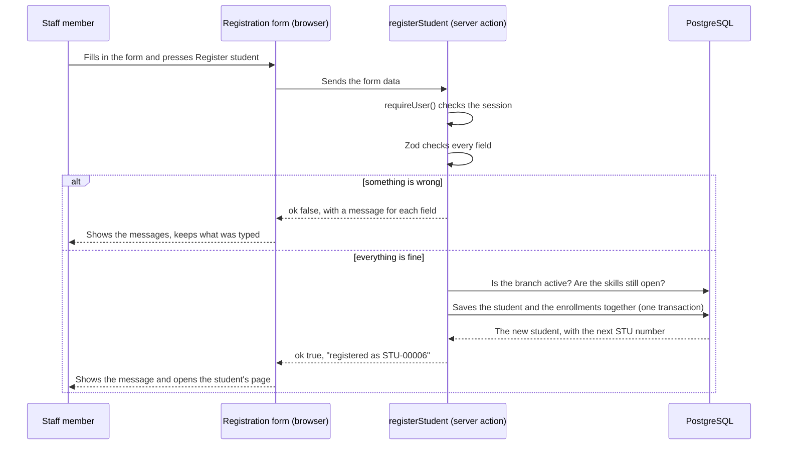

# How the Hormuud Academy system works

This guide explains the whole system: the technology it's built on, every library it uses, how the code is organised, how the database tables connect, and every screen and action you can use. Read it top to bottom once. After that, use the contents list to jump back to the part you need.

The words in this guide have exact meanings. A "class" is a room, not a group of students, and an "enrollment" is one student taking one skill. [CONTEXT.md](../CONTEXT.md) defines every term, and [docs/adr](adr) records the main decisions the rest of the design depends on.

## Contents

1. [The system in two minutes](#the-system-in-two-minutes)
2. [Technology stack](#technology-stack)
3. [Every library and what it does](#every-library-and-what-it-does)
4. [Architecture](#architecture)
5. [The database](#the-database)
6. [Who can do what](#who-can-do-what)
7. [Using the system](#using-the-system)
8. [The money screens](#the-money-screens)
9. [Everyday situations](#everyday-situations)
10. [Running and deploying](#running-and-deploying)
11. [Adding new features](#adding-new-features)
12. [What isn't built yet](#what-isnt-built-yet)

## The system in two minutes

Hormuud Academy is one college with several branches. The system keeps track of:

- the branches
- the skills the college teaches, like Graphic Design or Tailoring, in one list for the whole college
- when, where and by whom each skill is taught at each branch: its class times, each in a class (room), from a start time to an end time on chosen days, with a teacher
- the students, and which skills each student is taking
- the registration fee a student pays for each skill they start, and whether it's paid
- every payment the college takes, by day, by category and by how it was paid
- in two currencies, US dollars and Somaliland shillings, kept apart like two separate books
- the books the college sells: what each branch charges, how many copies are on its shelf, and every sale
- every month of every skill: paid, or still owed
- what the college spends, at which branch and on what
- what each teacher earns, whether that's a fixed salary or a share of the fees they bring in
- what each branch planned to take and spend this month, against what really happened

One chain of ideas holds it all together:

```
Skill            Graphic Design, defaults: 4 months,          (one for the whole college)
│                $15 to register, $30 a month
└─ Branch skill  Graphic Design at Main Branch,               (one per branch that teaches it)
   │             4 months, $15 to register, $30 a month
   └─ Class time 6–8 pm, Sat Mon Wed, Computer Lab,           (one or more per branch skill)
      │          Demo Teacher 2
      └─ Enrollment STU-00003 started on 19 Aug 2026, Active  (one per student taking it)
```

A skill is defined once. Each branch that teaches it gets a **branch skill**, which says how long it runs there and what it costs. Branches are in different cities, so a small town can charge $5 a month for what costs $10 in the capital. The skill's own fees and duration are only the defaults a new branch starts from. Each branch skill has one or more **class times**, which say when, where and by whom it's taught: a class (room), the hours like 4–6 pm, the days of the week, and a teacher. Each class time sets its own hours, so a room can hold a two-hour class and a one-hour class in the same afternoon, and a popular skill can run in the morning and again in the evening. When a student starts a skill, the system creates an **enrollment** that links the student to that branch skill, in one of its class times. The enrollment keeps the branch skill's two fees and its end date from that day. A student taking three skills has three enrollments, and three registration fees, and the skills can be at different branches.

Money hangs off that same chain. Every amount in is a **payment**, and every payment says what it was for, which branch took it, how it was paid and in which currency:

```
Enrollment   STU-00003 takes Graphic Design at Main Branch, $30 a month
├─ Payment   Registration fee   $15            ZAAD    19 Aug 2026
├─ Payment   Aug 2026           $30            Cash     5 Sept 2026   → teacher earns $9
└─ Payment   Sept 2026          256,500 SLSH   eDahab   4 Sept 2026   → teacher earns 76,950 SLSH
```

A monthly fee payment names the **month it pays for**, not just the day the money arrived, so the system can say which months a student has settled and which they still owe. Money out is an **expense**, which always names a branch. Nothing stores a running total: a day's takings, a month's spending and a teacher's earnings are counted from those rows every time a screen asks.

Books follow the skills' pattern. A **book** is on one list for the whole college with a default price, and each branch that sells it gets a **branch book** with its own price and its own **stock**, the copies on its shelf. Selling books is a payment in the Books category with a line per title, and the copies come off that branch's shelf as the sale is recorded. The stock is the one count the system does store, because two people mustn't sell the last copy; every delivery and fixed count is kept beside it, so it can always be checked.

Fees are set in dollars, but a student can pay in dollars or in Somaliland shillings. The two are never added together: every screen shows dollars and shillings separately, and underneath them what the two are worth together in dollars at today's rate. The admin sets the exchange rate on the Settings page. Each shilling payment keeps the rate it was recorded at, like a receipt, while the totals always use today's.

Two kinds of people log in:

- **Admins** see every branch and set everything up.
- **Branch staff** work at one branch. They register students and look after those students' skills at that branch.

Nobody signs up on their own. The admin creates every account, and the person signs in with the Google account for that account's email. Passwords from before Google sign-in still work until the switch-over finishes.

Phase 1 was the college itself: branches, skills, teachers, classes, students and enrollments. Phase 2 is the money described above. Attendance, exams and certificates aren't built yet, and the last section lists everything else that's missing.

## Technology stack

| Layer | Technology | Its job in this system |
|---|---|---|
| Language | TypeScript 5 | All the code, on the server and in the browser |
| Framework | Next.js 16 (App Router) | Serves the pages, runs the server code, builds the app |
| UI library | React 19 with the React Compiler | The screens are React components |
| Styling | Tailwind CSS 4 | Styles through class names such as `flex gap-2 text-sm` |
| Components | shadcn/ui on Radix UI | Buttons, dialogs, tables, the sidebar, form fields |
| Database | PostgreSQL | Stores everything. Neon in production, `prisma dev` on your computer |
| Database access | Prisma 7 | Describes the tables, changes the database safely, runs typed queries |
| Login | Better Auth 1.7 | Google sign-in, sessions, roles, deactivating accounts, and the old passwords until they're removed |
| Validation | Zod 4 | Checks every form on the server before anything is saved |
| Photos | Cloudinary | Stores student photos |
| Hosting | Vercel | Runs the app on the internet |
| Package manager | pnpm 11 | Installs the libraries |
| Code checks | ESLint 9 | Catches mistakes, including React Compiler rule breaks |

### Next.js 16 and React 19

Next.js decides which page a URL shows, runs code on the server, and builds the app. This project uses the **App Router**: every folder under `src/app` is part of a URL. A `page.tsx` file is the page for that URL, and a `layout.tsx` file wraps every page beneath it.

Three kinds of code matter:

- **Server components** are the default. They run only on the server, so they can read the database directly and send finished HTML to the browser. Almost every `page.tsx` here is one.
- **Client components** start with `"use client"`. They run in the browser and handle anything interactive: dialogs, forms, the sidebar, dropdowns that change other dropdowns. Files named `*-dialog.tsx` and `*-form.tsx` are client components.
- **Server actions** live in files that start with `"use server"`, which are always called `actions.ts` here. They are functions that run on the server, but a client component calls them like normal functions. Every change you make in the app, like saving a form or clicking Deactivate, is a server action. That is why the project has no separate REST API.

The **React Compiler** (`reactCompiler: true` in `next.config.ts`) speeds up re-rendering automatically, so the app's own code doesn't need manual `useMemo` or `useCallback`. Next.js 16 builds with **Turbopack**.

Next.js 16 changed a lot compared to older versions, and `AGENTS.md` points to the exact documentation for the installed version in `node_modules/next/dist/docs/`.

### Tailwind CSS 4 and shadcn/ui

Tailwind styles elements with class names instead of CSS files. The theme colours and fonts are in `src/app/globals.css`.

The colours are CSS variables such as `--background` and `--warning`, set once in `:root` for light mode and again in `.dark` for dark mode. Screens use the variable names (`bg-background`, `bg-warning`), never fixed colours like `bg-amber-50`, so they follow the theme without extra classes. `next-themes` puts the `dark` class on `<html>` when someone picks Dark from the sun and moon button (top right of every page), or picks System and their device is in dark mode. It saves the choice in the browser's `localStorage`, so each person's choice stays on their own device.

shadcn/ui is not a normal library. Its command line tool copies each component's source code into `src/components/ui`, so the project owns that code and you can edit it. The components are built on **Radix UI**, which handles keyboard use, focus and screen readers for dialogs, checkboxes and menus. `components.json` records the settings (the "radix-vega" style). To add another component, run `pnpm dlx shadcn@latest add <name>`.

### PostgreSQL and Prisma 7

PostgreSQL stores the data in tables. Prisma sits between the code and the database:

- `prisma/schema.prisma` describes every table as a **model**.
- `prisma generate` turns the schema into a TypeScript client in `src/generated/prisma`, so a query like `prisma.student.findMany()` knows every column's type. The generated folder isn't in git, and `pnpm dev` and `pnpm build` regenerate it.
- **Migrations** in `prisma/migrations` are SQL files that change the database one step at a time. `pnpm db:migrate` creates and applies them on your computer, and `pnpm db:deploy` applies them to the production database.
- Prisma 7 talks to Postgres through a **driver adapter**, here `@prisma/adapter-pg` with the `pg` driver. The same code works with Neon and with the local database.
- `prisma.config.ts` tells the Prisma command line tool where the schema, the migrations, the seed script and the database are.
- The **partial indexes** preview feature is switched on for one rule: a student can't have the same skill Active twice.

On your computer, `pnpm db:local` runs `prisma dev`, a real Postgres engine (PGlite) inside the Prisma CLI, so you don't need Docker. It accepts one connection at a time, which is why `.env` sets `DATABASE_POOL_MAX=1` locally. In production the database is **Neon**, a hosted Postgres you add through the Vercel Marketplace.

### Better Auth

Better Auth handles everything about logging in:

- It checks emails and passwords and stores only a hash of each password, never the password itself.
- It creates a **session** when someone logs in, stores it in the `session` table, and gives the browser a `better-auth.session_token` cookie. A login lasts 7 days and is extended while the person keeps using the app.
- The **admin plugin** adds roles (`admin` and `staff`), lets an admin create accounts and set passwords, and **bans** accounts. In this app, "Deactivate" on a staff account is a ban. A ban also ends the person's open sessions.
- It **rate-limits** its own `/api/auth` endpoints and keeps the counts in the `rateLimit` table. Its default store is the server's memory, which doesn't work on Vercel, where each copy of the app has its own memory and loses it often. Better Auth only applies these limits in production.
- The `nextCookies()` plugin lets server actions set the login cookie.
- Sign-up is switched off (`disableSignUp: true`), for passwords and for Google. The seed script creates the first admin, and after that only admins create accounts.
- It signs staff in with **Google** (`socialProviders.google`), described below.

The configuration is in `src/lib/auth.ts`. Better Auth's web endpoints are served at `/api/auth/...` by `src/app/api/auth/[...all]/route.ts`. The screens don't call them directly, because the login and logout forms use server actions. The one endpoint used from outside is `/api/auth/callback/google`, where Google sends people back.

A server action calls Better Auth's functions directly, without going through `/api/auth`, so Better Auth's rate limit never sees it. That's why the login actions check their own limits first, with `consumeRateLimit()` from `src/lib/rate-limit.ts`, in the same `rateLimit` table.

### Google sign-in

Staff sign in with their Google account instead of a password. Google proves the person owns the email, which is what an invite email would otherwise do, so the app sends no emails and needs no password.

What happens when someone presses **Sign in with Google**:

1. The form runs `signInWithGoogle` in `src/app/login/actions.ts`. It asks Better Auth for Google's sign-in address and sends the browser there. Better Auth stores a random `state` in the `verification` table and in a cookie, so nobody can finish a sign-in someone else started.
2. Google shows its account picker (`prompt: "select_account"`, so on a shared computer nobody walks in as whoever signed in last), and the person picks their account.
3. Google sends the browser to `/api/auth/callback/google`. Better Auth checks the `state`, asks Google who the person is, and looks for a user with that email.
4. **No user with that email:** refused, because sign-up is off. The browser goes back to `/login?error=signup_disabled`, and the page explains it.
5. **A user with that email:** on the first Google sign-in, Better Auth adds an `account` row with `providerId = "google"`, which links that Google account to the user. After that it finds the user through the link. It links only when the user's `emailVerified` is true, and every account the admin creates or saves is marked so.
6. A session is created as usual and the browser goes to `/students`. A deactivated account is refused at this step and sent back to `/login?error=BANNED_USER`.

Google also hands over tokens for its own services. The app never uses them, and `encryptOAuthTokens` keeps them encrypted in the `account` table.

**Only the admin creates accounts, and two settings make sure of it.** Better Auth has a second way to sign in with Google: posting a Google ID token straight to `/api/auth/sign-in/social`. In Better Auth 1.7.5 that way ignores `disableSignUp`, so anyone with a Google account could have made themselves a staff account with one request. The app never uses it, so `disableIdTokenSignIn: true` switches it off (it answers `ID_TOKEN_NOT_SUPPORTED`). As a backstop, a `databaseHooks.user.create.before` hook in `src/lib/auth.ts` refuses to create any user unless the request is the admin plugin's `/admin/create-user`, which the Staff page, the seed and the demo script all use. Any other attempt fails with `signup_disabled`, whatever a sign-in setting says.

The Google side is an **OAuth client** in a Google Cloud project, whose ID and secret are `GOOGLE_CLIENT_ID` and `GOOGLE_CLIENT_SECRET`. Its authorized redirect URIs must list `http://localhost:3000/api/auth/callback/google` and `https://hormuud-academy.vercel.app/api/auth/callback/google`. Without the two keys the Google button is hidden (`googleSignInEnabled`).

**Changing a staff member's email** removes their Google link and logs them out, because the old Google account would otherwise still get in. They sign in again with the Google account for the new address.

**The first admin** comes from the seed: `pnpm db:seed` creates an admin from `SEED_ADMIN_NAME` and `SEED_ADMIN_EMAIL`, with no password. If the only admin loses their Google account, run the seed again with a new Gmail. It leaves existing emails alone and creates the new admin. Two admins avoid needing that.

**The switch-over.** Accounts made before Google sign-in still have passwords, and the login page still shows the password form under the Google button. The steps to finish it are in `docs/open-decisions.md`.

### Zod

Every server action checks its form with a Zod schema before touching the database, for example "a phone number is the nine digits after +252". When something is wrong, the action sends back one message per field and the form shows each message under the right field. The checks run on the server, so nobody can skip them by changing the page in their browser.

### Cloudinary

Student photos are uploaded to Cloudinary. The database keeps only the photo's address (`photoUrl`) and its Cloudinary id (`photoPublicId`, needed to delete it). Photos are shrunk to at most 600 by 600 pixels and stored in the `hormuud-academy/students` folder. Until the three Cloudinary keys are in `.env`, the photo field says upload is off, and everything else works.

### Vercel

Vercel runs the app on the internet and deploys it from GitHub. A college that pays for the system needs the Pro plan, because the free Hobby plan is for non-commercial use.

## Every library and what it does

These are all the libraries in `package.json`.

### Used when the app runs

| Library | Version | What it's for | Where you'll see it |
|---|---|---|---|
| `next` | 16.3.5 | The framework | Everywhere |
| `react`, `react-dom` | 19.2.8 | Building the screens | Every component |
| `@prisma/client` | 7.10 | The runtime the generated Prisma client runs on | `src/lib/prisma.ts` |
| `@prisma/adapter-pg` | 7.10 | Connects Prisma to Postgres | `src/lib/prisma.ts` |
| `pg` | 8.23 | The Postgres driver the adapter uses | Used by the adapter |
| `better-auth` | 1.7.5 | Login, sessions, roles, bans | `src/lib/auth.ts`, `src/lib/session.ts` |
| `@better-auth/prisma-adapter` | 1.7.5 | Lets Better Auth save users and sessions through Prisma | `src/lib/auth.ts` |
| `zod` | 4.6 | Checks form input | `src/lib/validation.ts` and every `actions.ts` |
| `cloudinary` | 2.11 | Uploads and deletes photos | `src/lib/cloudinary.ts` |
| `server-only` | 0.0.1 | Breaks the build if server-only code ends up in the browser | `session.ts`, `cloudinary.ts`, `students/queries.ts` |
| `dotenv` | 18 | Reads `.env` for the Prisma CLI and the scripts | `prisma.config.ts`, `prisma/seed.ts`, `prisma/demo.ts` |
| `radix-ui` | 1.6.7 | Accessible parts behind the shadcn components | `src/components/ui` |
| `shadcn` | 4.21 | The shadcn tool, plus the `shadcn/tailwind.css` styles | `src/app/globals.css` |
| `class-variance-authority` | 0.7 | Defines component variants such as button sizes and colours | `src/components/ui` |
| `cn` | 0.3 | Merges Tailwind class names without conflicts | `src/lib/utils.ts` and the UI components |
| `lucide-react` | 1.47 | Icons | Sidebar, buttons, pages |
| `sonner` | 2.0 | The small pop-up messages, like "Branch saved." | `src/components/ui/sonner.tsx` |
| `next-themes` | 0.4 | Light, dark or device theme, remembered in the browser | `src/components/theme-provider.tsx`, `src/components/theme-toggle.tsx` |
| `tw-animate-css` | 1.4 | Opening and closing animations for dialogs | `src/app/globals.css` |

### Used only while developing

| Library | Version | What it's for |
|---|---|---|
| `prisma` | 7.10.0 | The Prisma CLI: migrations, generate, Studio, the local database. Pinned to exactly 7.10.0, because npm's "latest" tag points at a Prisma 8 test release |
| `typescript` | 5.9 | Type checking |
| `tailwindcss`, `@tailwindcss/postcss` | 4.3 | Builds the CSS |
| `eslint`, `eslint-config-next` | 9, 16.3.5 | Lint rules, including the React Compiler rules |
| `babel-plugin-react-compiler` | 1.0 | The React Compiler |
| `tsx` | 4.23 | Runs TypeScript scripts directly, for the seed and demo scripts |
| `@serwist/turbopack`, `serwist` | 9.5 | Build the service worker that makes the app installable and shows the offline page. See [Installing it as an app](#installing-it-as-an-app) |
| `esbuild` | 0.28 | Bundles the service worker; Serwist runs it during the build |
| `@types/node`, `@types/react`, `@types/react-dom`, `@types/pg` | | Type information for those libraries |

The fonts are Inter for text and Geist Mono for the student ID on a student's page, loaded by `next/font` in `src/app/layout.tsx`.

The shadcn components installed are alert-dialog, avatar, badge, button, card, checkbox, dialog, field, input, label, select, separator, sheet, sidebar, skeleton, sonner, spinner, table and tooltip. Three more are installed but not used yet: dropdown-menu, empty and textarea.

## Architecture

### The big picture


```mermaid
flowchart LR
    subgraph browser["Staff member's browser, phone or computer"]
        UI["Pages and forms"]
    end
    subgraph app["Next.js app, on Vercel"]
        SC["Server components<br/>read data and build pages"]
        SA["Server actions<br/>check, validate and save"]
        BA["Better Auth<br/>who is logged in"]
    end
    DB[("PostgreSQL<br/>on Neon")]
    CL[("Cloudinary<br/>student photos")]

    UI -- "open a page" --> SC
    UI -- "submit a form or press a button" --> SA
    SC -- "session check" --> BA
    SA -- "session check, log in, accounts" --> BA
    SC -- "Prisma" --> DB
    SA -- "Prisma" --> DB
    BA -- "Prisma" --> DB
    SA -- "upload a photo" --> CL
    UI -. "photos load from" .-> CL
```

There is one app and one database. Every branch uses the same app through a browser, so the admin sees every branch's data live.

### Folders and files

```
hormuud-academy/
├── prisma/
│   ├── schema.prisma            All the database tables
│   ├── migrations/              The SQL that builds the database, step by step
│   ├── seed.ts                  Creates the first admin and the two starting categories
│   └── demo.ts                  Sample data for trying the app locally
├── prisma.config.ts             Where the Prisma CLI finds the schema and the database
├── next.config.ts               Next.js settings: React Compiler, 6 MB uploads, Cloudinary images,
│                                retrying when the connection drops, Serwist
├── public/icons/                The app icons a phone puts on its home screen
├── src/
│   ├── app/                     Every page, by URL
│   │   ├── layout.tsx           The outer page: fonts, pop-up messages, the offline banner,
│   │   │                        and the service worker
│   │   ├── manifest.ts          The app's name, icons and colours when it's installed
│   │   ├── icon.svg, apple-icon.png The graduation cap in browser tabs and on iPhones
│   │   ├── sw.ts                The service worker
│   │   ├── serwist/             Builds sw.ts and serves it at /serwist/sw.js
│   │   ├── ~offline/            The "You're offline" page
│   │   ├── login/               The login page and its server actions (password and Google)
│   │   ├── api/auth/            Better Auth's web endpoints
│   │   └── (app)/               Everything behind the login
│   │       ├── layout.tsx       Checks the login, draws the sidebar and header
│   │       ├── app-sidebar.tsx  The menu
│   │       ├── actions.ts       Log out
│   │       ├── page.tsx         "/" sends you on to /students
│   │       ├── students/        Student list, registration, student page, editing, and the
│   │       │                    student picker the money dialogs search with
│   │       ├── finance/         The money screens
│   │       │   ├── page.tsx     The financial dashboard, admins only
│   │       │   ├── labels.ts    The words for each stored code, shared by every screen
│   │       │   ├── access.ts    Who sees which money
│   │       │   ├── period.ts    Day, month or everything, read from the query string
│   │       │   ├── queries.ts   The totals every money screen is built from
│   │       │   ├── figures.tsx  The stat cards and the breakdown table
│   │       │   ├── amount-fields.tsx The amount box and its USD / SLSH dropdown
│   │       │   ├── fee-months.ts Which months an enrollment owes a fee for
│   │       │   ├── payments.ts  The registration fee written with a new enrollment
│   │       │   ├── income/      Income, and every action that records a payment, book
│   │       │   │                sales included, with the Sell books dialog
│   │       │   ├── owed/        Who still owes a registration fee or a month
│   │       │   ├── expenses/    Expenses, admins only
│   │       │   ├── expense-categories/ The list of expense categories, admins only
│   │       │   ├── teacher-pay/ What each teacher earned and was paid, admins only
│   │       │   └── budget/      The plan per branch per month, admins only
│   │       ├── books/           The book list and each branch's shelf. Admins set books and
│   │       │                    prices; branch staff add copies and fix their branch's count.
│   │       │                    [id]/ is one book: its branches and what happened to its copies
│   │       ├── teachers/        Admins manage them; branch staff see their branch's
│   │       ├── classes/         Admins manage them; branch staff see their branch's.
│   │       │                    [id]/ is one class's week
│   │       ├── class-times/     [id]/ is one class time: its details and every student in it.
│   │       │                    Admins and the branch's own staff
│   │       └── admin/           Setup screens, admins only
│   │           ├── layout.tsx   Sends anyone who isn't an admin back to /students
│   │           ├── branches/
│   │           ├── categories/
│   │           ├── skills/      The skill list, and [id]/ for one skill's page with its
│   │           │                class times
│   │           ├── staff/
│   │           └── settings/    The exchange rate and its history
│   ├── components/
│   │   ├── ui/                  shadcn/ui components
│   │   └── *.tsx                Shared pieces: DataTable, FormDialog, ActionButton, fields, badges
│   ├── hooks/                   useFormAction and useIsMobile
│   ├── lib/                     auth, session, prisma, access, dates, money, exchange-rate,
│   │                            teacher-share, format, validation, search-params, cloudinary,
│   │                            rate-limit, class-times (hours and days), clashes (nothing
│   │                            in two places at once)
│   └── generated/prisma/        The generated Prisma client (not in git)
├── docs/                        This guide and the decision records
├── CONTEXT.md                   The glossary
├── CLAUDE.md, AGENTS.md         Notes for AI coding assistants working on the project
└── .env.example                 Every setting the app needs, without real values
```

`(app)` in brackets is a **route group**. The brackets keep the folder name out of the URL, so the student list is at `/students`, not `/app/students`. The group exists so every page inside it shares one layout with the login check and the sidebar.

### The files inside a feature folder

Every setup screen has the same three kinds of file. Take `src/app/(app)/admin/branches/`:

- `page.tsx` is a server component. It reads the branches with Prisma and draws the table.
- `actions.ts` holds the server actions: `createBranch`, `updateBranch`, `setBranchActive` and `deleteBranch`.
- `branch-dialog.tsx` is a client component: the pop-up form used both to add and to edit a branch.

Every server action follows the same five steps:

1. Check who is asking with `requireUser()` or `requireAdmin()`.
2. Check the form with a Zod schema.
3. Check the business rules, for example that the name isn't taken or the branch is active.
4. Save with Prisma.
5. Call `refresh()` so the page shows the new data, and return an `ActionResult`.

The students folder has a few more files, because it has more rules:

| File | What it does |
|---|---|
| `access.ts` | Decides which students and which enrollments each person can see and change |
| `queries.ts` | All the reading: the list with its filters, a student's page, the skills a student can join |
| `actions.ts` | Register, edit, add a skill, change an enrollment's status, record and change registration fees, delete, find by phone |
| `types.ts` | Plain data shapes passed from the server to the forms |
| `student-fields.tsx` | Fields used by registration, editing and Add skill: the phone warning, the photo picker, the skill picker and the "registration fee paid" box |
| `new/` | The registration page |
| `[id]/` | A student's page with its Add skill and fee dialogs, plus `edit/` for editing |

The finance folder works the same way, with a few pieces shared by all four money screens:

| File | What it does |
|---|---|
| `labels.ts` | The word shown for each stored code: `EDAHAB` is "eDahab", `MONTHLY_FEE` is "Monthly fee". Also `TEACHER_SALARY_ID`, the id of the Teacher salary expense category. Safe to import from a client component, so a dropdown and a table can't disagree |
| `access.ts` | Which payments a person may see, and which branch a screen reports on |
| `period.ts` | Reads "one day", "one month" or "everything" out of the query string and turns it into a date filter |
| `queries.ts` | Income by method, income by category, expenses by category, the totals and the net balance |
| `expense-categories/queries.ts` | The expense categories from A to Z, and the ones an expense can be put in |
| `figures.tsx` | `StatCard` and `Breakdown`, the two shapes every money screen is drawn from |
| `fee-months.ts` | The months one enrollment owes a fee for, none when the monthly fee is zero. Pure arithmetic, no database |
| `income/actions.ts` | Every action that records or removes a payment, including the ones the student's page calls |

The student's page imports `recordRegistrationFee` and `recordMonthlyFee` from `finance/income/actions.ts` rather than having its own copies, so the branch check and the teacher's share are worked out in one place whatever screen took the money.

### What happens when you open a page

1. The browser asks for `/students`.
2. `src/app/(app)/layout.tsx` calls `requireUser()` in `src/lib/session.ts`. That asks Better Auth to turn the session cookie into a user. With no valid session, you go to `/login`.
3. Pages under `/admin` also go through `admin/layout.tsx`, which calls `requireAdmin()` and sends branch staff back to `/students`.
4. The page reads what it needs through Prisma, filtered by the branch rules in `students/access.ts`.
5. Next.js builds the HTML on the server and sends it. The interactive parts, like dialogs, start working once the browser loads them.

### What happens when you press Save

This is registering a student. Every other form works the same way.


```mermaid
sequenceDiagram
    participant S as Staff member
    participant F as Registration form (browser)
    participant A as registerStudent (server action)
    participant DB as PostgreSQL

    S->>F: Fills in the form and presses Register student
    F->>A: Sends the form data
    A->>A: requireUser() checks the session
    A->>A: Zod checks every field
    alt something is wrong
        A-->>F: ok false, with a message for each field
        F-->>S: Shows the messages, keeps what was typed
    else everything is fine
        A->>DB: Is the branch active? Are the skills still open?
        A->>DB: Saves the student and the enrollments together (one transaction)
        DB-->>A: The new student, with the next STU number
        A-->>F: ok true, "registered as STU-00006"
        F-->>S: Shows the message and opens the student's page
    end
```

"One transaction" means the student and their enrollments are saved together or not at all. You never get a student saved without their skills.

### The shared building blocks

| Piece | File | What it does |
|---|---|---|
| `ActionResult` | `src/lib/action-result.ts` | What every action returns: `{ ok: true, message }` or `{ ok: false, error, fieldErrors }` |
| `useFormAction` | `src/hooks/use-form-action.ts` | Sends a form to an action, keeps what you typed when there's an error, shows field errors, shows the success message |
| `DataTable` | `src/components/data-table.tsx` | Every table of records. The page gives it the columns and, per row, the value for each column. Clicking a row opens a pop-up listing all of them, so a phone doesn't have to scroll sideways to read the far columns |
| `FormDialog` | `src/components/form-dialog.tsx` | A pop-up with one form. Closes when the action works, and opens with a fresh form each time |
| `ActionButton` | `src/components/action-button.tsx` | A button that runs an action without a form, like Deactivate or Mark finished. It can ask for confirmation first and can move to another page afterwards |
| `TextField`, `SelectField` | `src/components/form-fields.tsx` | A labelled input or dropdown with its error message |
| `SelectInput` | `src/components/select-input.tsx` | The one dropdown every screen uses: the form fields, the students filters and the theme picker. Built on the shadcn `select`. The page draws the list itself, so it gets the app's font and theme, which the browser's own `<select>` list can't. It can't take an empty option value, so a "no filter" choice like "Any skill" needs a real value |
| `PageHeader`, `ActiveBadge`, `EmptyRow` | `src/components/` | The page title row, the Active/Inactive badge, the "nothing here yet" box |

### Installing it as an app

The app is a PWA (progressive web app): a website a phone or computer can install like an app. Installed, it gets the graduation cap on the home screen and opens full screen, without the browser's address bar. It's still the same website, so every deploy reaches installed copies straight away, with no app store.

Four pieces make it work:

- **The manifest** (`src/app/manifest.ts`, served at `/manifest.webmanifest`) tells the phone the app's name, icons and colours, and that it opens on `/students`.
- **The service worker** (`src/app/sw.ts`) is a small script the browser keeps running for the site, even between visits. It sits between the app and the internet and decides what comes from the network and what from the phone. Serwist builds it during `pnpm build` and serves it at `/serwist/sw.js`. It's switched off under `pnpm dev`, where a cache would serve stale code; to try it locally, run `pnpm build` then `pnpm start`.
- **The offline page** (`src/app/~offline/`). When a page can't load because there's no internet, the service worker shows this instead of the browser's error. The address stays the page you wanted, so **Try again** reloads it.
- **The offline banner** (`src/components/offline-banner.tsx`). Next.js's `useOffline` setting notices when a page load or a save fails for lack of internet. Instead of failing, the request waits, and goes through by itself once the connection is back. Meanwhile a yellow strip across the top says "No internet".

What the service worker keeps on the phone is only the app's own files (scripts, styles, fonts, icons) and the offline page, about 1.3 MB, downloaded once per deploy. **It never keeps pages.** Pages hold student records and payments, and a phone at a branch may be shared: if pages were cached, the next person could read them offline after the first one logged out. That's why `sw.ts` doesn't use Serwist's ready-made cache list, which would keep them. For the same reason the app doesn't reload itself when the connection comes back: a reload would throw away a form someone was halfway through.

### Security and permissions

- Every page and every server action checks the login again. A server action can be called without opening its page, so hiding a button isn't enough: the action itself checks with `requireUser()` or `requireAdmin()`, and then checks the branch rules.
- The branch rules live in `src/app/(app)/students/access.ts`: `visibleEnrollments`, `browsableStudents`, `canEditStudent` and `canActAtBranch`.
- Staff sign in with Google, and an unknown Google account is refused. The app never sees a Google password.
- No account can be created except through the admin's create-user. A database hook in `src/lib/auth.ts` refuses every other way, so a sign-in setting that fails to switch sign-up off can't open it.
- The passwords left from before Google sign-in are stored as hashes. Nobody, including the admin, can read a password back. An admin can only set a new one, and only on an account that still has one.
- There is no sign-up page.
- Deactivating an account stops the login and ends every open session straight away.
- Setting a new password also ends every open session for that person, because a reset often means someone else knew the old password. An admin who resets their own password stays logged in on the device they're using.
- The login form allows 5 tries per email and 20 tries per computer (IP address) each minute. After that it shows "Too many login attempts" and how many seconds to wait. This stops anyone guessing a password by trying thousands. The Google button has its own limit of 20 a minute per computer.

### Dates and the time zone

Registration, start and end dates are calendar days with no time. The database stores them as `DATE` columns. "Today" always means today in East Africa Time (UTC+3), wherever the server runs. Without that, a student registered after 21:00 UTC would get the next day's date. All of this is in `src/lib/dates.ts`.

An enrollment's end date is its start date plus the skill's duration in months. When the day doesn't exist in the target month, the end date moves to the last day of that month, so 31 January plus one month is 28 or 29 February.

### Months

A month is written `2026-09`, which is what an `<input type="month">` gives, and stored as that month's first day in a `DATE` column. `src/lib/dates.ts` has the helpers: `collegeMonth()`, `monthOf()`, `monthStart()`, `monthEnd()`, `monthsBetween()` and `formatMonth()`. A budget is set for a month, and a monthly fee pays for one.

### Money

Every amount is stored as a `DECIMAL`, exact to the cent: `DECIMAL(14, 2)` for payments, expenses and salaries, which can be millions of shillings, and `DECIMAL(10, 2)` for fees and budgets, which are in dollars. Ordinary floating-point numbers can't hold an amount like 0.10 exactly, which is why no amount is one. Prisma hands these back as `Decimal` objects; the code turns them into strings like `"20.50"` and adds them with the helpers in `src/lib/money.ts`, which work in whole cents so `10.10 + 15.20` comes out as `25.30` and not `25.299999999999997`.

Each enrollment copies the skill's monthly fee and registration fee on the day the student joins, so a later price change doesn't touch current students.

**Every amount in is a payment.** One row in `payments` holds the amount, its currency, the day the money came in, the branch that took it, what it was for and how it was paid. Registration fees used to live on the enrollment; [ADR 0004](adr/0004-one-ledger-for-every-payment.md) explains why they moved here and why nothing stores a running total. The enrollment still keeps the fee it *owes*, because that's a price the admin can waive; whether it was paid is the ledger's answer.

A fee is settled or it isn't, whether it's a registration fee or one month of a skill. There is no running balance: staff can record less than the fee when a student can't pay it all, and that one payment settles it. A monthly fee payment carries a **fee month**, so September stays September's however late the money arrived, and the database refuses a second payment for a month already settled. A skill whose monthly fee is zero is free: it has no fee months, so it never shows an unpaid month, Fees owed leaves it out, and recording a monthly payment for it is refused.

**Every amount out is an expense**, and every expense names the branch it was spent for. A teacher's pay is an expense in the Teacher salary category that also names the teacher and the month it covers.

### Two currencies

The college takes and spends two currencies, US dollars (`USD`) and Somaliland shillings (`SLSH`). Think of them as two separate account books. [ADR 0007](adr/0007-two-currencies-two-ledgers.md) explains the choice; here is how it works.

- **Every payment and expense is in exactly one currency.** Each form that takes money has a Currency dropdown next to the amount, dollars by default. Shillings are whole numbers, because there's no coin smaller than one shilling. A box accepts `250000`, `250,000` or `250 000`.
- **No stored total ever mixes the two.** Every total on every screen is shown per currency: the dollars, the shillings, and underneath them the **combined** figure, which is what the two are worth together in dollars at today's rate.
- **The exchange rate** is how many shillings one dollar is, like 8,550. The admin sets it on the Settings page (`src/app/(app)/admin/settings`). Every change is a new row in `exchange_rates`, so the page can show who changed it and when; the latest row is the rate in force. `src/lib/exchange-rate.ts` reads it. Until a rate is set, nothing can be recorded in shillings.
- **A shilling row keeps its rate, like a receipt.** When a shilling payment or expense is recorded, the rate in force is copied onto it (`exchangeRate`), and what it was worth in dollars that day is worked out once, to the cent, and stored with it (`usdValue`). A dollar row's `usdValue` is simply its amount. Neither ever changes: a new rate doesn't rewrite a receipt. The row shows it under the shillings, like "≈ $5.00 at 8,550". Correcting a shilling expense's amount works its dollar value out again at the rate it was first recorded at.
- **Totals use today's rate.** A combined figure says what the college's money is worth now, so it's the dollars plus the shillings at today's rate, worked out each time a screen opens, and it moves when the rate does: if a dollar was 10,000 shillings last month and is 12,000 now, last month's shillings count for less. That's why the ≈ figures on the rows, which are each at their own day's rate, don't add up to the totals. Every screen uses the same rate, so they all agree on the same total.
- **Fees stay priced in dollars.** Paying a monthly fee in shillings, the amount box starts at the fee at today's rate (a $20 fee at 8,550 is 171,000 shillings) and can be lowered for a discount like a dollar amount. A registration fee works the same way, except the amount can only go down: the box starts at the fee at today's rate, to the nearest shilling, and the app refuses more than that. **Fees owed** stay in dollars, because that's what the fees are set in.
- **Teacher pay follows the ledgers.** A fixed salary is set in one currency, on the teacher, and paid in that currency: the pay dialog fixes the dropdown, and the server refuses the other one. A percentage teacher earns their share in whatever currency the student paid, so their unpaid share has a dollar part and a shilling part, and each is paid out of its own ledger.
- **The monthly budget is planned in dollars**, and compared against the combined figures, at today's rate like everywhere else.

`src/lib/money.ts` holds the currency helpers: `inLedger()` gives the columns a new payment or expense needs (amount, currency, rate and dollar value), `dollarsToShillings()` turns a fee into shillings, `totalOf()` adds grouped sums into a `MoneyTotal` (`{ USD, SLSH }`), the shape every query returns, and `totalAtRate()` adds its combined figure at a rate. The stat cards and breakdown tables in `finance/figures.tsx` read today's rate themselves, so every figure on a page uses the same one. The database checks that a dollar row has no rate and is worth its amount, and that a shilling row has a rate above zero and a dollar value within a cent of its shillings at that rate.

**Expense categories are a list the admin keeps**, not codes fixed in the program. Teacher salary is the exception: teacher pay is found by it, so it has the fixed id `teacher_salary` and can't be renamed, deactivated or deleted. A category that an expense or a budget plan uses can only be deactivated, never deleted, so past months keep adding up. [ADR 0006](adr/0006-expense-categories-are-kept-by-the-admin.md) explains why.

**A percentage-paid teacher's share** is worked out when the payment is recorded and written onto it, along with the rate it was worked out at, by `src/lib/teacher-share.ts`. Raising a rate changes what they earn from that day on and never rewrites the past. [ADR 0005](adr/0005-a-teachers-share-is-worked-out-once.md) covers it.

### Student IDs

A student's number comes from a database sequence and is shown as `STU-00001`. Numbers are never reused. They can skip: if a registration fails halfway, or a student is deleted, that number is gone.

### Phone numbers

Every number the college holds — a student's, a responsible person's, a teacher's, a branch's — is a Somali mobile: the country code 252, then nine digits starting with 6.

The database keeps that number as digits and nothing else: `252611111111`. No plus, no spaces, no trunk zero. That is exactly the form WhatsApp takes, in a `wa.me/252611111111` link and in the Cloud API's `to` field, so when the college starts sending messages a number goes from a row into a message with nothing to clean up first.

The country code is the same for everyone, so the forms don't ask for it: `+252` sits in a small grey box of its own, and the nine digits are typed next to it, grouped the way people read them out — `61 1111111`. The box starts with a 6 already in it because most Somali mobiles start with 6, but that digit is typed over like any other, so a `90` or `77` number goes in just as easily. A box holding nothing but that starting 6 counts as empty. The server puts the whole number together before saving, and screens print it back as `+252 61 1111111`.

`src/lib/phone.ts` holds the whole rule:

| Function | What it does |
|---|---|
| `toStoredPhone("61 1111111")` | `"252611111111"`, the value the database holds. Understands a pasted `0611111111` or `+252 61 1111111` too, and returns `null` for anything that isn't nine digits |
| `phoneTyped(value)` | What the box shows while someone types or pastes: a whole pasted number settles as `61 1111111` |
| `isBlankEntry(value)` | True for an empty box, or one holding only the 6 it starts with |
| `formatPhone("252611111111")` | `"+252 61 1111111"` for the screen. A value that doesn't fit the pattern is shown as it is, never mangled |
| `phoneEntry("252611111111")` | `"61 1111111"`, what a form's box starts with when editing |
| `phoneSearch(query)` | The digits a search should match the end of a number with |

`DEFAULT_PREFIX` in `src/lib/phone.ts` is the 6 a fresh box starts with. Change it there and every phone field follows.

### How search works

The search box on the student list reads what you type:

| You type | It searches for | Where |
|---|---|---|
| `STU-00042`, `stu42` or `42` (up to 5 digits) | That student ID | Every branch |
| Six or more digits, like `0611111111` or `+252 61 1111111` | That phone number, as the student's or the responsible person's phone | Every branch |
| Anything else | Names containing those letters, ignoring upper and lower case | Only the students you can browse |

A phone search ignores the country code and the trunk zero and matches the end of the number, so `0611111111`, `611111111`, `+252 61 1111111` and `252611111111` all find the same student. See [Phone numbers](#phone-numbers) for how they are stored.

## The database

### How the tables connect


```mermaid
erDiagram
    Branch ||--o{ Classroom : "has"

    Branch ||--o{ TeacherBranch : "employs"
    Teacher ||--o{ TeacherBranch : "works at"
    Category ||--o{ Skill : "groups"
    Skill ||--o{ BranchSkill : "is taught as"
    Branch ||--o{ BranchSkill : "teaches"
    BranchSkill ||--o{ ClassTime : "runs at"
    Classroom ||--o{ ClassTime : "hosts"

    Teacher ||--o{ ClassTime : "teaches"
    Branch ||--o{ Student : "is home branch of"
    Student ||--o{ Enrollment : "takes"
    BranchSkill ||--o{ Enrollment : "is taken through"
    ClassTime ||--o{ Enrollment : "seats"
    Skill ||--o{ Enrollment : "is copied onto"
    Branch |o--o{ User : "staff work at"
    User ||--o{ Student : "registered"
    User ||--o{ Enrollment : "created"
    User ||--o{ Session : "has"
    User ||--o{ Account : "has"
    Enrollment ||--o{ Payment : "is paid by"
    Student ||--o{ Payment : "pays"
    Branch ||--o{ Payment : "takes"
    Teacher |o--o{ Payment : "earns a share of"
    User ||--o{ Payment : "recorded"
    Branch ||--o{ Expense : "spends"
    ExpenseCategory ||--o{ Expense : "groups"
    ExpenseCategory ||--o{ MonthlyBudgetLine : "is planned in"
    Teacher |o--o{ Expense : "is paid by"
    User ||--o{ Expense : "recorded"
    Branch ||--o{ MonthlyBudget : "plans"
    MonthlyBudget ||--o{ MonthlyBudgetLine : "plans to spend"
    User ||--o{ MonthlyBudget : "saved"
    User ||--o{ ExchangeRate : "set"
    Book ||--o{ BranchBook : "is sold as"
    Branch ||--o{ BranchBook : "sells"
    Payment ||--o{ BookSaleLine : "lists"
    BranchBook ||--o{ BookSaleLine : "is sold on"
    BranchBook ||--o{ StockChange : "is counted by"
    User ||--o{ StockChange : "recorded"

    Branch {
        string id PK
        string name UK
        string phone
        string address
        boolean active
    }
    Category {
        string id PK
        string name UK
        boolean active
    }
    Skill {
        string id PK
        string name UK
        string categoryId FK
        int durationMonths
        decimal registrationFee
        decimal monthlyFee
        boolean active
    }
    Classroom {
        string id PK
        string branchId FK
        string name "unique within a branch"
        boolean active
    }
    ClassTime {
        string id PK
        string branchSkillId FK
        string classroomId FK
        int startMinute "minutes after midnight"
        int endMinute "both empty until the admin sets them"
        enum days "a list of weekdays"
        string teacherId FK
        boolean active
    }
    Teacher {
        string id PK
        string name
        string phone
        boolean active
    }
    TeacherBranch {
        string teacherId PK, FK
        string branchId PK, FK
    }
    BranchSkill {
        string id PK
        string skillId FK
        string branchId FK
        int durationMonths
        decimal registrationFee
        decimal monthlyFee
        boolean active
    }
    Student {
        string id PK
        int number UK "shown as STU-00001"
        string fullName
        enum sex "MALE or FEMALE"
        string phone
        string responsiblePhone
        string photoUrl
        date registrationDate
        string homeBranchId FK
        string createdById FK
    }
    Enrollment {
        string id PK
        string studentId FK
        string branchSkillId FK
        string classTimeId FK
        string skillId FK
        date startDate
        date endDate
        decimal monthlyFee
        decimal registrationFee
        enum status "ACTIVE, FINISHED or DROPPED"
        string createdById FK
    }
    Payment {
        string id PK
        int number UK "the receipt number"
        enum category "REGISTRATION_FEE, MONTHLY_FEE, BOOKS, EXAMINATION_FEE, OTHER"
        enum method "CASH, ZAAD, EDAHAB or BANK"
        decimal amount
        enum currency "USD or SLSH"
        decimal exchangeRate "set for shillings only"
        decimal usdValue "what it's worth in dollars"
        date paidOn "the day the money came in"
        string branchId FK
        string studentId FK "empty for a walk-in sale"
        string enrollmentId FK "set for a fee"
        date forMonth "the month a monthly fee pays for"
        string teacherId FK "set when it earned a share"
        decimal teacherSharePercent
        decimal teacherShare "in the payment's currency"
        decimal teacherShareUsdValue
        string note
        string recordedById FK
    }
    ExpenseCategory {
        string id PK "teacher_salary is fixed"
        string name UK
        boolean active
    }
    Expense {
        string id PK
        int number UK
        string categoryId FK
        enum method "CASH, ZAAD, EDAHAB or BANK"
        decimal amount
        enum currency "USD or SLSH"
        decimal exchangeRate "set for shillings only"
        decimal usdValue "what it's worth in dollars"
        date spentOn
        string branchId FK
        string teacherId FK "set on a teacher's pay"
        date forMonth "the month a salary covers"
        string note
        string recordedById FK
    }
    ExchangeRate {
        string id PK
        decimal rate "shillings to one dollar"
        string setById FK
        datetime createdAt "the latest is in force"
    }
    MonthlyBudget {
        string id PK
        string branchId FK
        date month "one per branch per month"
        decimal expectedIncome
        string note
        string savedById FK
    }
    MonthlyBudgetLine {
        string budgetId PK, FK
        string categoryId PK, FK "one line per expense category"
        decimal amount
    }
    Book {
        string id PK
        string title UK
        decimal price "the default for a new branch"
        boolean active
    }
    BranchBook {
        string id PK
        string bookId FK
        string branchId FK
        decimal price "this branch's, in dollars"
        int stock "copies on the shelf, never below 0"
        boolean active
    }
    BookSaleLine {
        string paymentId PK, FK
        string branchBookId PK, FK "one line per title"
        int quantity
        decimal unitPrice "the branch's price that day"
    }
    StockChange {
        string id PK
        string branchBookId FK
        enum kind "RECEIVED or CORRECTED"
        int quantity "copies added, below 0 when taken off"
        int stockAfter
        string note
        string recordedById FK
    }
    User {
        string id PK
        string name
        string email UK
        string role "admin or staff"
        boolean banned
        string branchId FK
    }
```

GitHub draws this diagram. In VS Code you need a Mermaid preview extension. PK is the primary key (the row's id), FK a foreign key (a column pointing at another table), and UK a unique column.

Read the lines like this: `Branch ||--o{ Classroom` means one branch has zero or more classes, and each class belongs to exactly one branch. `Branch |o--o{ User` means a user belongs to zero or one branch, because admins have none. In the same way, `Teacher |o--o{ Payment` means a payment names zero or one teacher: none unless the teacher of the student's class time is paid by percentage.

### The tables one by one

The code uses the model names on the left. The actual table names in Postgres are in brackets.

**Branch** (`branches`). One location of the college. Name (unique), phone, address, and `active`. Classes, teachers, branch skills, staff and students all point at a branch.

**Category** (`categories`). A group of skills, like Technology Skills or Hand Skills. Name (unique) and `active`. The seed script creates those two.

**Skill** (`skills`). One entry in the college-wide catalog. Name (unique), category, `durationMonths` (1 to 60), `registrationFee` and `monthlyFee` in dollars (a registration fee of 0 means none), and `active`. The duration and fees are defaults: they're copied onto a branch skill when the skill is added to a branch, and changing them later touches no branch that has it already.

**Classroom** (`classrooms`). A room at a branch, like Room 3. The screens call it a "Class". Each class belongs to one branch, and names are unique within a branch. The code says Classroom so nobody mistakes it for a group of students.

**ClassTime** (`class_times`). One branch skill taught in one class, from a start time to an end time on chosen days, by one teacher: "Graphic Design, Computer Lab, 6–8 pm, Sat Mon Wed, Demo Teacher 2". `startMinute` and `endMinute` are minutes after midnight (4 pm is 960), and `days` is a list of weekdays, from `SATURDAY` to `FRIDAY`. Each class time sets its own hours, so a two-hour class and a one-hour class can share an afternoon. A branch skill can have several class times, and every enrollment is in one. The hours and days are empty only on the class times the `class_times` migration made from the branch skills already set up, until the admin sets them. An inactive class time takes no new students, but the ones already in it stay.

**Teacher** (`teachers`). A person who teaches. Name, phone, `active`, and how they're paid: `salaryType` is `FIXED` with a `fixedSalary` each month in its `salaryCurrency` (dollars or shillings), or `PERCENTAGE` with a `percentageRate` such as 30 for 30%. Never both — the form clears the one that doesn't apply. A percentage teacher earns in whatever currency each student pays, so their `salaryCurrency` means nothing. A teacher is not a login account.

**TeacherBranch** (`teacher_branches`). A link table: one row for each branch a teacher works at. It lets one teacher work at several branches without being entered twice.

**BranchSkill** (`branch_skills`). A skill as taught at one branch: which skill, which branch, the `durationMonths`, `registrationFee` and `monthlyFee` that branch charges, and `active`. There is at most one per skill per branch (a unique rule on skill plus branch). This is what students enroll in. Who teaches it, where and when is on its class times, so the fees stay the same whichever class time a student picks.

**Student** (`students`):

| Column | Meaning |
|---|---|
| `number` | The student ID, from a sequence. Shown as STU-00001 |
| `fullName`, `sex` | Required |
| `phone`, `responsiblePhone` | At least one of the two is required. Stored as `252611111111` — see [Phone numbers](#phone-numbers) |
| `photoUrl`, `photoPublicId` | The Cloudinary photo, if there is one |
| `registrationDate` | The day they registered. Can be set to an earlier date for students from the old system |
| `homeBranchId` | The branch they registered at |
| `createdById` | The staff account that registered them |

A student has no status column. They are Active when at least one of their enrollments is Active, and the system works that out each time.

**Enrollment** (`enrollments`). One student taking one branch skill, in one of its class times:

| Column | Meaning |
|---|---|
| `studentId`, `branchSkillId` | Who, and which skill at which branch |
| `classTimeId` | Which of the branch skill's class times the student comes to. The database refuses a class time that belongs to another branch skill |
| `skillId` | A copy of the branch skill's skill, kept so the database can enforce the rule below |
| `startDate`, `endDate` | The end date is start plus the skill's duration. It's a guide only |
| `monthlyFee` | The skill's monthly fee on the day the student joined |
| `registrationFee` | The skill's registration fee on the day the student joined, unless the admin lowered or waived it since. 0 means nothing to pay. Whether it was *paid* is a row in `payments`, not a column here |
| `status` | `ACTIVE`, `FINISHED` or `DROPPED` |
| `statusChangedAt` | When the status last changed |
| `createdById` | The staff account that added it |

**Payment** (`payments`). Money received. One row per registration fee, per month of a skill, per book sale and per examination fee taken at the counter. A book sale's titles are in `book_sale_lines`, below:

| Column | Meaning |
|---|---|
| `number` | The receipt number, from a sequence, counted across the whole college |
| `category` | `REGISTRATION_FEE`, `MONTHLY_FEE`, `BOOKS`, `EXAMINATION_FEE` or `OTHER` |
| `method` | `CASH`, `ZAAD`, `EDAHAB` or `BANK` (bank or anything else) |
| `amount`, `currency` | How much, in `USD` or `SLSH`. Shillings are whole numbers |
| `exchangeRate` | For shillings, the rate in force when it was recorded. Empty for dollars |
| `usdValue` | What it was worth in dollars the day it was recorded: the amount itself for dollars, the shillings at `exchangeRate` for shillings. Worked out once and never changed, like the rest of the receipt. Totals use today's rate instead |
| `paidOn` | The college day the money came in. Daily income counts by `paidOn`, not by when the row was typed |
| `branchId` | Where the money was taken. For a fee, the branch teaching the skill |
| `studentId` | Empty for income with nobody behind it, like books sold to somebody walking in |
| `enrollmentId` | Set for a registration fee or a monthly fee, which always belong to one skill |
| `forMonth` | The month a monthly fee pays for, as that month's first day |
| `teacherId`, `teacherSharePercent`, `teacherShare`, `teacherShareUsdValue` | Filled in only when the teacher of the student's class time is paid by percentage. The share is in the payment's currency, with its dollar value beside it. The rate is kept beside the amount so a later change never rewrites it |
| `note`, `recordedById` | A free note, and the account that recorded it |

**ExpenseCategory** (`expense_categories`). What money goes on, like Rent. Name (unique) and `active`. The migration that made the table started it with nine: Rent, Electricity, Teacher salary, Staff salary, Internet, Stationery, Transportation, Maintenance and Other expenses, with ids made from their old codes (`rent`, `teacher_salary` and so on). Categories the admin adds get ordinary ids. Teacher salary's id, `teacher_salary`, never changes: teacher pay is found by it.

**Expense** (`expenses`). Money spent. A number, a category, a method, an amount with its `currency`, `exchangeRate` and `usdValue` (as on a payment), the day it went out, the branch it was spent for, a note and who recorded it. A teacher's pay also carries `teacherId` and the `forMonth` it covers.

**ExchangeRate** (`exchange_rates`). Every exchange rate the admin has set: the `rate` (shillings to one dollar), who set it and when. Nothing is ever changed or deleted here, so it's also the history the Settings page shows. The newest row is the rate in force.

**MonthlyBudget** (`monthly_budgets`) and **MonthlyBudgetLine** (`monthly_budget_lines`). One branch's plan for one month: the income it expects, a note, and one line per expense category it plans to spend on. A category with no line simply wasn't planned for. Nothing about what *actually* happened is stored here — that's counted from the payments and expenses each time the screen opens, so the comparison always matches the ledger.

**Book** (`books`). One book the college sells. Title (unique), `price` in dollars, and `active`. The price is a default, like a skill's fees: it's copied onto a branch book when the book is added to a branch, and changing it later touches no branch that sells it already. A deactivated book can't be sold anywhere.

**BranchBook** (`branch_books`). A book as one branch sells it: which book, which branch, that branch's `price`, its `stock`, and `active`. At most one per book per branch. `stock` is the copies on the shelf now. It's the one count the system stores instead of adding up every time, so that two people can't both sell the last copy: a sale takes its copies off with an update that only succeeds while enough are left, in the same transaction that records the payment. [ADR 0008](adr/0008-a-shelf-keeps-its-count.md) explains why.

**BookSaleLine** (`book_sale_lines`). One title on one book sale: the payment, the branch book, the `quantity` of copies and the `unitPrice`, the branch's price for one copy on the day. One line per title per sale. The payment's amount is what was actually paid, which can be less than its lines add up to after a discount.

**StockChange** (`stock_changes`). Copies put on or taken off a shelf by hand, never by a sale. `kind` is `RECEIVED` for a delivery or `CORRECTED` for a fixed count, `quantity` is the copies added (below zero when a fixed count took some off), `stockAfter` is the count once the change was made, with a note and who recorded it. A branch book's `stock` always equals its stock changes added up, less the copies on its sale lines.

**User** (`user`). A login account. Better Auth's own columns (name, email, `emailVerified`, `image`), the admin plugin's columns (`role`, `banned`, `banReason`, `banExpires`), and this app's `branchId`. Branch staff have a branch. Admins have none. `emailVerified` is true once the admin has created or saved the account, and Google sign-in needs it.

**Session**, **Account**, **Verification** (`session`, `account`, `verification`). Better Auth's tables. A session is one login on one device. An account row is one way to sign in: `providerId = "google"` links a Google account, and `providerId = "credential"` holds an old password's hash. Verification holds the `state` of each Google sign-in while the person is at Google.

**RateLimit** (`rateLimit`). Counts recent login attempts. `key` says what's being counted, such as `action:sign-in:email:amina@example.com`, `count` is the attempts so far, and `lastRequest` is when the count started, in milliseconds. Rows older than a minute are deleted as new attempts come in.

### Rules the database enforces itself

These hold even if a bug slips into the code:

- Unique: branch names, category names, expense category names, skill names, class names within a branch, one branch skill per skill per branch, book titles, one branch book per book per branch, student numbers, user emails.
- One active enrollment per student per skill, at any branch. This is a **partial unique index**: it only counts rows whose status is `ACTIVE`, so a student can finish a skill and take it again later.
- One registration fee per enrollment, and one monthly fee payment per enrollment per fee month. Both are partial unique indexes too, counting only rows of that category. Two clicks on Record payment can't charge a student twice, whatever the code does.
- One budget per branch per month.
- A class time starts before it ends, within the day. It has a start, an end and at least one day, or none of them while it waits for the admin. An enrollment's class time belongs to the enrollment's own branch skill: the foreign key names the two together.
- A dollar payment or expense has no exchange rate and is worth exactly its amount. A shilling one has a rate above zero, and a dollar value within a cent of its shillings at that rate. The same goes for a teacher's share. These are **check constraints**, written by hand in the migrations because Prisma's schema can't describe them. An exchange rate is always above zero.
- A book's price and a branch's price for it are above zero. A shelf never holds fewer than no copies, which is what stops two people selling the last one. A sale line sells at least one copy at a price above zero, a delivery adds copies, a fixed count changes the count, and neither leaves it below zero. Check constraints too.
- A row can't be deleted while other rows point at it. You can't delete a teacher a class time still uses, for example. The exceptions are deliberate: deleting a student deletes their enrollments and every payment they made, deleting an enrollment deletes its payments, deleting a payment deletes its book sale lines, deleting a budget deletes its lines, deleting a teacher deletes their branch links, and deleting a user deletes their sessions and accounts. The app refuses to delete a teacher who has any money on record, so nobody's earnings vanish by accident. Before deleting a student, the app takes their name off the books they bought, so those sales stay: the copies have left the shelf either way.

The app adds its own checks on top. Names are compared ignoring upper and lower case, so "main branch" is refused when "Main Branch" exists. The database compares exact text only. The app also keeps everything in one place at a time (`src/lib/clashes.ts`): a class holds one class time at a time, a teacher teaches one at a time at any branch, and a student sits in one at a time. "At the same time" means overlapping hours on a day both meet, so 4–6 pm on Saturdays and 4–6 pm on Sundays can share a room. A class time that's been deactivated still counts while students are in it, because they still come.

### Migrations so far

| Migration | What it does |
|---|---|
| `20260919075848_init` | Creates every table, index and rule |
| `20260919093000_rename_guardian_phone` | Renames `guardianPhone` to `responsiblePhone`, keeping the data |
| `20260919151919_registration_fee` | Adds the registration fee to skills and enrollments, with the paid date and who recorded it. Skills and enrollments that existed already start at 0 |
| `20260920104500_financial_system` | Adds payments, expenses, budgets and budget lines, and the teacher's salary type. Moves every registration fee already recorded as paid into `payments`, then drops the two columns that held it. The moved rows land under Cash with a note saying the method wasn't asked for back then, rather than pretending the college knows |
| `20260921120000_whatsapp_phone_numbers` | Rewrites every phone number already in the database into WhatsApp's form. `0611111111`, `611111111`, `+252 61 1111111` and `00252611111111` all become `252611111111`. Anything that isn't a Somali mobile is left alone for a person to look at |
| `20260921180000_branch_skill_pricing` | Gives each branch skill its own duration, registration fee and monthly fee, copied from its skill so nothing changes until the admin edits a branch |
| `20260922090000_rate_limit` | Adds the `rateLimit` table, which counts login attempts so someone can't guess a password by trying thousands |
| `20260925120000_expense_categories` | Turns the fixed list of expense categories into the `expense_categories` table. The nine old categories become its first rows, and every expense and budget line keeps its category |
| `20260929090000_two_currencies` | Gives every payment and expense a currency and, for shillings, an exchange rate, and teachers a salary currency. Adds the `exchange_rates` table and widens the money columns so large shilling amounts fit. Everything already recorded becomes dollars, so no amount changes |
| `20260929130000_dollar_values` | Gives every payment, expense and teacher share its dollar value, worked out at the row's own rate, and adds the checks that keep those values right |
| `20261003090000_class_times` | Adds class times, and moves the teacher and class off the branch skill onto its class times. Every branch skill already set up becomes one class time, in the class and with the teacher it had, and its students all go into it. Those class times have no hours or days until the admin sets them. It also added fixed shifts, which the next migration takes out again |
| `20261003120000_class_time_hours` | Gives each class time its own start and end, copied from its shift, and drops the shifts, so classes of different lengths can share an afternoon |
| `20261005090000_books` | Adds the book list (`books`), each branch's price and copies (`branch_books`), the titles on a sale (`book_sale_lines`) and the deliveries and fixed counts (`stock_changes`), with the checks that keep prices above zero and shelves at zero or more. Books payments from before keep their notes and have no lines |

### Looking at the data yourself

`pnpm db:studio` opens Prisma Studio in your browser, where you can browse and edit every table. Be careful editing there: Studio skips the app's rules.

## Who can do what

| Action | Admin | Branch staff |
|---|---|---|
| See the student list | Every student | Students registered at their branch, or taking a skill there |
| Find a student by exact ID or phone | Yes | Yes, from any branch |
| Open a student's page | Yes | Yes, but they only see the skills at their own branch |
| Register a student | At any branch | At their own branch only |
| Add a skill to a student | At any branch | At their own branch only |
| Mark finished, drop, set active again | At any branch | Only for skills at their branch |
| Move a student to another class time | At any branch | Only for skills at their branch |
| See who is in a class time | Every class time | Their own branch's class times |
| Record a registration fee payment, for less than the fee if the student can't pay it all | At any branch | Only for skills at their branch |
| Record a monthly fee payment | At any branch | Only for skills at their branch |
| Sell books, for less than they come to if the student was given a discount | At any branch | At their own branch only |
| Record examination fees and other income | At any branch | At their own branch only |
| See the books and the copies on the shelf | Every branch's | Their own branch's |
| Add books, add them to a branch, set prices | Yes | No |
| Record copies that arrived, fix the count | At any branch | At their own branch only |
| Lower or waive a registration fee | Yes, while it's unpaid | No |
| Remove a payment from the books (a book sale's copies go back on the shelf) | Yes | No |
| See the Income screen | Every branch, with a branch filter | Their own branch only |
| See the Fees owed screen | Every branch, with a branch filter | Their own branch's students only |
| See a teacher's share on a payment | Yes | No, the column is hidden |
| Expenses | Yes | No, the page is blocked |
| Teacher pay | Yes | No, the page is blocked |
| Monthly budget | Yes | No, the page is blocked |
| The financial dashboard | Yes | No, the page is blocked |
| Set how a teacher is paid | Yes | No |
| Edit a student's details | Yes | Only students whose home branch is theirs |
| Move a student to another home branch | Yes | No |
| Delete a student | Yes | No |
| See teachers and classes | Every branch's | Their own branch's, read-only |
| Add or change teachers and classes | Yes | No |
| Add or change a skill's class times | Yes | No |
| Branches, skills, categories | Yes | No, those pages aren't in their menu and are blocked |
| Expense categories | Yes | No, the page is blocked |
| Staff accounts | Yes | No |
| Record money in shillings | Yes | Yes, wherever they can record dollars |
| Set the exchange rate (Settings) | Yes | No, the page is blocked |

A staff account that has no branch set sees a notice asking them to contact the admin, and can't do anything else.

## Using the system

### Logging in and out

Go to the app's address. Anyone not logged in lands on the login page. Press **Sign in with Google** and pick the Google account whose email the admin put on your account. A Google account the admin didn't add is refused with "There's no account for that Google address", and a deactivated account shows "This account has been deactivated."

Until the switch-over finishes, the email and password form is still under the Google button. A wrong password shows "Wrong email or password." After 5 wrong tries in a minute, the form makes you wait before you can try again.

To log out, use **Log out** at the bottom of the sidebar.

### Installing the app on a phone or computer

- **Android (Chrome):** open the app's address, then the ⋮ menu → **Install app** (or **Add to Home screen**). Chrome sometimes offers it by itself at the bottom of the screen.
- **iPhone (Safari):** open the address, tap the Share button, then **Add to Home Screen**.
- **Computer (Chrome or Edge):** the install icon at the right of the address bar.

The installed app logs in the same way and shows the same screens. Without internet it shows "You're offline" instead of a page. If the connection drops while a page is open, a yellow strip appears at the top, and anything you pressed Save on goes through when the connection is back. Don't press Save twice.

### The screen layout

- **The sidebar** on the left. Students (**Students** and **Register student**) is there for everyone. Admins also get Money (**Dashboard**, **Income**, **Fees owed**, **Expenses**, **Expense categories**, **Teacher pay**, **Monthly budget**) and Admin (**Branches**, **Skills**, **Categories**, **Books**, **Teachers**, **Classes**, **Staff accounts**, **Settings**). Branch staff get Your branch instead (**Income**, **Fees owed**, **Books**, **Teachers** and **Classes**), which shows only their own branch; the teachers and classes there can't be changed, and of the books only the copies on the shelf can. The bottom shows your name, your role and your branch.
- **The header** shows "All branches" for an admin, or your branch's name for branch staff. The button on the left of the header hides and shows the sidebar.
- **On a phone**, the sidebar folds away. Open it with the button at the top left.
- **Tables** are wider than a phone, so the last columns sit off the side. Instead of scrolling across, tap a row: a pop-up lists everything in it, one line per column, with that row's buttons at the bottom. Tapping a link inside the row, such as a student's name, still opens that page. The same click works on a computer.
- After every change, a short message appears at the top of the screen.

### Setting up the college for the first time

Log in as the admin and do these in order, because each step needs the one before it:

1. **Categories.** Technology Skills and Hand Skills already exist. Add others if you need them.
2. **Branches.** Add each branch.
3. **Classes.** Add the rooms at each branch.
4. **Teachers.** Add each teacher and tick the branches they work at.
5. **Skills.** Add each skill with its category, duration, registration fee and monthly fee. After saving, the app opens the skill's page.
6. **On each skill's page**, press **Add to a branch** for every branch that teaches it, then **Add class time** under that branch: the hours, the days, a class and a teacher. A skill no branch teaches can't be taken by anyone, and neither can a branch skill with no class time.
7. **Staff accounts.** Create an account for each person at each branch with their Gmail address, and tell them to sign in with Google.
8. **Settings.** Set the exchange rate, so staff can take shillings.
9. **Books**, if the college sells any. Add each book with its default price, then on its page **Add to a branch** for every branch that sells it, and **Add copies** for what's on that branch's shelf. Staff at the branch can add copies themselves from then on.

After that, staff can register students.

### Admin screens

Every setup screen follows the same pattern. There's a table, an **Add** button at the top right, and buttons on each row. **Deactivate** takes a record out of new use but keeps its history. **Delete** only appears when nothing uses the record yet, which is usually right after you added it by mistake.

#### Branches

Add, edit, deactivate and delete branches. Each has a name, a phone and an address. The table shows how many students registered at each branch and how many skills it teaches.

A deactivated branch disappears from every form: new classes, teacher branches, staff accounts, registration, and adding skills to students. Its old records stay.

#### Categories

Add, rename, deactivate and delete categories. A deactivated category can't be picked for new skills. Skills already in it keep working normally.

#### Classes

Add a class by picking its branch and typing a name. You can rename a class, but not move it to another branch, because class times at that branch may already use it. A deactivated class can't be picked for class times anymore. The class times already there keep it until you change them. The table shows each class's class times: the skill, when, and who teaches it.

Click a class's name to see its week: one box per day, Saturday to Friday, with what meets there in clock order. Each class time shows its hours, skill, teacher and how many students it has, and the free hours between two classes show as a dashed line, so it's easy to see when a room is empty. A deactivated class time still shows, with a badge, while students still come to it. Class times that use the class but have no hours yet are listed underneath. The student count on each box opens that class time's students. On a phone the days sit one under another.

Branch staff see this page too, with only their branch's classes and no buttons. They can open the week of their own branch's classes only.


#### Teachers

Add a teacher with a name, an optional phone, at least one branch, and how they're paid. A fixed salary has a Currency dropdown beside it: the salary is set in that currency, and their pay is always recorded in it. When you edit a teacher, you can't untick a branch where they still have a class time: give that class time another teacher first. You also can't deactivate a teacher who still teaches a class time that's active or has students. The table shows every class time each teacher teaches: the skill, the branch and the hours.

Branch staff see this page too, with only the teachers at their branch, the class times each one teaches there, in which class and at what hours, and no buttons.

#### Skills

The **Skills** page lists every skill with its category, duration, registration fee, monthly fee, the branches that teach it and how many students are taking it now. Press **Add skill** to create one. Click a skill's name to open its page.

On a **skill's page** you can:

- **Edit skill** to change the name, category, or the default duration and fees. The defaults only fill in branches you add afterwards; a branch that teaches the skill already keeps its own.
- **Deactivate** the skill, so nobody new can take it at any branch. Current students keep it.
- **Delete** it, only while no branch teaches it.
- **Add to a branch.** Pick the branch. The duration and fees start at the skill's defaults; change them if this branch charges differently. The registration fee is paid once by each student who starts the skill. Enter 0 if there's none.

Each branch that teaches the skill has a box of its own, with its duration, fees, how many students take it there, and its class times. In the box:

- **Add class time.** Type when it starts and ends, tick the days, and pick a class and a teacher. The lists only hold that branch's active classes and teachers. Any hours work: a class can run 4–6 pm while another runs 4–5 pm in a different room, and a third takes that room 5–6 pm. The app refuses a class that already has another skill at that time on one of those days, and a teacher who's teaching somewhere else then, at any branch. A skill can have as many class times as it needs, such as a morning one and an evening one.
- **Change fees** sets that branch's duration and fees. A new fee or duration only applies to students who join afterwards; current students keep what they joined with.
- **Deactivate** stops that branch taking new students for this skill. Current ones continue. **Remove** appears only if no student ever took it there, and removes its class times with it.

Each class time row shows its time, days, class, teacher and how many students it has, with these buttons:

- **Students** opens the class time's own page, described below. The time itself is a link to the same page.
- **Change** its hours, days, class or teacher. Its students move with it, so the app also refuses a change that would put one of them in another skill at the same time. A new teacher earns from fees paid from then on; fees already paid stay with the teacher they were paid under.
- **Set time** instead of Change on a class time with a yellow **Time not set** badge. Those came from before class times had hours: type its hours and tick its days.
- **Deactivate** stops it taking new students. The students already in it stay, and it keeps its class and teacher until they've all finished.
- **Remove**, only while no student has ever been in it.

#### A class time's students

Everyone studying one skill at one time is on one page. Open it from the **Students** button on a class time's row on the skill's page, or from the student count on a box in a class's week. Branch staff reach it from the week, and only for their own branch's class times: another branch's gives Not found, the same as a class there does.

The top card says what the class time is: the skill, the branch, the class, the teacher, the hours and days, how many students are in it now (and how many have ever joined, when that's more), the length of the course and the two fees, with "Free" for a monthly fee of zero. Under it is the list of students, A to Z, each with their phone and the responsible person's phone, the day they joined, their end date, whether the registration fee is paid, and Active, Finished or Dropped. An Active student past their end date gets a yellow **Past end date** badge, and an unpaid fee shows its amount. A student's name opens their page. The list opens on the **Active** students; **Finished**, **Dropped** and **All** beside the heading switch it, each with its count.

#### Setting the hours on class times that say "Time not set"

The `class_times` migration turned every skill already set up at a branch into one class time, in the class and with the teacher it already had, and put its students in it. It couldn't know the hours, so each of those class times says **Time not set** until the admin types them. It's a one-time job, done once after the update goes live, and again for any database moved over from before class times existed.

A class time with no hours still works: students can join it and their fees are right. What it can't do is protect you from a clash. The app skips any class time with no hours when it checks whether a class, a teacher or a student is in two places at once, so until you set it, the same room could be given to another skill at the same time and nothing would warn you. It also stays off the week on the Classes page, where it's listed in a **Time not set** box at the bottom, and the Teachers page says "time not set" beside it.

Before you start, write down for every skill at every branch: the hours, the days, and whether it really runs more than once, like a morning group and an evening group. The branch staff or the teachers know. Then, for each skill:

1. Open **Skills** and click the skill's name.
2. Find the branch's box. In its table, a row with a yellow **Time not set** badge needs its hours.
3. Press **Set time** on that row. The dialog is called "Change class time at" and the branch's name. The class and the teacher already hold what the skill had before, so leave them unless they're wrong.
4. Type **Starts** and **Ends**, in 5-minute steps. Any hours work, like 4:00 pm to 5:30 pm, as long as it ends after it starts.
5. Tick the **Days** it meets.
6. Press **Save**. The row now shows its hours and days.
7. Do the same for the branch's other rows and for the skill's other branches, then move on to the next skill.

If the app refuses, nothing is saved, and the message says why:

- *Room 1 already has Graphic Design at 4:00–5:00 pm on Monday.* Another class time holds that class then. Pick other hours or another class.
- *Demo Teacher 2 already teaches Tailoring at Main Branch at 5:00–6:00 pm on Monday.* The teacher is busy then, here or at another branch. Pick other hours or another teacher.
- *A student in this class time would be in two places at once,* followed by a student's name and the skill. That student already takes another skill at those hours. Pick other hours, or fix the other skill's class time first.

A skill that really runs twice needs a second class time. After setting the first, press **Add class time** under the same branch and give it the other hours, or another class at the same hours. Then open each student who belongs in the second group and press **Change class time**. Their fees and payments don't change.

When you're done, check it three ways:

- No yellow **Time not set** badge is left on any skill's page.
- On the Classes page, click each class's name: the **Time not set** box is gone and the week looks like the real timetable.
- The Teachers page doesn't say "time not set" anywhere.

#### Books

The **Books** page lists every book with its default price, each branch that sells it with that branch's price and copies, the copies across all branches, and Active or Inactive. **Add book** takes a title and a default price in dollars, above zero, and then opens the book's page. **Sell books** at the top is the same dialog as on the Income screen.

On a **book's page** you can:

- **Edit book** to change the title or the default price. The default only fills in branches you add afterwards; a branch that sells the book already keeps its own price.
- **Deactivate** the book, so no branch can sell it. Its copies and its sales stay.
- **Delete** it, only while no branch sells it.
- **Add to a branch.** Pick the branch. The price starts at the book's default; change it if this branch charges differently.

Each branch that sells the book has a box of its own, with its price and the copies on its shelf (a yellow **Out of stock** badge at zero):

- **Add copies** when a delivery arrives: how many, and an optional note like "From the head office". The count goes up straight away.
- **Fix count** when the shelf doesn't match the app: count the copies, type what's really there, and say why, like "Two copies damaged". The reason is required, so copies never vanish without a word. If a sale changes the count while you're typing, nothing is saved and the app asks you to look again.
- **Change price** sets that branch's price. Sales from then on use it; past sales keep the price they were sold at.
- **Deactivate** stops that branch selling the book. Its copies stay on the count. **Remove** appears only while no copies were ever recorded or sold there.

Under the buttons is what happened to the copies, newest first: each **Delivery** (+20) and **Count fixed** (−2, with what was counted and why), and each **Sale** (−1) with its receipt number and the student, if one was named, and who recorded it. It shows the latest 20; older sales are on the Income screen under Books.

Branch staff see the Books page too, with only their branch's books: the price, the copies on the shelf, and **Add copies** and **Fix count** on each row. A book's page shows them only their branch's box, without the price and setup buttons, and a book their branch doesn't sell gives Not found.

#### Staff accounts

- **Add staff account.** Enter a name, the person's Gmail address, a role and, for branch staff, their branch. There's no password and no email sending: tell the person yourself that they can sign in with Google.
- **Signs in with** shows Google once the person has signed in with Google, "Google, not signed in yet" before that, and Password for an account left from before Google sign-in.
- **Edit** changes the name, Gmail address, role or branch. Changing the address logs the person out and removes their Google link, so they sign in again with the Google account for the new address. Saving also gets an older account ready for Google. You can't change your own role, so the college can't be left without an admin.
- **New password** shows only on accounts that still have a password from before Google sign-in. It sets a new one and logs them out everywhere.
- **Deactivate** logs the person out everywhere and blocks their login. Their students and records stay. **Turn back on** reverses it. You can't deactivate yourself.

Accounts can't be deleted, because students and enrollments record who created them.

#### Settings

The exchange rate lives here: how many Somaliland shillings one US dollar is, like 8,550. The page shows the rate in force with who set it and when, a box to set a new one (8,550 and 8550 both work), and the history of every rate set before, newest first.

A new rate changes every combined figure straight away, because those say what the money is worth now. Every shilling payment and expense already recorded keeps the rate it was recorded at, like a receipt. Until the first rate is set, the page says so, and nothing can be recorded in shillings anywhere.

### Student screens

#### The student list

**Students** in the sidebar shows the students you can browse, newest first, 25 per page. Each row shows the student's photo, name, ID, sex, phone, home branch, the skills they're taking now and whether they're Active. A yellow **Fee unpaid** badge next to the status means they still owe a registration fee.

To narrow the list:

- **Search** by name, student ID or phone (see [How search works](#how-search-works)).
- **Status**: All, Active or Inactive. This describes the student across the whole college.
- **Taking skill** shows only students with that skill Active.
- **Past end date** shows students with an Active skill whose end date has passed.
- **Registration fee unpaid** shows students who still owe a registration fee, whatever their skill's status.

Two yellow bars can appear above the list. One says how many registration fees are unpaid, and the other how many skills are past their end date. **Show those students** on either applies that filter. In the table, a skill past its end date has a yellow badge. **Clear** removes every filter.

For branch staff, the Skills column, the Fee unpaid badge and both yellow bars only count skills at their own branch.

#### Registering a student

Press **Register student**. The form has two parts.

**Student**:

- **Home branch.** Admins pick it. For branch staff it's always their own branch.
- **Full name** and **Sex** are required.
- **Phone** and **Responsible person's phone**. At least one is required. When you leave a phone field, the app checks whether another student already has that number and shows a yellow warning with a link to them. It's only a warning, because families often share one phone, so you can still save.
- **Registration date** is today by default. For a student from the old system, set their original date. It can't be in the future.
- **Photo** is optional, up to 5 MB. On a phone you can take the picture right then. Until Cloudinary is set up, this field only says that photo upload is off.

**Skills**:

- **Start date** is today by default. Every skill you tick starts on this day.
- **Skills** lists the skills open at the home branch, each with its fees and duration. A skill with one class time shows when, where and with whom; a skill with several says how many, and once you tick it a **class time** dropdown appears under the list for you to pick one. A skill with no class time yet can't be ticked. Tick at least one. Two skills at the same time on the same day are refused, because the student can't be in two rooms at once.
- **Registration fee paid** appears once you tick a skill that has a registration fee. It shows the total, and each skill's share when there's more than one. Tick it if the student paid now, then pick **Paid by** (Cash, ZAAD, eDahab or Bank / other) and **Paid in** (USD or SLSH). In shillings, the form shows what the fees come to at today's rate, and that's what's recorded. The fees are recorded as paid on the registration date, which is also right for a student from the old system who paid long ago. Leave it empty if they'll pay later. The tick clears itself when you change the skills, so you always confirm the final amount.

Press **Register student**. If something is missing, every problem shows at once under its field and nothing you typed is lost. When it works, you see "registered as STU-00006" and the app opens the student's page.

#### A student's page

The top shows the photo, name, student ID and Active or Inactive. The buttons are:

- **Edit details**, for an admin or staff at the student's home branch.
- **Add skill.** Pick a skill, its class time if it has more than one, and a start date. The dialog shows the fees, roughly when the skill will end and, for a skill with one class time, when and where it is. A skill with no class time yet isn't in the list; the dialog names it underneath. The app refuses a class time that clashes with another skill the student takes now, at any branch. When the skill has a registration fee, tick **Registration fee paid** if the student paid now and say how: it's recorded as paid today. Branch staff only see their branch's skills, and skills the student already has Active don't appear. The button is greyed out when there's nothing left to add.
- **Sell books**, the same dialog as on the Income screen with this student already filled in. It's greyed out when no branch you can sell at has copies of anything.
- **Delete**, for admins only. Use it only for duplicates and typing mistakes: it removes the student, every skill record they have and every payment they made, for good, which changes the income already recorded for those days. Books they bought are the exception: those sales stay, with no student named, because the copies have left the shelf either way. It's greyed out for a student who has paid even one monthly fee, and the app refuses it too. The money is already in the books, and a percentage teacher may have been paid a share of it. To take that student out of their classes, drop their skills instead: they show as Inactive and their history stays.

**Details** shows sex, phones, home branch, registration date, and who registered the student and when.

**Skills** lists each enrollment with its branch, its class time (the hours and days, then the class and teacher), start and end dates, registration fee, monthly fee and status. A yellow **Class time deactivated** badge means the student still comes to a class time that takes nobody new: move them to another one. Branch staff see only the skills at their branch, with a note saying so.

The **Registration fee** column shows one of three things:

- The amount with a yellow **Unpaid** badge.
- The amount with the day it was paid, how it was paid, and who recorded it. A fee paid in shillings, or paid for less than the fee, also says how much was paid.
- **Nothing to pay**, when the skill has no registration fee or the admin waived it.

Its buttons appear only while the fee is unpaid:

- **Record payment**, for staff at the skill's branch and admins. Pick the day the student paid — today by default, never in the future — how they paid (Cash, ZAAD, eDahab or Bank / other), the amount and the currency. The amount starts at the full fee, or at the fee at today's rate in shillings, with what it comes to in dollars underneath. A student who can't pay all of it can pay less: lower the amount, and that settles the fee. It can't be zero or more than the fee. This writes a payment into the books, which is why the method has to be asked for.
- **Change fee**, for admins only. Enter a lower amount, or 0 to waive it. Only this student's fee for this skill changes.

To take a recorded payment back, an admin removes it on the [Income screen](#income), where the receipt lives.

The other buttons on each row are:

- **Change class time** moves the student to another of the skill's class times, say from the evening to the morning. It shows only on an Active skill that has another class time taking students. Fees, dates and payments stay exactly as they are. A teacher paid by percentage earns from the fees paid after the move, so the new class time's teacher earns from then on and the old one keeps what they already earned. The app refuses a class time that clashes with another skill the student takes.
- **Mark finished** when the student completed the skill.
- **Drop**, after confirming, when the student stopped coming before finishing.
- **Set active**, after confirming, to undo a Finished or Dropped by mistake. It's refused if the student is already taking that skill again, or if its class time now clashes with a skill they took up since. If the class time was deactivated and its class or teacher has gone to another class time since, it's refused too: add the skill again in another class time instead.

When the last Active skill is finished or dropped, the student becomes Inactive by themselves. Adding a new skill makes them Active again.

**Monthly fees** is below the Skills table, one panel per skill. Each panel has a box per month, from the month the student joined up to this one, stopping at the skill's last month or the month the student dropped it. A skill that lasts four months has four boxes, so a student who joins on 19 April owes April to July, not August: the end date, 19 August, falls in the month after the last one taught. Nobody owes for a month that hasn't happened.

- A **grey box** is a month that's been paid. It shows the amount in the currency it was paid in, and hovering over it says when it was paid, how, and who recorded it.
- A **yellow box** is a month still owed. Staff at the skill's branch click it to record that month: the amount starts at the fee the student joined at and can be lowered for a discount, then pick the day and the method. Pick **SLSH** in the Currency dropdown and the amount switches to the fee at today's rate, with what it comes to in dollars underneath. Whatever is recorded settles that month, and no balance is kept.

The panel's heading counts the months paid, what's been collected in each currency and what's still owed, and the badge beside the student's name at the top adds up everything they owe, registration fees included. **Every payment they made** opens the Income screen filtered to that student.

#### Editing a student

**Edit details** opens the same fields as registration, filled in. Admins can also change the home branch. Moving a student doesn't move their skills: those stay at the branch that teaches them. If the student has a photo, you can replace it or tick **Remove the current photo**. The student ID never changes.

## The money screens

Branch staff get **Income** and **Fees owed** for their own branch, because they are the ones taking money at the counter and chasing what hasn't come in. The dashboard, expenses, teacher pay and the budget are the admin's alone, so a branch can't read what the college pays its rent or its people. Every one of these pages checks that again on the server, so typing the address in by hand doesn't get anybody in.

Income and Expenses share a **period picker** at the top left: **One day**, **One month** or **Everything**. The choice travels in the address, so any filtered view can be bookmarked or sent to somebody else. The dashboard takes a day and a month together, teacher pay and the budget take a month, and Fees owed is always "as things stand now".

Every figure is in both currencies. A box shows the dollars and the shillings, and under a line, **Combined at today's rate**: what the two are worth together in dollars now. A breakdown table has a USD column, an SLSH column and a Combined at today's rate column. A shilling amount on a single row shows what it was worth the day it was recorded, like "≈ $20.00 at 8,550", so those don't add up to today's totals. See [Two currencies](#two-currencies) for how it works.

### Income

Everything the college was paid. Filter by period, branch (admins), income category, payment method, currency, student — by ID, phone or name, the same box as the student list — and, for admins, the teacher a payment earned a share for. Filtering by a teacher says so above the table, with a link to their unpaid share. The currency filter is how a cash drawer is counted: one day, Cash, SLSH gives the shillings that should be in it.

At the top, **Total income** for the period, then what came in as **Cash**, **ZAAD**, **eDahab** and **Bank / other**. Below that, a table with one row per income category — Registration fee, Monthly fee, Books, Examination fee, Other income — so a zero is visibly a zero rather than a missing line, and the total at the bottom.

Then every payment, newest first, 25 per page: receipt number, date, student, what it was for, branch, method, amount, the teacher's share (admins only) and who recorded it. A book sale says Books with its titles underneath, like "Computer Basics Workbook, English Grammar Book 1 × 2". Admins get **Remove** on each row, after confirming, for money recorded by mistake; the day's income and any teacher's share change with it, and a book sale's copies go back on the shelf, which is also how to take back books a student handed back. A monthly fee that earned a percentage teacher a share can't be removed once that teacher has been paid for the month it was taken in: the college doesn't refund money whose share has already gone out.

**Sell books** at the top right sells books over the counter. Admins pick the branch first; branch staff sell at their own. Then pick a book and how many copies, and **Add another book** for each other title: one receipt can hold several. Only books with copies on that branch's shelf are listed, each with its price and how many are left, and a title already on the sale isn't offered twice. The dialog adds up what the books come to at the branch's prices, and **Amount paid** starts at that, in dollars or at today's rate in shillings. Lower it if the student was given a discount; it can't be more. Then the method, the day, an optional student and an optional note. The copies come off the shelf the moment the sale is recorded. Asking for more copies than are left is refused with how many there are, and if someone else sells the last copy while you're typing, nothing is saved.

**Record income** beside it is for money that is neither a fee nor books: **Examination fee** or **Other income**. Give the amount and its currency, the method, the day, the branch, and a note. A student is optional — pick one and the payment shows on that student's record too. Registration and monthly fees aren't in this list, because they're recorded on the student's own page where the amount, the skill and the teacher's share are already known.

The **Student** box in both dialogs is a search. Type part of a name, a student ID like `42` or `STU-00042`, or a phone number, and the matching students appear underneath with their ID, home branch and phone, at most eight at a time. Click one, or move to it with the arrow keys and press Enter, and it shows as the chosen student, with an × to change it. It searches the way the student list does: an ID or a phone number finds the student at any branch, and a name only finds the students you can already see, so branch staff find their own branch's students by name. A whole ID typed without picking still works. A name typed without picking is refused with "Pick the student from the list, or clear the box", so a payment never loses its student by accident.

### Fees owed

Everyone who still owes the college money, the biggest debt first. Staff see their own branch; admins see every branch with a branch filter, and both can search for one student by ID, phone or name.

The three figures at the top are what's owed altogether and how many students that is, then how much of it is registration fees and how much is monthly fees, with the number of unpaid months. Each row names the student, their phone, and for every skill what they're behind on: the registration fee if it's unpaid, and the unpaid months with the fee per month. More than three months are shortened to "and 2 more". The student's name opens their page, where the months can be recorded.

A month only counts once it has started, and a student who dropped a skill in March isn't chased for April. Nothing here is stored: it's worked out from the enrollments and their payments each time the screen opens.

What's owed is in dollars, because that's what fees are set in. A month paid in shillings is paid like any other.

### Expenses

Admins only. The same period picker, plus branch, category, currency and teacher filters. At the top, the total spent and how it was paid out; below it, one row per active expense category with the total. A deactivated category gets a row only when money went on it in the period, so old spending still adds up. The category filter lists deactivated categories too, marked "(inactive)", so their old expenses can still be found.

**Record expense** asks for the category, amount and currency, method, day, branch and a note. Only active categories are offered. Choose **Teacher salary** and two more fields appear: which teacher, and which month the pay covers. That's what makes a salary traceable back to a person, which is why it isn't optional. A fixed-salary teacher is paid in their salary's currency, so picking one fixes the Currency dropdown.

Each row can be edited or removed. An expense in a category that has since been deactivated keeps it when edited, but can't be moved into another deactivated one. A shilling expense keeps the rate it was recorded at when it's edited, and the dialog shows its dollar value at that rate rather than today's.

### Expense categories

Admins only, from the sidebar or the **Categories** button on Expenses. The list of what money goes on, from A to Z, with how many expenses and budget plans use each one.

- **Add category** and **Rename**. Names are unique, ignoring upper and lower case. A new name shows everywhere, on past expenses too.
- **Deactivate** takes a category out of Record expense and the budget form. Its old expenses keep it and the reports still count them. **Activate** brings it back.
- **Delete** only appears while no expense and no budget plan uses the category. Once one does, deleting it would change what past months add up to, so it can only be deactivated.
- **Teacher salary** is marked **Built in** and has no buttons. Teacher pay is recorded in it, so it can't be renamed, deactivated or deleted.

### Teacher pay

Admins only. Pick a month at the top. The four figures across the top are the fixed salaries due each month, what percentage teachers earned from the fees paid in that month, what was paid out for that month, and the **unpaid teacher shares**: what percentage teachers have earned and the college hasn't handed over yet. Each is in both currencies, with the combined figure at today's rate.

The table lists every teacher with how they're paid, what they teach, what they earned in the month, what they've been paid for it and their **unpaid share**, one line per currency. A fixed-salary teacher paid less than their salary for the month gets a yellow **Salary not paid in full** badge. Fixed-salary teachers show a dash under "Earned" and "Unpaid share": student payments never add to their pay.

A percentage teacher earns in whatever currency each student paid: a fee paid in shillings earns shillings. So their unpaid share can be dollars and shillings at once, and each is paid out of its own currency.

"Unpaid share" is money the college still has to pay the teacher, never money the teacher owes the college. The screens keep the word "owed" for students, on Fees owed, so the two directions can't be mixed up. A student paying their fee earns the teacher a share, but the share only leaves the college when someone presses **Pay**.

**Pay** on a row opens the expense dialog with the teacher, the month and the amount already filled in — a percentage teacher's unpaid share, or a fixed teacher's monthly salary. For a percentage teacher owed in both currencies, the box starts at the dollars, and switching the Currency dropdown to SLSH switches it to the shillings. A fixed teacher's currency is their salary's, and the dropdown can't be changed. It saves as an ordinary Teacher salary expense, so it shows up in the month's spending like every other cost. The amount box is checked: a percentage teacher can't be paid more than their unpaid share in the currency being paid, and a fixed teacher can't be paid more than their monthly salary for that month across every payment for it, so a second full salary is refused. A fixed teacher with no salary set can't be paid until one is entered on the Teachers page. Editing a saved salary expense is checked the same way.

Clicking a teacher's name opens their own page: what they've earned in total, what they've been paid, their unpaid share, which branches the earnings came from, the last 100 payments that earned them a share — with the student, the skill, the month, what the student paid and the rate it was worked out at — and every payment the college has made to them.

### Monthly budget

Admins only. Pick a month, and the first screen compares every branch's plan against what really happened: income planned and actual, expenses planned and actual, and the net balance, with a row for the whole college at the bottom. A branch with no plan yet says so.

A plan is written in dollars. The actual figures are dollars and shillings together in dollars at today's rate — the same combined figures as everywhere else — so a branch that takes shillings is compared with its plan in dollars, and a past month's result moves when the rate does.

Click a branch to open its plan for that month. At the top: income, expenses, the net balance, and how the month came out against what was expected. Then a line-by-line comparison — income first, then every expense category, then the totals — with the difference beside each. A difference that's the wrong way round is red: taking less income than planned, or spending more than budgeted. A category with no plan reads **Not planned**, and any spending on it still shows.

The form underneath writes or replaces the plan: the income you expect, an amount for each active category you plan to spend on, and a note. Boxes left empty mean nothing was planned for that category. A deactivated category keeps its box, and its line in the comparison, while the plan has an amount for it, so saving the plan again doesn't lose that amount. **Remove the plan** throws the plan away and leaves every payment and expense exactly as they are.

### The financial dashboard

Admins only, and the first thing under Money. Pick a day, a month and optionally one branch. A line under the title gives the exchange rate in force and links to Settings.

**The day** shows what came in as cash, ZAAD, eDahab and bank, the total, and then income, expenses and the net balance side by side. Every box has the dollars, the shillings and the combined figure.

**The month** shows income, expenses, what percentage teachers earned from that month's fees, and the net balance, then income by category next to expenses by category. Every block links through to the screen behind it: every payment that day, every payment or expense that month, or the month against its plan.

## Everyday situations

**A new student joins.** Register student, tick their skills, tick Registration fee paid if they paid, save.

**A student starts another skill later.** Open their page and press Add skill. The new skill has its own registration fee.

**A student pays the registration fee later.** Open their page and press Record payment on that skill. Pick the day they paid and how. The amount starts at the full fee; lower it if they could only pay part.

**A student pays for a month.** Open their page, find the skill under Monthly fees and click the yellow box for that month. The amount is already there; change it if they were given a discount, then pick the day and the method. If the teacher is paid by percentage, their share is worked out and added at the same moment.

**A student pays in shillings.** The same as paying in dollars, but pick **SLSH** in the Currency dropdown. The amount switches to the fee at today's rate, with what that comes to in dollars underneath; change it if they paid something else. The payment keeps today's rate for good.

**The exchange rate changes.** The admin opens Settings and saves the new rate. Every combined figure moves to it at once, past months included, because they say what the money is worth now. Every receipt and expense already recorded keeps its own rate and its own dollar value from the day.

**A student pays for three months at once.** Record each month separately, all with the same date. The books show three payments on one day, and the student's page shows three months settled.

**Checking who is behind on their fees.** Open **Fees owed**: everyone who still owes anything, the biggest first, with what each one is behind on. For one student, their own page shows every unpaid month as a yellow box, and the badge at the top adds up what they owe.

**Checking who still owes a registration fee.** Tick Registration fee unpaid on the student list, or press Show those students in the yellow bar.

**A student gets a discount or a free place.** An admin opens their page and presses Change fee on that skill: a lower amount, or 0 to waive it. Branch staff can't do this, so it stays the admin's decision.

**A payment was recorded by mistake.** An admin opens Income, finds the receipt — searching the student's ID narrows it fast — and presses Remove. The money leaves the day's income, the month goes back to unpaid, and any teacher's share it earned comes back out. If the payment earned a percentage teacher a share and that teacher has already been paid for the month, the app refuses, with a message naming the teacher and the month. To change a registration fee that's already paid, remove the payment first.

**Counting the till at the end of the day.** Open Income. The day is already today. The four figures across the top are the cash, ZAAD, eDahab and bank that came in.

**Selling a book to a student.** Open the student's page and press Sell books, or press it on Income or Books and search for the student by name, ID or phone in the Student box. Pick the book and how many copies, add another row for each other title, check the amount and the method, and press Record sale. The copies come off your branch's shelf at once. Somebody who isn't a student is the same, with the Student box left empty.

**Books arrive at the branch.** Open Books, find the book and press Add copies with how many came. Staff at the branch can do it themselves. A book the branch doesn't sell yet has to be added to the branch by the admin first, on the book's page.

**The shelf doesn't match the app.** Count the copies, press Fix count, type what's really there and say why. The book's page keeps the change, with who made it.

**A student hands books back, or a sale was typed wrong.** An admin opens Income, finds the receipt and presses Remove. The money leaves the day's income and the copies go back on the shelf. A sale can't be edited, so to keep part of it, remove it and record the right sale again.

**A book's price changes.** An admin opens the book and presses Change price on the branch's box. Sales from then on use the new price; past receipts keep theirs. Edit book's price is only the default for branches added later.

**Moving copies to another branch.** There's no transfer. Fix count at the branch they leave, saying where they went, then Add copies at the branch they arrive at, saying where they came from.

**Recording the rent or the electricity.** An admin opens Expenses, presses Record expense, and picks the category, amount, method, day and the branch the money was spent for.

**A new kind of spending.** The college starts paying for a security guard. An admin opens Expense categories, presses Add category and types Security. It's in Record expense and the budget form straight away. If the college stops paying for it, Deactivate it: the months it was paid in still show it.

**Paying a teacher.** An admin opens Teacher pay, picks the month and presses Pay on that teacher's row. A fixed salary comes up at their monthly amount; a percentage teacher comes up at their unpaid share. Both save as a Teacher salary expense for that month.

**Changing a teacher's percentage.** Edit the teacher and change the rate. Everything they've already earned keeps the rate it was worked out at; only fees paid from now on use the new one.

**Planning a month.** At the start of the month an admin opens Monthly budget, clicks a branch, and fills in the income expected and what each category is expected to cost. Coming back later in the month shows the plan against what really happened, line by line.

**Seeing how the month went.** Open the financial dashboard, or Monthly budget for the plan-against-actual view. Total income minus total expenses is the net balance.

**A student wants a skill another branch teaches.** Staff at that other branch search for the student's exact ID or phone, open their page and press Add skill. The student keeps one record and one ID. An admin can also do it from any branch.

**A student finishes a skill.** Mark finished on their page.

**A student stops coming.** Drop on their page.

**A skill is past its end date.** The end date doesn't finish anything by itself, because students sometimes need an extra month. Click Show those students in the yellow bar, open each student, and Mark finished (or leave it Active if they're still coming).

**Entering a student from the old system.** Register them with their original registration date and the date they started their current skills. If they already paid the registration fee, tick Registration fee paid, and it's recorded on their original registration date. They get a new STU number. Their past monthly fees appear as unpaid boxes — record the ones they really paid, dated when they paid them, and the books match the old ledger.

**Two students share a phone.** The yellow warning is just a hint. Check it isn't the same person, then save.

**A student was registered twice by mistake.** An admin opens the duplicate and deletes it.

**A skill's price changes.** Edit the skill's registration fee or monthly fee. Students already taking it keep their old fees, and new students get the new ones.

**A teacher leaves.** On each skill page where they teach, press Change on their class times and pick another teacher. Then deactivate the teacher.

**A skill gets a second group.** Too many students for one room at 4 pm? On the skill's page, press Add class time under that branch and give it other hours, or another class at the same hours. New students pick which one they join.

**A class moves to another time.** On the skill's page, press Change on that class time and type the new hours or tick other days. Its students move with it. If the new time clashes with another skill one of them takes, the app says who.

**A student wants another time.** Open the student, press Change class time on that skill and pick the new one. Their fees and payments don't change.

**Class times say "Time not set".** They came from before class times had hours. They work, but the app can't check them for clashes until the admin types their hours. See [Setting the hours on class times](#setting-the-hours-on-class-times-that-say-time-not-set).

**A class time closes.** On the skill's page, press Deactivate on it: nobody new can join, and its students keep coming. Their pages show a yellow Class time deactivated badge; open each one and press Change class time. Once nobody is left in it, its class and teacher are free for other class times.

**Finding a free room.** Open Classes and click a class's name. The dashed lines show when it stands empty on each day.

**A branch stops teaching a skill.** On the skill's page, deactivate that branch's row. Current students continue, and nobody new can join there.

**A branch closes.** Finish or drop its students' skills, deactivate its skills on each skill page, deactivate its staff accounts, then deactivate the branch. The history stays.

**A staff member can't get into their Google account.** Google's own account recovery is the first stop. If the account is gone for good, an admin edits their staff account and puts in a new Gmail address. An account left from before Google sign-in can still get a new password under New password.

**A staff member leaves.** An admin deactivates their account. The students they registered keep their "registered by" record.

**A staff member moves to another branch.** An admin edits their account and changes the branch.

**A student moves to another branch for good.** An admin edits the student and changes the home branch. Their current skills stay at the old branch, so finish or drop those there and add the new ones at the new branch.

## Running and deploying

### Commands

| Command | What it does |
|---|---|
| `pnpm install` | Installs the libraries |
| `pnpm db:local` | Starts the local database in the background. Run it again after restarting your computer |
| `pnpm db:migrate` | Applies migrations locally, or creates a new one after you change `schema.prisma` |
| `pnpm db:seed` | Creates the first admin and the two starting categories. Safe to run twice |
| `pnpm db:demo` | Fills an empty local database with sample branches, skills, teachers and students |
| `pnpm dev` | Runs the app at http://localhost:3000 |
| `pnpm lint` | Checks the code for mistakes |
| `pnpm typecheck` | Checks the TypeScript types |
| `pnpm build` | Builds the production version. Run it before every commit, because it catches problems the type check misses |
| `pnpm start` | Runs the built version at http://localhost:3000. The only way to try the service worker and offline page locally |
| `pnpm db:studio` | Opens Prisma Studio to look at the data |
| `pnpm db:deploy` | Applies migrations to the production database |

The [README](../README.md) has the full first-time setup and the steps to deploy to Vercel with Neon.

### Settings in `.env`

| Setting | What it is |
|---|---|
| `DATABASE_URL` | The database the app uses. In production, Neon's pooled connection |
| `DIRECT_URL` | A direct database connection for the Prisma CLI. If it's missing, `DATABASE_URL_UNPOOLED` is used instead, which is the name Neon's Vercel integration gives it |
| `DATABASE_POOL_MAX` | Only locally: `1`, because the local database takes one connection at a time |
| `SHADOW_DATABASE_URL` | Only locally: a scratch database `prisma migrate dev` uses to check migrations |
| `BETTER_AUTH_SECRET` | A long random secret that signs the login cookies. Different in every environment, and never shared |
| `BETTER_AUTH_URL` | The app's address, like `http://localhost:3000` or the production address |
| `GOOGLE_CLIENT_ID`, `GOOGLE_CLIENT_SECRET` | The Google Cloud OAuth client for Google sign-in. Leave empty to hide the Google button |
| `CLOUDINARY_CLOUD_NAME`, `CLOUDINARY_API_KEY`, `CLOUDINARY_API_SECRET` | Photo upload. Leave empty to turn photos off |
| `SEED_ADMIN_NAME`, `SEED_ADMIN_EMAIL` | The first admin that `pnpm db:seed` creates. The email is their Gmail address; there's no password |

`.env` holds real secrets and is never committed. `.env.example` is the copy without values.

### Sample data

`pnpm db:demo` adds two branches (Main Branch and Second Branch), four skills with six class times (the Computer Lab holds Computer Basics from 4 to 6 pm and Graphic Design after it, Computer Basics also runs in the morning, and Tailoring takes Room 1 for one hour), four teachers, four students and a branch staff account `staff@college.local` at Main Branch. That address isn't a Google account, so it signs in with a password, which the script prints once. If you lose it, set a new one under Staff accounts.

The sample students cover a student with two skills, a student past their end date, a student taking skills at both branches, an Inactive student, and both paid and unpaid registration fees. The money is there too: two of the four teachers are on a fixed salary (one of them in shillings) and two on a percentage, fees are paid across all four methods with some months left owing, books were sold over the counter (one Books payment with a note, from before the book list, so the list itself starts empty), rent and electricity went out for this month and last, last month's salaries were paid and this month's weren't, and both branches have a plan for this month to compare against. The exchange rate is set at 8,550, one student pays the Second Branch in shillings, which earns her teacher a shilling share, and the Second Branch pays its electricity in shillings. Never run it on the real database. It refuses anyway if branches already exist.

## Adding new features

### The recipe

Most new features follow the same steps:

1. **Name things.** Check [CONTEXT.md](../CONTEXT.md). If the feature brings a new idea, like "payment", add it there first so the code and the screens use one word for it.
2. **Change the schema.** Edit `prisma/schema.prisma`.
3. **Create a migration.** Run `pnpm db:migrate --name what_changed`. This writes the SQL into `prisma/migrations` and applies it to your local database. Read the SQL before committing it.
4. **Write the reading code.** In the feature's `page.tsx`, or in a `queries.ts` when several pages share it.
5. **Write the server actions** in `actions.ts`, following the five steps: check the user, check the form with Zod, check the rules, save with Prisma, `refresh()`. Remember the branch rules in `students/access.ts`.
6. **Build the screen.** A server component `page.tsx` that hands its rows to `DataTable`, and a client `*-dialog.tsx` that uses `FormDialog` for the form.
7. **Add it to the menu** in `src/app/(app)/app-sidebar.tsx`.
8. **Check it.** Run `pnpm lint` and `pnpm build`, then try the feature in the browser as an admin and as branch staff.
9. **Record big decisions.** If the feature involved a hard-to-undo trade-off, add a short decision record to `docs/adr`.

### A small example: a notes field for students

1. Add `notes String?` to the `Student` model in `schema.prisma`.
2. Run `pnpm db:migrate --name add_student_notes`.
3. Add `notes: optionalText(500)` to `profileSchema` in `students/actions.ts`, so register and edit both save it.
4. Add `notes` to `StudentFormValues` in `students/types.ts`, give it a starting value in `new/registration-form.tsx` and `[id]/edit/page.tsx`, and add a field for it in `student-fields.tsx`.
5. Show it in the Details card on `students/[id]/page.tsx`.

### Where the next modules plug in

| Future module | What it attaches to | Why that's already ready |
|---|---|---|
| Attendance | Enrollment and ClassTime | A class time is one teacher's group in one room at one time, and each enrollment is one student in it |
| Exams and results | Enrollment | Results belong to one student in one skill at one branch |
| Printed receipts | Payment | Every payment already has a receipt number, an amount, a method and a date |
| Office staff salaries | Expense, with User | Staff salaries are already a category; a `userId` beside `teacherId` would name the person |
| Reports over longer stretches | Payment and Expense | Both carry a branch and a date, so any grouping is a `groupBy` away |
| Custom roles and permissions | `src/lib/auth.ts` | Better Auth's access control can define more roles than admin and staff |
| Importing from the old system | `students/actions.ts` | Registration already knows how to create a student with enrollments in one transaction |

## What isn't built yet

Everything here was left out of Phase 1 on purpose, or is a known gap:

- No attendance, exams, results or certificates.
- A fee is settled or it isn't. There are no part payments to add up later, for a registration fee or for a month. Paying less, for a discount or because the student couldn't pay it all, is recorded by lowering the amount, and the fee still counts as settled. The difference isn't kept as a balance, so nothing chases it.
- No printed receipts or statements. Payments have receipt numbers, but nothing prints them.
- Removing a payment deletes it rather than writing a reversing entry, so the books show what is true now, not what was once typed. That's the right trade for a college this size, but it means a removed payment leaves no trace.
- Office staff salaries are an expense category with no person attached. Only teachers are named on their pay.
- Books: what the college paid for a delivery isn't linked to it, so record it on Expenses yourself. There's no transfer of copies between branches, no warning when a shelf runs low beyond the Out of stock badge, and a sale can't be edited or partly returned: remove it and record it again.
- Fees owed reads every enrollment a person can see and works the months out in the app, because the months a fee is due for are arithmetic the database can't do. That's comfortable for a college of this size; tens of thousands of enrollments would need a stored count of months paid.
- Nothing chases anybody by itself. Fees owed lists who is behind, but there are no reminders, no SMS and no yellow bar on the student list for unpaid months the way there is for registration fees.
- A budget is per branch per month and has to be written by hand each month. Last month's plan isn't copied forward.
- Only two currencies, US dollars and Somaliland shillings, and fees can only be priced in dollars. A shilling payment always uses the rate in force when it's recorded; there's no typing in a different rate for one payment. Changing a fixed teacher's salary currency partway through a month counts what they were already paid in the old currency in the new one, at today's rate.
- No automated tests yet. Everything was checked by hand in the browser. Adding tests is a good next step: unit tests for `src/lib` and browser tests for registration and the branch rules.
- No import from the old system. Old students are typed in by hand.
- No printing: no ID cards, receipts or registration forms.
- No emails. Staff sign in with Google, so there's nothing to send.
- The app doesn't work offline. Installed, it shows an offline page and holds saves until the connection is back, but registering a student or recording a payment with no internet would need every form to queue its work on the phone, and that isn't built.
- No push notifications on phones.
- Photos stay off until the Cloudinary keys are set.
- No record of who changed what. Only who registered a student, who added each enrollment, who recorded each payment and expense, and who saved each budget. A fee the admin lowered or waived doesn't show what it was before, and an edited expense doesn't show its old amount.
- Students move to another class time one at a time. There's no moving every student in a class time together.
- No seat counts. Nothing stops a class time taking more students than the room has chairs.
- A staff account works at exactly one branch.
- Phone search needs the number written the same way. `0611111111` and `+252611111111` are different.
- The admin tables don't page through results. That's fine for a few dozen branches, teachers or skills.
